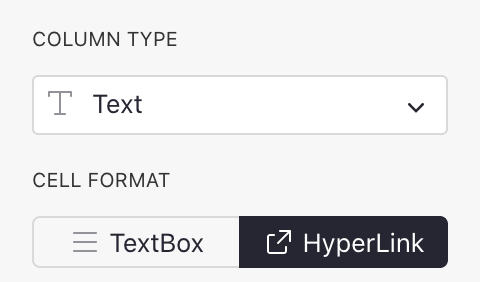
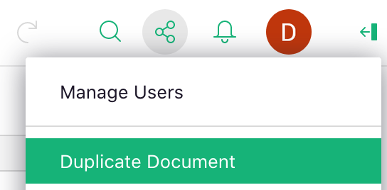
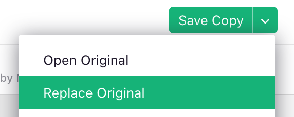
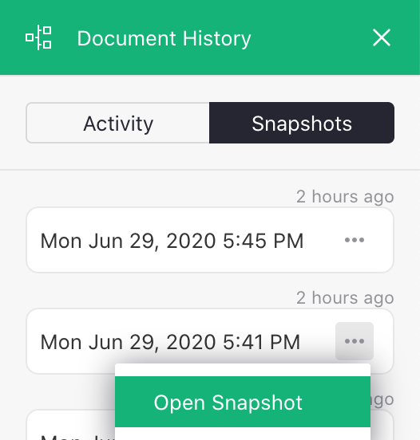

# June 2020 Newsletter

<table class="header" cellpadding="0" cellspacing="0" border="0"><tr>
  <td class="header-text">
    <table class="header-top"><tr>
      <td class="header-image">
        
      </td>
      <td class="header-top-text">
        
Grist for the Mill

        
June 2020
          &#8226; <a href="https://www.getgrist.com/">getgrist.com</a>

      </td>
    </tr></table>
    

      Welcome to our monthly newsletter of updates and tips for Grist users.
    

  </td>
</tr></table>

## Quick Tips

- **Get the Calendar Quarter.** If you have a column of type Date, you
  can extract parts of it with Excel-like functions for
  [year](../functions.md#year),
  [month](../functions.md#month), and
  [more](../dates.md).
  But how to get the quarter? This formula will produce values like “2020 Q2”:

    `"%s Q%s" % ($MyDate.year, CEILING($MyDate.month, 3) / 3)`{: .formula }

- **Make Hyperlinks.** To create a column of links in Grist, set the column
  type to Text, and click the “HyperLink” button under CELL FORMAT:

    **
    {: .screenshot-half }

    Now, a value like `Grist Labs https://getgrist.com` will
    show a link to <https://getgrist.com>
    with “Grist Labs” as the text.
    See below for a Book Club example that uses formulas extensively to generate useful links.

## What’s New

<b>Safely work on complex changes.</b> As your document or spreadsheet
grows in importance, the ease of making changes may get
overshadowed by the fear of breaking something.

Grist now has a tool to help. Click “Duplicate Document”[^duplicate-doc] in the Share menu:

[^duplicate-doc]: After the July 2020 update, use the "Work on a Copy" option for this functionality.
See [Copying Documents](../copying-docs.md#trying-out-changes).

**
{: .screenshot-half }

You'll get an unsaved copy of your document. You can experiment on it
without fear of affecting the original.
Make changes big or small, one or many. Once satisfied,
open the dropdown next to “Save Copy” and click “Replace Original”:

**
{: .screenshot-half }

Grist will warn you if the replacement risks overwriting any recent changes in the original.

<b>Examine and restore backups.</b> Grist automatically saves backups of
your documents as you work on them. You can now view them easily. Click
“Document History” in the left panel, then click the “Snapshots” tab in the
panel on the right:

**
{: .screenshot-half }

You can open any of the listed snapshots. You can revert to an old version
using the “Replace Original” option[^snapshots], or save an old version as a new
document.

[^snapshots]: This menu was updated in July 2020, see [Automatic Backups](../automatic-backups.md).

## New Examples

Here are some examples of what you can do with Grist:

- [Slice and Dice Credit Card Expenses](../examples/2020-06-credit-card.md):
  Grist offers handy way to explore your credit card transactions quickly. American Express card
  members can use the ready-made template in the example.

- [Book Lists with Library and Store Look-ups](../examples/2020-06-book-club.md):
  Grist’s link handling and formulas can help you with your book club, by adding automatic links
  to libraries, stores, review sites, and other references. The same ideas could work with Ikea
  furniture, food orders, whatever you like.

## Grist Overview Demo

Interested in seeing an overview of Grist features on a realistic example?
Check out our new demo video:
<https://www.youtube.com/watch?v=XYZ_ZGSxU00>.

## Learning Grist

- Get started quickly with basic Grist concepts by watching this playlist
  of a few very short introductory videos:
  [Grist Video Series](https://www.youtube.com/playlist?list=PL3Q9Tu1JOy_4Mq8JlcjZXEMyJY69kda44).

- Each of our featured [Examples & Templates](https://docs.getgrist.com/p/templates)
  has a related tutorial that shows step-by-step how to build it
  from scratch. Read through one to gain a deeper understanding of how
  various features play together.

- Visit our [Help Center](../index.md) to
  find all of the above, along with the full product documentation.

- Questions or suggestions? Click the
   Give Feedback
  link near the bottom left in the Grist application, or simply email
  <support@getgrist.com>.
