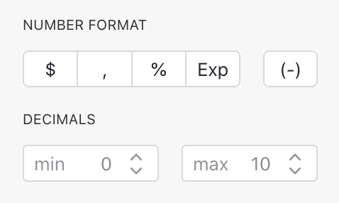
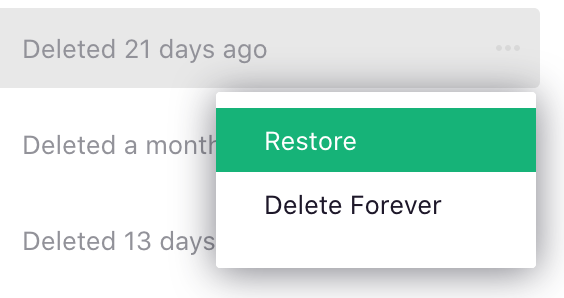

# July 2020 Newsletter

<table class="header" cellpadding="0" cellspacing="0" border="0"><tr>
  <td class="header-text">
    <table class="header-top"><tr>
      <td class="header-image">
        
      </td>
      <td class="header-top-text">
        
Grist for the Mill

        
July 2020
          &#8226; <a href="https://www.getgrist.com/">getgrist.com</a>

      </td>
    </tr></table>
    

      Welcome to our monthly newsletter of updates and tips for Grist users.
    

  </td>
</tr></table>

## Quick Tips

- **Review Document Logic.** The "Code View" link in the left panel shows a Python
  module that describes the full data model of your document: all tables, all columns with types,
  and all formulas. It's a great overview of the logic that drives a document's calculations.

- **Links to Compose Emails.** If you have a column like "Email", try adding
  a formula column with the formula `"mailto:" + $Email`{: .formula }, set its type to `Text`, and
  CELL FORMAT to `HyperLink`. You can now click a link to compose an email to this address. See
  [New Examples](#new-examples) below for much more you can do with this.

## What’s New

**More [number format options](../col-types.md#numeric-columns).**
One-click formatting for dollar amounts, percentages, showing
negative numbers in parentheses, and more:

**
{: .screenshot-half }

**Longer backup retention.** Grist makes regular [automatic backups](../automatic-backups.md) of
your documents as you work on them. It now retains them for longer, even on the free plan.

**Recover or purge deleted documents.** Deleted documents are moved to Trash. It is now easy to
recover them. Documents in Trash get deleted permanently after 30 days, or you can delete them
permanently yourself to purge them from our systems sooner.

**
{: .screenshot-half }

**Use your own domain.** If you use Grist to share data with your own customers and would like it
served from your own domain, this option is now available as an add-on to the [Team
Plan](https://www.getgrist.com/pricing).

**Zapier integration.** Grist [integration on Zapier](https://zapier.com/apps/grist/integrations)
is now available in beta. Go ahead and connect Grist to other apps.

**
{: .screenshot-half }

## New Examples

Here is an example of what you can do with Grist:

- [Prepare Emails using Formulas](../examples/2020-07-email-compose.md): Turn cells into links
  that open an email program to compose a new message, and prefill its recipients, subject, and
  more. You can essentially create email templates using Grist formulas.

## Learning Grist

- Get started quickly with basic Grist concepts by watching this playlist
  of a few very short introductory videos:
  [Grist Video Series](https://www.youtube.com/playlist?list=PL3Q9Tu1JOy_4Mq8JlcjZXEMyJY69kda44).

- Each of our featured [Examples & Templates](https://docs.getgrist.com/p/templates)
  has a related tutorial that shows step-by-step how to build it
  from scratch. Read through one to gain a deeper understanding of how
  various features play together.

- Visit our [Help Center](../index.md) to
  find all of the above, along with the full product documentation.

- Questions or suggestions? Click the
   Give Feedback
  link near the bottom left in the Grist application, or simply email
  <support@getgrist.com>.
