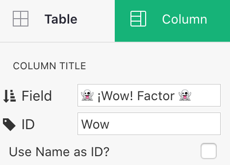
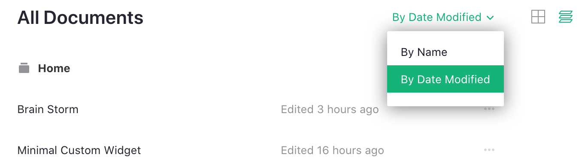
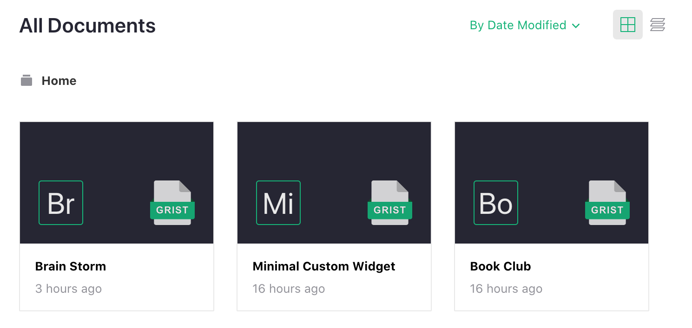

# August 2020 Newsletter

<table class="header" cellpadding="0" cellspacing="0" border="0"><tr>
  <td class="header-text">
    <table class="header-top"><tr>
      <td class="header-image">
        
      </td>
      <td class="header-top-text">
        
Grist for the Mill

        
August 2020
          &#8226; <a href="https://www.getgrist.com/">getgrist.com</a>

      </td>
    </tr></table>
    

      Welcome to our monthly newsletter of updates and tips for Grist users.
    

  </td>
</tr></table>

## Quick Tips

- **Date Offsets.** It is easy to get into muddles calculating
  dates. [DATEADD](../functions.md#dateadd) is an easy and reliable
  way to add years, months, weeks, and days to a date.  For example,
  to calculate three months on from a specific date, do
  `DATEADD($date, months=3)`. For a week and a day before that, do
  `DATEADD($date, months=3, weeks=-1, day=-1)`. Simple!

- **Column Names.** Sometimes, there is a tension between choosing a
  column name as a verbose label to explain what it is about,
  and choosing something short and snappy that is comfortable in
  formulas.  You can have both! Just open the column options and
  uncheck "[Use Name as ID?](../col-types.md#renaming-columns)".
  Then you can set the name used as a label and the name used in
  formulas separately.  And as always with Grist, if you change your
  mind later you can change or relink the names and all your formulas will
  update automatically.

  **
    {: .screenshot-half }

## What’s New

**Sort your documents by modification date.** You can now choose
to order your documents so that the most recently changed ones show up first,
using the new `By Name` / `By Date Modified` option at the top right of document lists.

**
{: .screenshot-half }

**List documents as icons.** You may now also control whether documents show as
a grid of icons or as a list of names,
using the new grid and stack icons at the top right of document lists.

**
{: .screenshot-half }

**Reactive custom widgets.** We have made it simple for web developers to create
[Custom Widgets](../widget-custom.md) that offer new reactive views of your data
that update automatically. A developer need only call `grist.onRecord(s)` to subscribe
to a record or a set of records linked to the widget; after that, presentation is a
matter of preparing HTML/CSS/JS assets (no Grist-specific knowledge needed).
The user of the widget controls data selection using regular
[Widget Linking](../linking-widgets.md).
We invite web developers to have a go at building new widgets or visualizations,
and we'd be excited to hear about the results (shoot us a mail at <support@getgrist.com>).

## New Examples

Here is an example of what you can do with Grist:

- [Preparing Invoices](../examples/2020-08-invoices.md): Preview printable invoices side
  by side with your client and order data.  Enter billable items quickly, making use of formulas,
  and see the invoice update immediately just like any other part of a spreadsheet.
  This is also an example of the kind of new visualization that can be built with
  [Custom Widgets](../widget-custom.md).

## Learning Grist

- Get started quickly with basic Grist concepts by watching this playlist
  of a few very short introductory videos:
  [Grist Video Series](https://www.youtube.com/playlist?list=PL3Q9Tu1JOy_4Mq8JlcjZXEMyJY69kda44).

- Each of our featured [Examples & Templates](https://docs.getgrist.com/p/templates)
  has a related tutorial that shows step-by-step how to build it
  from scratch. Read through one to gain a deeper understanding of how
  various features play together.

- Visit our [Help Center](../index.md) to
  find all of the above, along with the full product documentation.

- Questions or suggestions? Click the
   Give Feedback
  link near the bottom left in the Grist application, or simply email
  <support@getgrist.com>.
