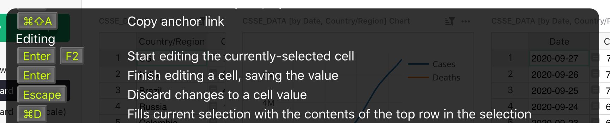
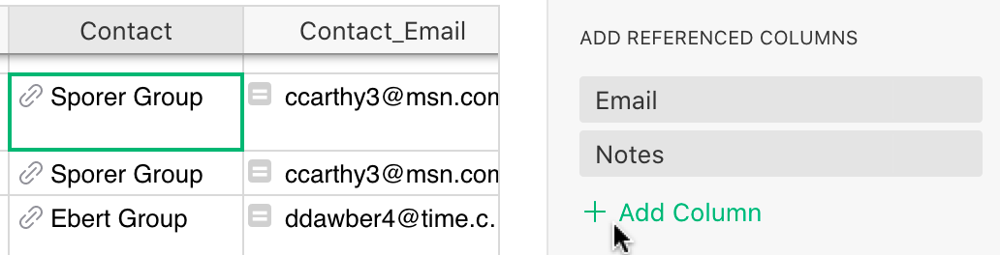
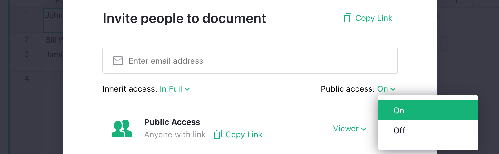
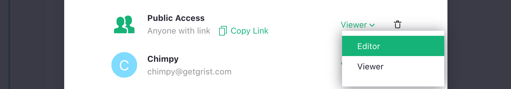
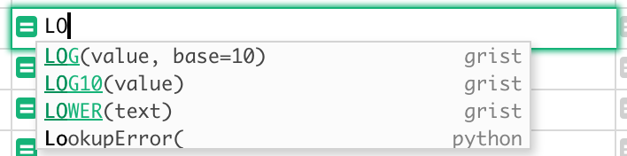
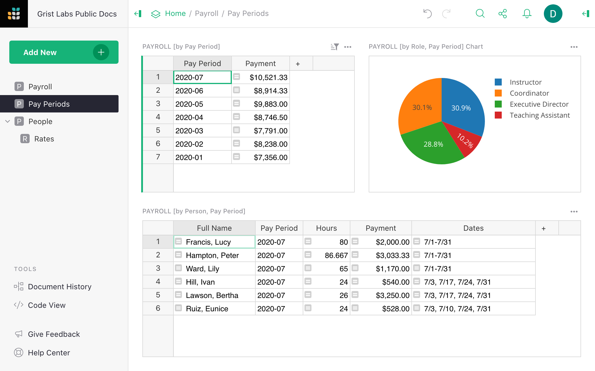

# September 2020 Newsletter

<table class="header" cellpadding="0" cellspacing="0" border="0"><tr>
  <td class="header-text">
    <table class="header-top"><tr>
      <td class="header-image">
        
      </td>
      <td class="header-top-text">
        
Grist for the Mill

        
September 2020
          &#8226; <a href="https://www.getgrist.com/">getgrist.com</a>

      </td>
    </tr></table>
    

      Welcome to our monthly newsletter of updates and tips for Grist users.
    

  </td>
</tr></table>

## Quick Tips

- **Keyboard Shortcuts.** Grist supports many keyboard shortcuts, including quite a few from Excel
  and Google Sheets. These are [listed here](../keyboard-shortcuts.md), and
  also available within Grist by pressing <code class="keys">*F1*</code> or <code class="keys">*⌘* */*</code> (Mac) or
  <code class="keys">*Ctrl* + */*</code> (Windows).

    **
      {: .screenshot-half }

- **Referenced Columns.** With the cursor anywhere in a column of type [Reference](../col-refs.md)
  (used to store a pointer to another record), the Column
  Options panel on the right has a section called "Add Referenced Columns". It allows quickly
  adding any field from the linked record.

    **
      {: .screenshot-half }

    If you hit <code class="keys">*Enter*</code> on the added column, you'll notice that it is
    simply a formula column, such as `$Contact.Email`{: .formula }.

## What’s New

**Public Sharing.** You can now share your documents publicly.
In the "Share" menu () on top,
select "Manage Users". Then toggle the dropdown next to "Public Access" to "On":

  **
    {: .screenshot-half }

Once you confirm the change, anyone with the link to your document will be able to view it. They
don't even need to have a Grist login.

The "Copy Link" button is handy to copy the link to the clipboard for pasting into an email,
tweet, or anywhere else.

You can also allow anyone with the link to your document to edit it: simply switch the role in the Public Access
row to Editor.

  **
    {: .screenshot-half }

Note that this allows *anyone* with the link to change absolutely anything in your document,
including deleting all the data. The snapshots in
[Document History](../automatic-backups.md#examining-backups) should help
if anything goes wrong.

**Improved Formula Suggestions.** While typing in formulas, Grist is now more helpful in
suggesting common functions, and includes their parameters, and a link to documentation.

  **
    {: .screenshot-half }

## New Examples

Here is an example of what you can do with Grist:

- [Tracking Payroll](../examples/2020-09-payroll.md): This template is convenient for small
  businesses, especially those with part-time employees. Grist can help you keep track of employee
  hours, rates, and roles, and to reduce mistakes with up-to-date payroll summaries and
  detailed histories of rates and hours.

## Learning Grist

- Get started quickly with basic Grist concepts by watching this playlist
  of a few very short introductory videos:
  [Grist Video Series](https://www.youtube.com/playlist?list=PL3Q9Tu1JOy_4Mq8JlcjZXEMyJY69kda44).

- Each of our featured [Examples & Templates](https://docs.getgrist.com/p/templates)
  has a related tutorial that shows step-by-step how to build it
  from scratch. Read through one to gain a deeper understanding of how
  various features play together.

- Visit our [Help Center](../index.md) to
  find all of the above, along with the full product documentation.

- Questions or suggestions? Click the
   Give Feedback
  link near the bottom left in the Grist application, or simply email
  <support@getgrist.com>.
