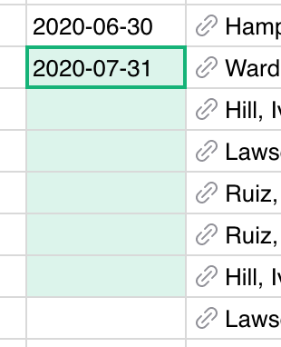
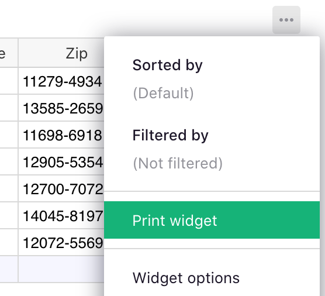

# October 2020 Newsletter

<table class="header" cellpadding="0" cellspacing="0" border="0"><tr>
  <td class="header-text">
    <table class="header-top"><tr>
      <td class="header-image">
        
      </td>
      <td class="header-top-text">
        
Grist for the Mill

        
October 2020
          &#8226; <a href="https://www.getgrist.com/">getgrist.com</a>

      </td>
    </tr></table>
    

      Welcome to our monthly newsletter of updates and tips for Grist users.
    

  </td>
</tr></table>

## Quick Tips

- **Fill a Range.** To fill a range of cells with the same value, enter the value
  in the top cell, then select the range below starting with this cell (which you can do by dragging
  the mouse, or <code class="keys">*Shift*</code>-clicking the bottom cell), then press
  <code class="keys">*Ctrl* + *D*</code> (Windows) or <code class="keys">*⌘* *D*</code> (Mac).

    **
      {: .screenshot-half }

    Remember it as "D" for filling **D**own.

    The usual Copy-Paste shortcuts work too -- <code class="keys">*Ctrl* + *C*</code>
    <code class="keys">*Ctrl* + *V*</code> (Windows) or <code class="keys">*⌘* *C*</code>
    <code class="keys">*⌘* *V*</code> (Mac). Pasting a value into a larger range will fill the range
    with multiple copies of the value.

- **Conditional Expressions.** If you have a formula like `$Birthday.year`{: .formula}, you'll
  find that when the `Birthday` column is empty, the formula shows an error. It's easy to avoid it
  using Python's conditional expressions:

    `$Birthday.year if $Birthday else None`{: .formula}

    The same idea can help in other situations, e.g. to avoid a ZeroDivisionError:

    `$Total / $Count if $Count else 0`{: .formula}

## What’s New

**Printing.** You can now easily print any widget on your screen, whether a table of data, a card,
or a custom widget. Click the three-dots icon on top of the widget, and select "Print Widget":

  **
    {: .screenshot-half }

Printing also works for special-purpose widgets such as [Invoices](../examples/2020-08-invoices.md) or
[Mailing Labels](../examples/2020-10-print-labels.md) (see below).

## Open Source Beta

We are excited to announce that we are taking Grist open-source! The
open-source version should be considered in Beta for now, but eager developers are welcome to
check it out: <https://github.com/gristlabs/grist-core>.

The secure managed service you know and love remains unchanged, and will be all the stronger from
engagement with the open-source community. Placing our code in the public domain also brings added
trust in quality of code and in long-term availability of Grist. Read more at
[Why Open Source](https://github.com/gristlabs/grist-core#why-open-source).

## New Examples

[Print Mailing Labels](../examples/2020-10-print-labels.md). This custom widget supports popular
label sizes and makes it easy to create printable labels and have them available at
the click of a button. It's yet another example of the extensibility of Grist.

## Learning Grist

- Get started quickly with basic Grist concepts by watching this playlist
  of a few very short introductory videos:
  [Grist Video Series](https://www.youtube.com/playlist?list=PL3Q9Tu1JOy_4Mq8JlcjZXEMyJY69kda44).

- Each of our featured [Examples & Templates](https://docs.getgrist.com/p/templates)
  has a related tutorial that shows step-by-step how to build it
  from scratch. Read through one to gain a deeper understanding of how
  various features play together.

- Visit our [Help Center](../index.md) to
  find all of the above, along with the full product documentation.

- Questions or suggestions? Click the
   Give Feedback
  link near the bottom left in the Grist application, or simply email
  <support@getgrist.com>.
