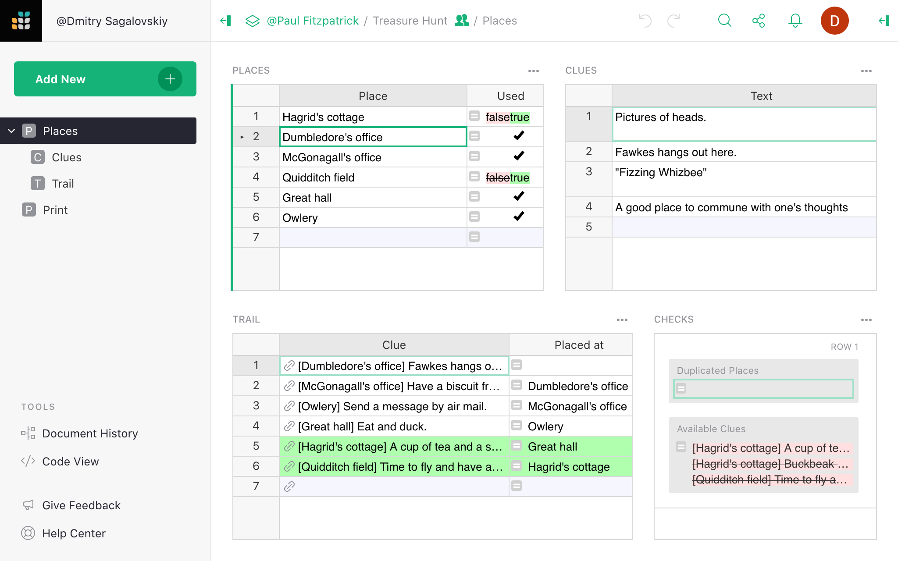
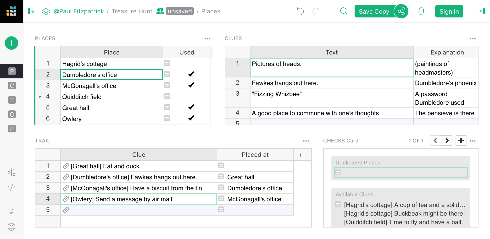

# November 2020 Newsletter

<table class="header" cellpadding="0" cellspacing="0" border="0"><tr>
  <td class="header-text">
    <table class="header-top"><tr>
      <td class="header-image">
        
      </td>
      <td class="header-top-text">
        
Grist for the Mill

        
November 2020
          &#8226; <a href="https://www.getgrist.com/">getgrist.com</a>

      </td>
    </tr></table>
    

      Welcome to our monthly newsletter of updates and tips for Grist users.
    

  </td>
</tr></table>

## Open Source Announcement

We are happy to announce the beta release of the [open source version of
Grist](https://www.getgrist.com/blog)! As a modern, powerful spreadsheet, Grist fits well
into the open-source ecosystem, and is as friendly to hacker-developers as to hacker-users.

[Join the discussion at HackerNews](https://news.ycombinator.com/item?id=25257521).

[Read the announcement](https://www.getgrist.com/blog).

This will interest technically-minded users who'd like to extend Grist, or
those with unusual requirements. Meanwhile, the service you know and love
remains the best supported and cost-efficient option, and will benefit from the increased
confidence in Grist source code.

## Quick Tips

- **Add a Record.** Some of the simplest shortcuts are the most useful. To add a record, press
  <code class="keys">*Ctrl* + *=*</code> (Windows) or <code class="keys">*⌘* *=*</code> (Mac).
  Press <code class="keys">*Shift*</code> at the same time to insert the record above the cursor
  rather than below.

- 
  **Cook up a Unique Identifier.** Let's say you'd like to refer to records in a table, but don't
  have a column that identifies each record uniquely. Perhaps you have people with `First_Name`
  and `Last_Name`, or sessions with `Program_Name` and `Date`. To use such tables as a destination
  of a Reference column, you'll need a unique identifier.

    You can create one using a formula that
    stitches together the fields that identify a record uniquely.
    For example, create a column `Full_Name` with the formula

      `$Last_Name + ", " + $First_Name`{: .formula}

    or a column `Session_Name` with the formula

      `"[%s] %s" % ($Date, $Program_Name)`{: .formula}

    The latter is Python syntax for formatting strings: each occurrence of `%s` in the quoted string
    is replaced by a value from the list in parentheses.

## What’s New

**Improved Attachments.** The preview of attachments has been vastly improved, and supports
showing PDF, video, and audio files. Simply double-click a cell with attachments to
preview its content:

**View Differences.** You can now view differences between a copy of a document you make using
"Work on a Copy" and the original, as well as what changed since a backup snapshot in the
document's history. Find the "Compare" menu item in the Share menu:

  **
    {: .screenshot-half }

This feature is experimental for now, but is already quite
useful:

This supports the workflow of [trying out
changes](../copying-docs.md#trying-out-changes), which should be familiar
to users of version control systems such as Git. One of its benefits is allowing view-only users to
propose changes, even though they cannot edit the document directly.

## New Examples

[Treasure Hunt](../examples/2020-11-treasure-hunt.md): Even better than using Grist for work is
using Grist for fun! Check out this template that helps you plan a treasure hunt without losing
track. Conspire with relatives or friends online to create a trail of clues, then watch and
laugh as the rest of your household flails their way through it.

## Learning Grist

- Get started quickly with basic Grist concepts by watching this playlist
  of a few very short introductory videos:
  [Grist Video Series](https://www.youtube.com/playlist?list=PL3Q9Tu1JOy_4Mq8JlcjZXEMyJY69kda44).

- Each of our featured [Examples & Templates](https://docs.getgrist.com/p/templates)
  has a related tutorial that shows step-by-step how to build it
  from scratch. Read through one to gain a deeper understanding of how
  various features play together.

- Visit our [Help Center](../index.md) to
  find all of the above, along with the full product documentation.

- Questions or suggestions? Click the
   Give Feedback
  link near the bottom left in the Grist application, or simply email
  <support@getgrist.com>.
