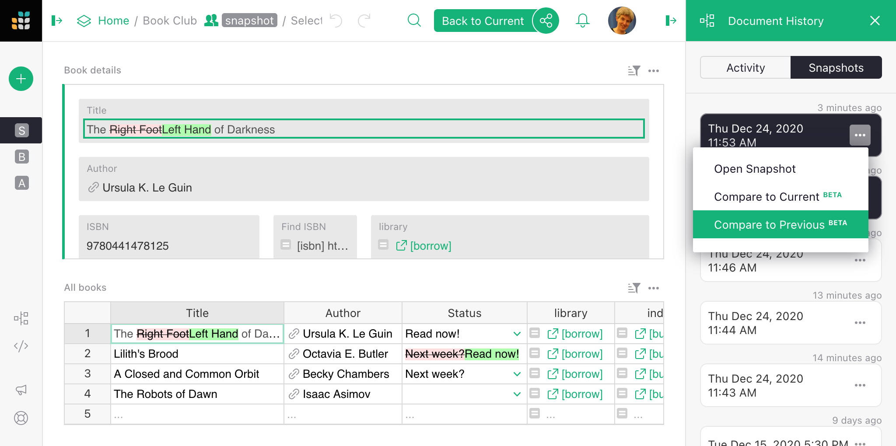
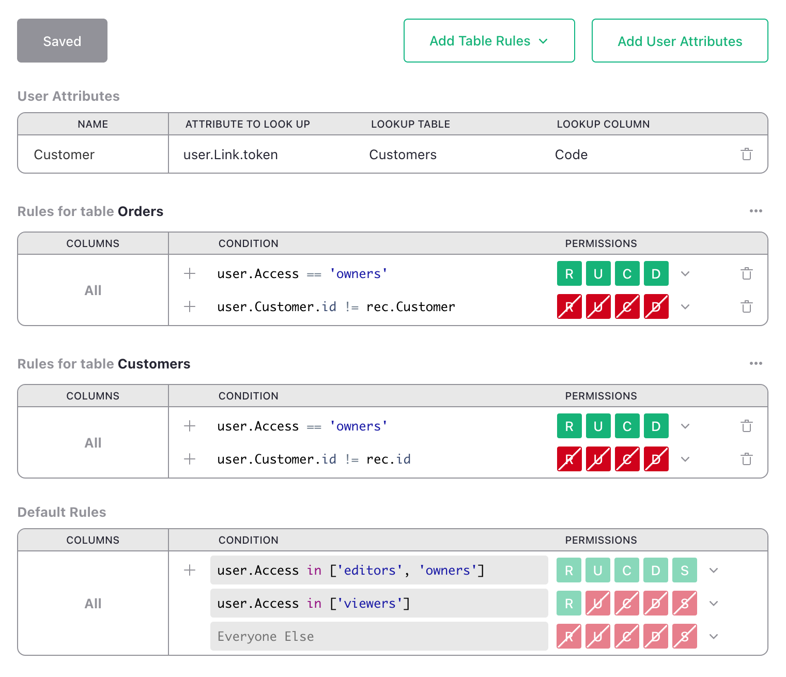
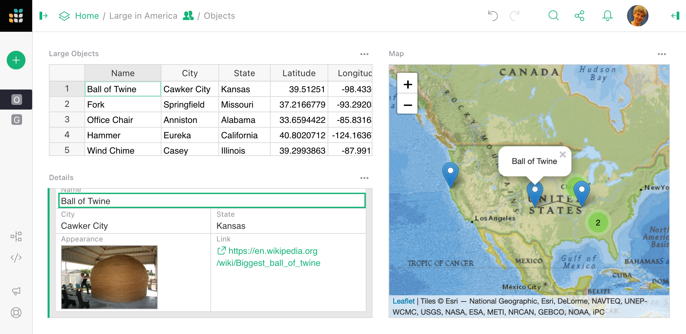

# December 2020 Newsletter

<table class="header" cellpadding="0" cellspacing="0" border="0"><tr>
  <td class="header-text">
    <table class="header-top"><tr>
      <td class="header-image">
        
      </td>
      <td class="header-top-text">
        
Grist for the Mill

        
December 2020
          &#8226; <a href="https://www.getgrist.com/">getgrist.com</a>

      </td>
    </tr></table>
    

      Welcome to our monthly newsletter of updates and tips for Grist users.
    

  </td>
</tr></table>

## What's New

Want to check how your document has changed recently?  Just press the
`Document History` button in the bottom left of your document, choose a
snapshot on the right, click the three-dots symbol
()
beside it, and select one of the new `Compare to Previous` or 
`Compare to Current` options.

## What's Coming

Grist has brought you a lot of new features in 2020, and it looks like
2021 is going to be another bumper year. One big feature we're
particularly excited about is fine-grained access control, where
you'll be able to determine who can see (or edit) which parts of your
document at the table, column, and row level. Several of you have been
asking for this, in different ways, and we're happy to have a solution
in hand that will cover a lot of use-cases. If you are interested in
getting early access, let us know!

## New Examples

[Show a Map](../examples/2020-12-map.md). This custom widget renders a list of locations
as a geographic map. So if you're making a list of places you want to go once travel
is a thing again, you can lay them out and start making plans...

## Learning Grist

- Get started quickly with basic Grist concepts by watching this playlist
  of a few very short introductory videos:
  [Grist Video Series](https://www.youtube.com/playlist?list=PL3Q9Tu1JOy_4Mq8JlcjZXEMyJY69kda44).

- Each of our featured [Examples & Templates](https://docs.getgrist.com/p/templates)
  has a related tutorial that shows step-by-step how to build it
  from scratch. Read through one to gain a deeper understanding of how
  various features play together.

- Visit our [Help Center](../index.md) to
  find all of the above, along with the full product documentation.

- Questions or suggestions? Click the
   Give Feedback
  link near the bottom left in the Grist application, or simply email
  <support@getgrist.com>.
