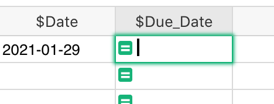
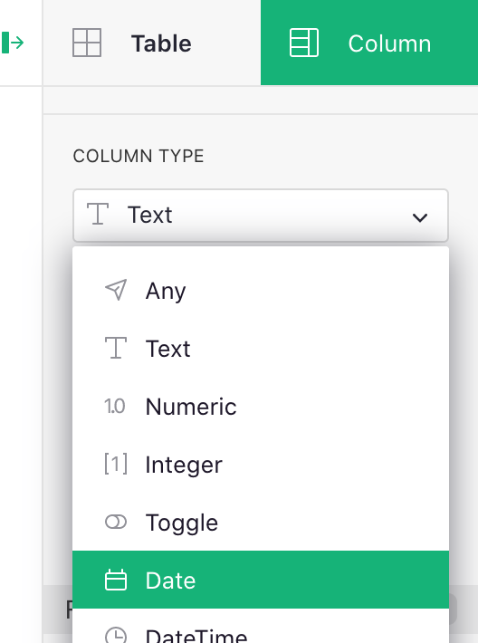

# January 2021 Newsletter

<table class="header" cellpadding="0" cellspacing="0" border="0"><tr>
  <td class="header-text">
    <table class="header-top"><tr>
      <td class="header-image" rowspan="2">
        
      </td>
      <td class="header-top-text">
        
Grist for the Mill

        
January 2021
          &#8226; <a href="https://www.getgrist.com/">getgrist.com</a>

      </td>
    </tr><tr>
      <td>
        

          Welcome to our monthly newsletter of updates and tips for Grist users.
        

      </td>
    </tr></table>
  </td>
</tr></table>

## Quick Tips

- **Entering Formulas.** To enter a formula in Grist, simply hit
  the equal sign (<code class="keys">*=*</code>) on the keyboard. To edit an existing formula, hit
  <code class="keys">*Enter*</code>.

    **
      {: .screenshot-half }

    Unlike a typical spreadsheet, a Grist formula applies to the whole column, and you can edit this
    single formula via any of the cells in the column. [Read more about formulas](../formulas.md).

- **Use Date Picker.** If you convert a column to type Date, you'll be able to enter dates using the
  date picker interface. To convert a column, open the right-side "Column" panel, and select
  "Date" under Column Type:

    **
      {: .screenshot-half }

    There are options for how to format dates too! [See here for more](../col-types.md#date-columns).

## New Example

In our [Task Management](../examples/2021-01-tasks.md) article, we share a
document similar to what we use internally at Grist Labs to manage our work.

This simple document works better for us than any custom software, thanks to the combination of
data linking, dropdowns to assign tasks, easy copy-pasting when needed, and live collaboration.
And it works just as well in the all-remote work setup, when all our meetings are over video.

## Find a Consultant, Be a Consultant

**Get help building.** Many businesses have complex data. Feel free to reach out to us for help
building your database. A good way is to email us at <support@getgrist.com> with a description of
what you'd like for your database (maybe even sketch some screens on paper and send photos). Then [schedule a
call](https://calendly.com/gristlabs/).

Often that's enough to get rolling and continue on your own. For bigger projects, or custom
integrations, we can recommend a consultant to work with.

**Help others!** Are you a freelancer? Do you enjoy building in Grist and organizing data? We'd be
glad to support you, and to add you to our list of independent Grist consultants. Please fill out
this interest form: [register to be a Grist consultant](../register-as-consultant.md).

## Learning Grist

- Get started quickly with basic Grist concepts by watching this playlist
  of a few very short introductory videos:
  [Grist Video Series](https://www.youtube.com/playlist?list=PL3Q9Tu1JOy_4Mq8JlcjZXEMyJY69kda44).

- Each of our featured [Examples & Templates](https://docs.getgrist.com/p/templates)
  has a related tutorial that shows step-by-step how to build it
  from scratch. Read through one to gain a deeper understanding of how
  various features play together.

- Visit our [Help Center](../index.md) to
  find all of the above, along with the full product documentation.

- Questions or suggestions? Click the
   Give Feedback
  link near the bottom left in the Grist application, or simply email
  <support@getgrist.com>.
