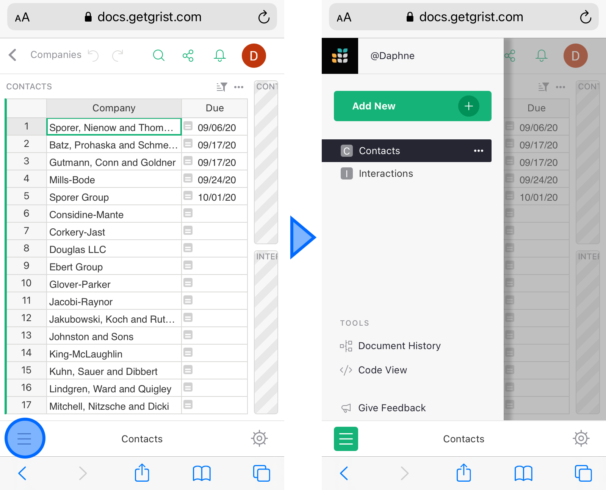

# February 2021 Newsletter

<table class="header" cellpadding="0" cellspacing="0" border="0"><tr>
  <td class="header-text">
    <table class="header-top"><tr>
      <td class="header-image">
        
      </td>
      <td class="header-top-text">
        
Grist for the Mill

        
February 2021
          &#8226; <a href="https://www.getgrist.com/">getgrist.com</a>

      </td>
    </tr></table>
    

      Welcome to our monthly newsletter of updates and tips for Grist users.
    

  </td>
</tr></table>

## Quick Tips

- 
  **Totals.** To compute totals of a column, spreadsheet users will often reach for the last row
  of their table to enter a formula there. In Grist, every row is a database record, including the
  last row. But totals are certainly available!

    Instead of adding a row for totals, add a one-line summary table. Click the "Add New" button,
    and select "Add Widget to Page". In the dialog that opens, click the summation icon
    () next to the table you'd like
    totals for:

    **
    {: .screenshot-half }

    Click "Add to Page", and you'll see a one-line summary of your table. Use the drag handle just to
    the left of the title to move it below your table (where you normally expect totals).

    **
    {: .screenshot-half }

    Grist creates sums of all numeric columns automatically. You can remove any you don't need,
    add new ones, or edit ones for which you need something other than sum (perhaps `AVERAGE`, `MAX`,
    or an entirely custom Python calculation).

    **
      {: .screenshot-half }

    Read [Summary tables](../summary-tables.md) for more on summary tables and their many uses.

- 
  **Real-time Sharing.** Even on the free plan, you can share a document and collaborate on it.
  Any change that you or another editor makes will immediately show up on the other person's screen.

    To share a document, click the sharing icon
    (), and select "Manage Users".

    In the dialog that opens, type in the email address of the person to invite. Change their role
    from Viewer to Editor if you'd like to give them editing permission. Then click Confirm. Your
    collaborator now has access to your document, and Grist will send them an email with a link to
    it.

    

    Read more at [Sharing](../sharing.md).

## What's New

Grist mobile support has come a long way recently, and we are happy to say that you can now use
Grist quite comfortably in mobile browsers such as Chrome, Safari, and Firefox.

On small screens, you can find the list of pages from the button in the bottom bar:

  

For pages with multiple widgets, only the active widget is expanded. Other widgets are collapsed
until you touch to expand them:

  

To edit a cell, simply double-tap it.

Mobile support is still a work in progress. To get back to the desktop version on a mobile device,
open your account menu, and select "Toggle Mobile Mode" option:

  **
  {: .screenshot-half }

Please report any issues, and share suggestions for improvements!

## Learning Grist

- Get started quickly with basic Grist concepts by watching this playlist
  of a few very short introductory videos:
  [Grist Video Series](https://www.youtube.com/playlist?list=PL3Q9Tu1JOy_4Mq8JlcjZXEMyJY69kda44).

- Each of our featured [Examples & Templates](https://docs.getgrist.com/p/templates)
  has a related tutorial that shows step-by-step how to build it
  from scratch. Read through one to gain a deeper understanding of how
  various features play together.

- Visit our [Help Center](../index.md) to
  find all of the above, along with the full product documentation.

- Questions or suggestions? Click the
   Give Feedback
  link near the bottom left in the Grist application, or simply email
  <support@getgrist.com>.
