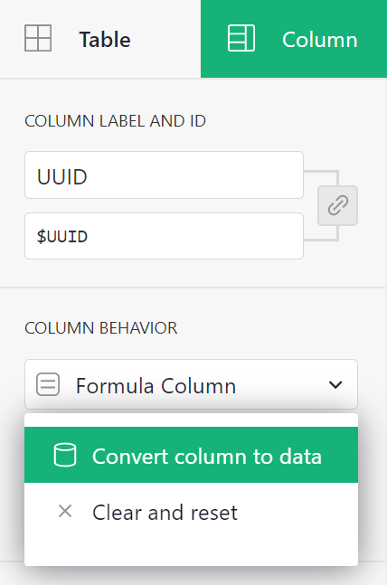

# April 2021 Newsletter

<table class="header" cellpadding="0" cellspacing="0" border="0"><tr>
  <td class="header-text">
    <table class="header-top"><tr>
      <td class="header-image">
        
      </td>
      <td class="header-top-text">
        
Grist for the Mill

        
April 2021
          &#8226; <a href="https://www.getgrist.com/">getgrist.com</a>

      </td>
    </tr></table>
    

      Welcome to our monthly newsletter of updates and tips for Grist users.
    

  </td>
</tr></table>

## Understanding Link Sharing

Last month we released granular access controls which makes it possible to limit who can see or
edit which parts of a document, down to individual columns and rows.

This same level of control can be set for documents shared via links with third parties who do not
have a Grist account or who are not a part of your organization. For example, you may want to
share purchase history with a customer, permit staff to see only their work schedules, or show a
client their project’s status.

In Grist, “link keys” are URL parameters that when combined with the access control rules will
determine which data a link recipient is permitted to view.

### Creating Unique Link Keys in 4 Steps

The best way to learn is by doing.
[We’ve created a simple template](https://public.getgrist.com/cBRGq2QKzTSC/Private-Tutor-LinkKey-Tutorial)
you can copy and edit to deepen your understanding of link sharing. In our example, you are a
private tutor who uses Grist to track hours, payments, and client data. You would like to share
session and payment history with parents via a link that only shows their family's data. [Follow
our 4 step guide to learn how to share limited data via links](../examples/2021-04-link-keys.md).

*The private tutor can see all data, but a parent can only see their family's data.*
{: .wide-img-caption}

[Learn How](../examples/2021-04-link-keys.md)
{: .grist-button}

## What's New

You can now create filter buttons in a bar above any view in Grist. The filter bar can be
toggled on or off, and edited to only include buttons for those columns you commonly filter
by. The bar can also be saved so that everyone with access to the doc can more easily filter data.

## Quick Tips

- **Freezing unique identifiers**. When using the Grist’s
  [`UUID()`](../functions.md#uuid) function, you may want to freeze values
  assigned to each record. If you don’t, the unique identifier will generate anew when you re-open
  the doc. To freeze unique identifiers, convert the column to the data column, and set the default
  formula for new records to `UUID()` so that new rows will also be assigned a unique identifier.

**
{: .screenshot-half }

- **Creating links in cells**. To create a column of links in Grist, set the column type to Text,
  and click the “HyperLink” button under Cell Format.

- **Link Keys and Public Access.** If you’re generating unique links to limited views of data,
  make sure you have turned on Public Access under “Manage Users” to allow link-sharing. Viewers
  who access your document via links will still be limited in accordance with your access rules.

**Still need help?** Visit our [Help Center](../index.md), [watch video
tutorials](https://www.youtube.com/playlist?list=PL3Q9Tu1JOy_4Mq8JlcjZXEMyJY69kda44), or contact
us at <support@getgrist.com>.
