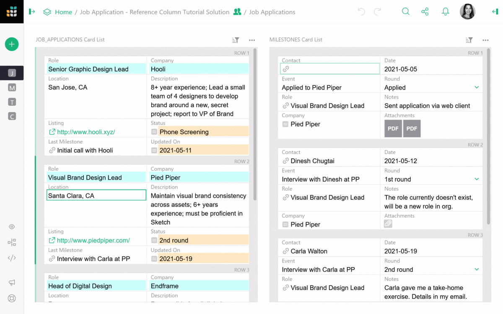
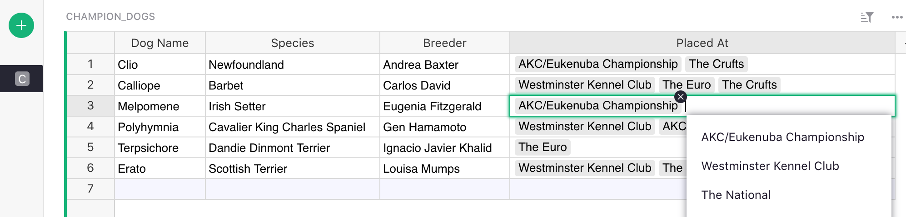
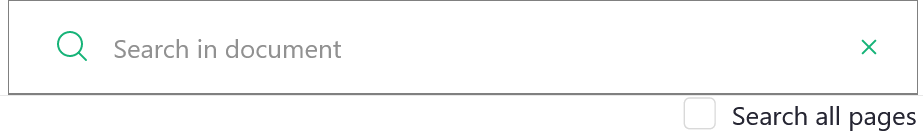
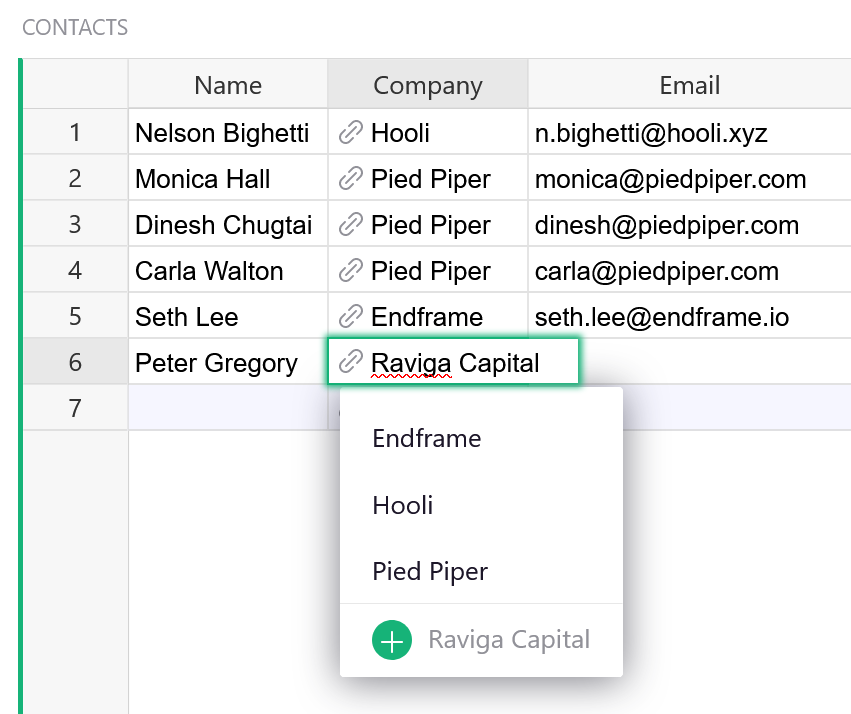
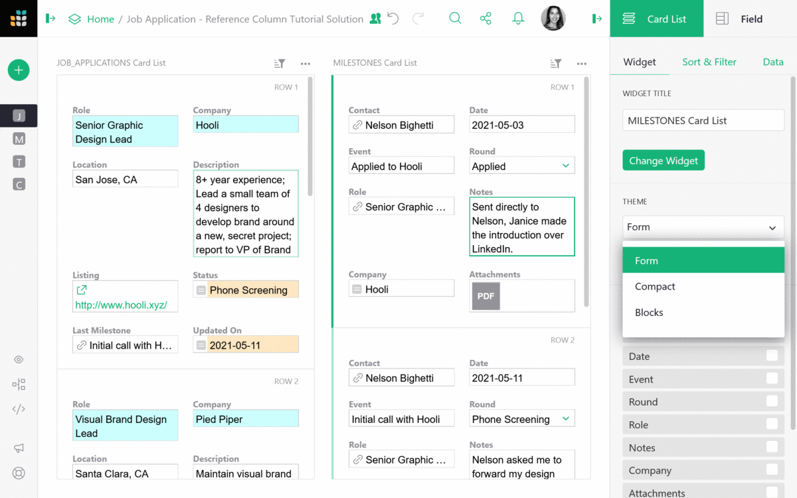

# May 2021 Newsletter

<table class="header" cellpadding="0" cellspacing="0" border="0"><tr>
  <td class="header-text">
    <table class="header-top"><tr>
      <td class="header-image">
        
      </td>
      <td class="header-top-text">
        
Grist for the Mill

        
May 2021
          &#8226; <a href="https://www.getgrist.com/">getgrist.com</a>

      </td>
    </tr></table>
    

      Welcome to our monthly newsletter of updates and tips for Grist users.
    

  </td>
</tr></table>

## Organizing Data with Reference Columns

Reference columns are at the heart of what Grist does best: make it easy to set up a relational
database and create highly productive layouts.  If you’re not familiar with databases,
understanding reference columns can feel a little tricky.  That’s why we’ve created a simple
template you can copy and edit to deepen your understanding of reference columns.

In our example, you are a job applicant who uses Grist to track your job application status at
multiple companies. You would like a simple dashboard that makes it easy to see your job status at
a glance, and to add new jobs, interviews and other milestones. [Follow our 3 step guide to learn
how to use reference columns](../examples/2021-05-reference-columns.md).

## What's New

### Choice Lists

You can now select multiple options in a Choice List column. In the screenshot below, multiple dog
shows are selected from a choice list, instead of just one.

### Search Improvements

When searching in Grist, the search now stays on the same page by default. If you want to search
across all pages, simply mark the checkbox.

**
{: .screenshot-half }

### Hyperlinks within Same Document

Previously all hyperlinks opened in a new tab. Now, hyperlinks that point to a different part of
the *same document* will open in the same tab. This makes it easier to jump to relevant parts of
large documents.

## Quick Tips

- **Adding new record from reference column drop-down list.** You may add a new value to the
  dropdown list in a reference column without switching to the underlying table. Just type in the
  value you want to add and select the `+` value in the dropdown list. Grist will automatically
  add a new record containing this value to the underlying table and insert the proper reference.

**
{: .screenshot-half }

- **Edit Card Widget Layout.** When converting a table into a card widget, you may want to move
  fields around to a more intuitive format. Click on the `...` menu above the widget you’d like to
  edit, then select EDIT LAYOUT. Click and drag fields to reposition them, then click SAVE LAYOUT.

- **Card List Widget Themes.** The card list widget tiles cards vertically. Grist has three-built in themes to choose from, depending on your need and how you wish to view the data.

**Still need help?** Visit our [Help Center](../index.md), [watch video
tutorials](https://www.youtube.com/playlist?list=PL3Q9Tu1JOy_4Mq8JlcjZXEMyJY69kda44), or contact
us at <support@getgrist.com>.
