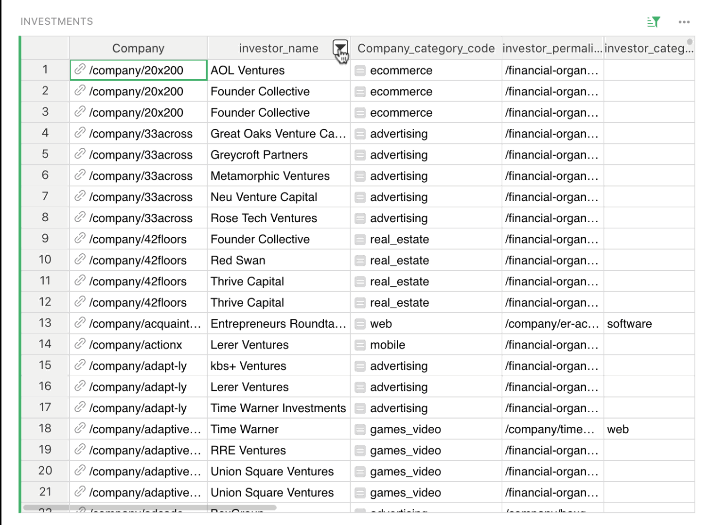
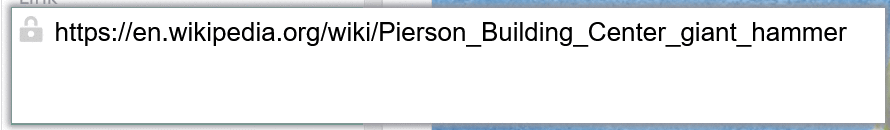
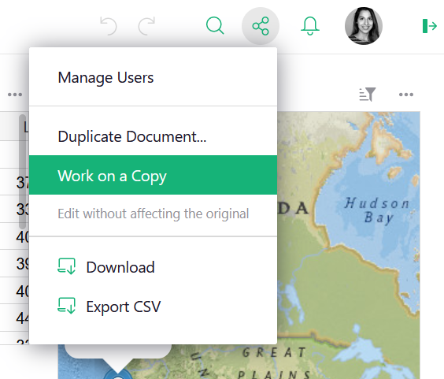
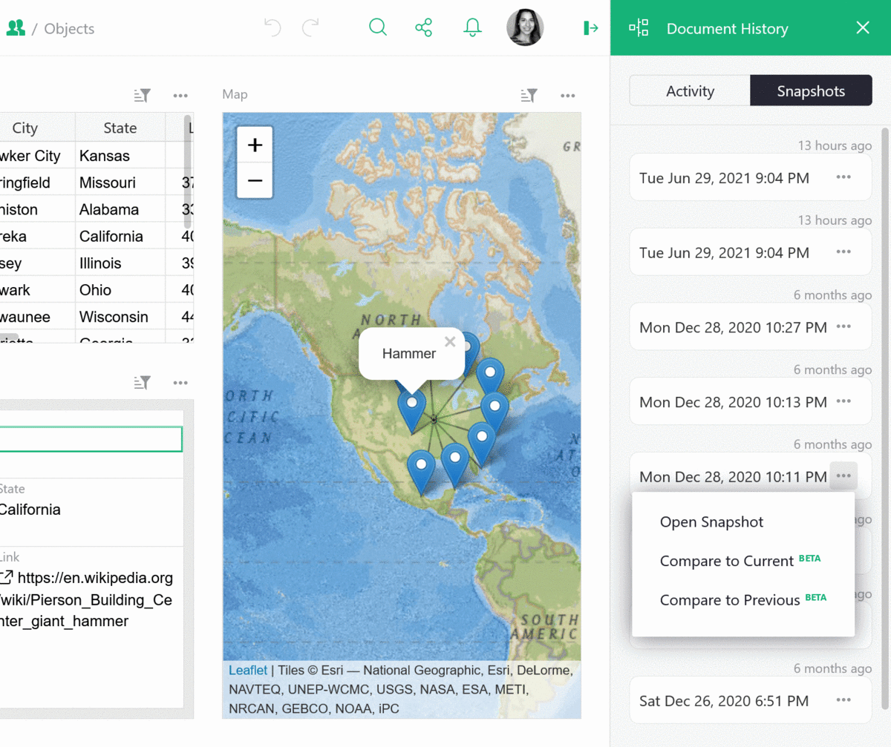
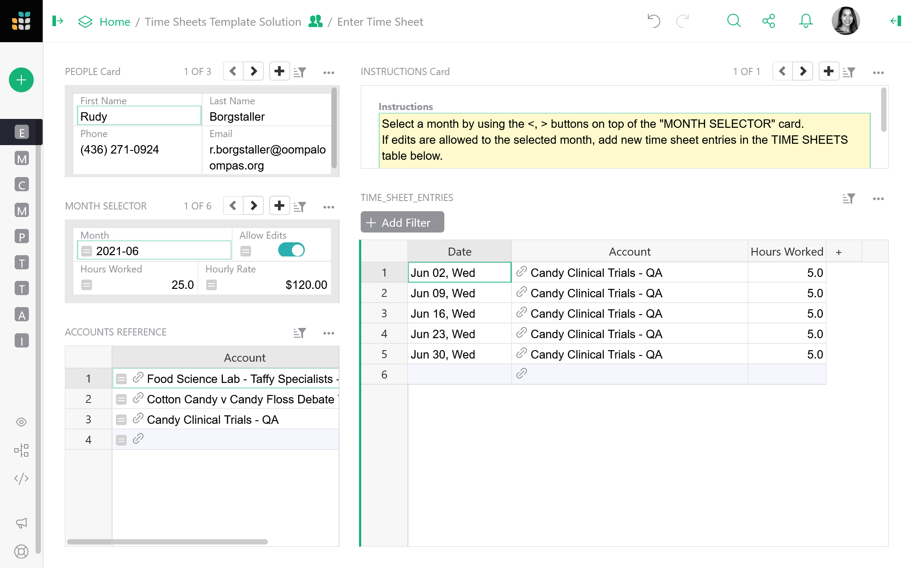

# June 2021 Newsletter

<table class="header" cellpadding="0" cellspacing="0" border="0"><tr>
  <td class="header-text">
    <table class="header-top"><tr>
      <td class="header-image">
        
      </td>
      <td class="header-top-text">
        
Grist for the Mill

        
June 2021
          &#8226; <a href="https://www.getgrist.com/">getgrist.com</a>

      </td>
    </tr></table>
    

      Welcome to our monthly newsletter of updates and tips for Grist users.
    

  </td>
</tr></table>

## What's New

### Freeze Columns

You can now freeze columns in Grist! Tame those wide spreadsheets and view your data, your way.

**
{: .screenshot-half }

### Read-only Editor

Team members with view-only access can now open a cell editor to more easily read long text,
access attachments, or take a peek at formulas. They will still be prevented from editing the
cell, as indicated by the gray lock icon.

*Read-only cell editor locked for edits v. unrestricted cell editor*
{: .wide-img-caption}

## Quick Tips

- 
  **Duplicate Document v Work on a Copy.** When making changes to a document’s structure it’s a
  good practice to `Work on a copy`. This does not automatically save a duplicate of your
  document. It creates an unsaved working copy where you can make edits, and then choose to replace
  the current document, copy your new edits to a new document, or discard your changes altogether.

    `Duplicate Document` does create a new, duplicated document, and you can choose whether or
    not to copy data or retain only the document’s structure.

**
{: .screenshot-half}

- 
  **Exporting Backups.** Grist periodically takes snapshots of your documents. You can save any
  version of your document (current or historical snapshots) to backup your data. To backup
  historical snapshots, click on `Document History` then `Snapshots`. Select any snapshot’s menu then
  click on `Open Snapshot`. Click on the share icon to open a menu from which you can download the
  entire document as a [Grist file](../exports.md#backing-up-an-entire-document).

**
{: .screenshot-half }

- 
  **Combining text fields with formulas.** You may sometimes have text in multiple columns that
  you would like to display in one column. For example, a table may have first name and last name
  columns. You may easily create a full name column with the formula
  `"{}, {}".format($Last_Name, $First_Name)`{: .formula}. The part in quotes is a format string: each set of
  curly brackets (`{}`) in it gets replaced with the next value from parentheses after `format`. In
  this case, the full name would be displayed as `Benson, Carla`.

## Dig Deeper

### Analyzing Data with Summary Tables and Formulas

Summary tables and formulas are vital tools in capturing actionable insights from your data. They
make it possible to group records into specific categories, then compute sums using those record
groups. Grist makes it easy to create summary tables and work with the `$group` field in summary
formulas.

[We've created a video tutorial](../examples/2021-06-timesheets.md) that helps you master two key
concepts: summary tables and summary formulas. The tutorial guides you into building two summary
pages in an advanced timesheet tracker template.

[LEARN: Summary Tables](../examples/2021-06-timesheets.md)
{: .grist-button}

## New Template

### Advanced Timesheet Tracker

The timesheet tracker makes it easier to track contractors' timesheets across various months and
departments. It has a dashboard where contractors can submit their hours directly into Grist, and
see only their historical timesheet data. The company's payroll department can see everyone's
timesheets, in all accounts, across all months, and have access to summary pages that provide
useful data around spending. They can also set permissions to allow or disallow timesheet edits in
certain months.

The summary tables tutorial starts with an unfinished version of the template, and guides you into
creating two new pages. If you want to use the completed template, go to the tutorial solution.
Note that there are access rules in place for the completed template which will prevent you from
seeing certain pages and most data. Make a copy to become the document owner and see all data and
pages.

[See Template](https://public.getgrist.com/uR353rDVZhmX/Time-Sheets-Template-Solution)
{: .grist-button}

*Make a copy to become the document owner and see all data and pages.*
{: .wide-img-caption}

**Still need help?** Visit our [Help Center](../index.md), [watch video
tutorials](https://www.youtube.com/channel/UCx0ioQrrC-bIrkmZ7ZULr0g/playlists), or contact
us at <support@getgrist.com>.
