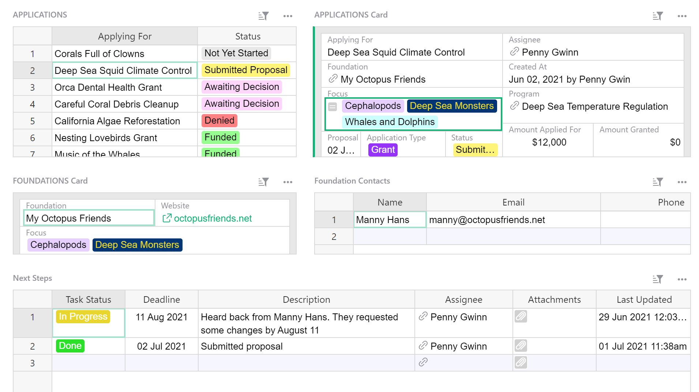
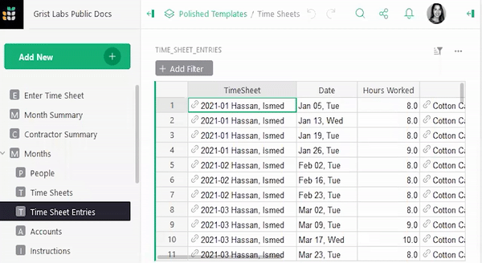
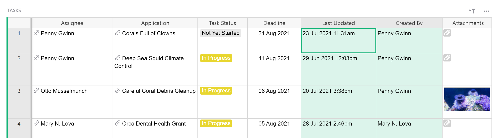
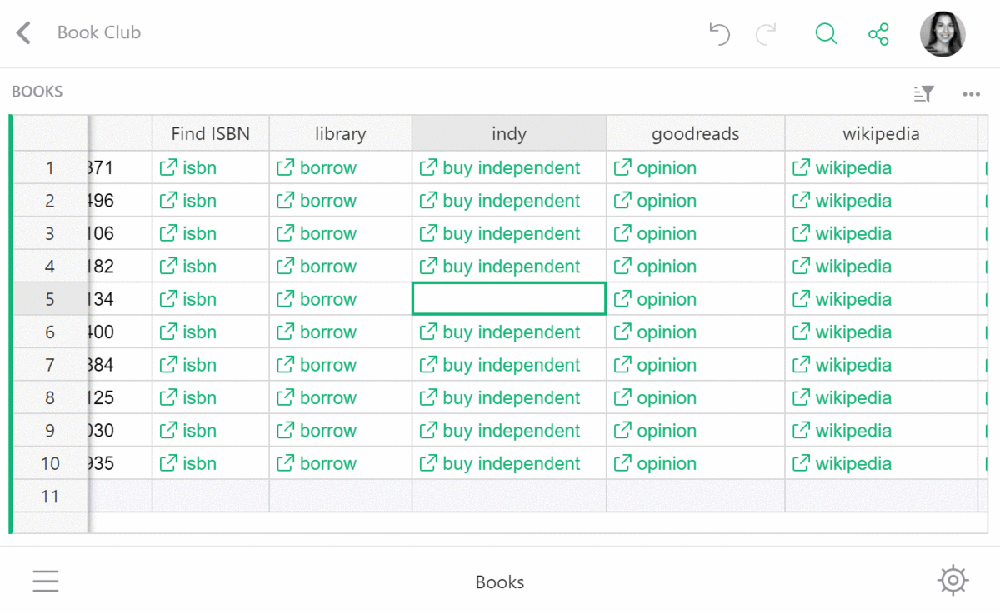
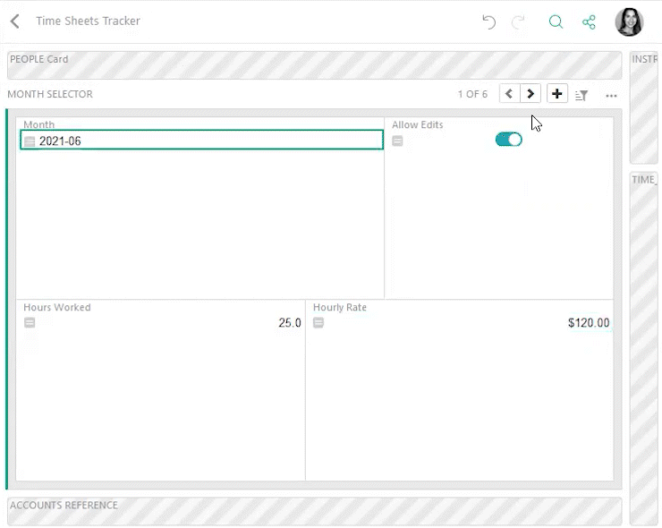
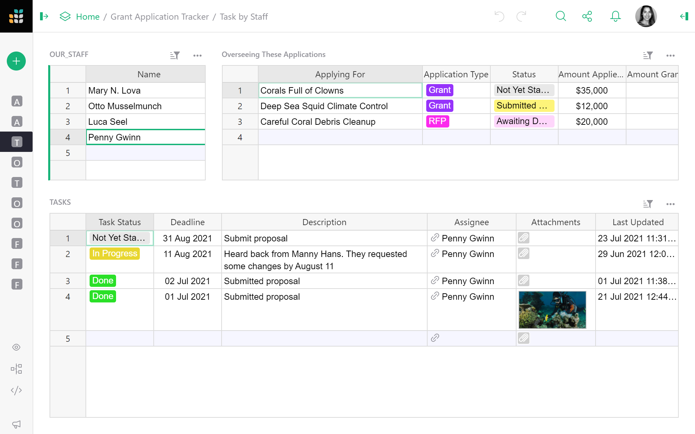

# July 2021 Newsletter

<table class="header" cellpadding="0" cellspacing="0" border="0"><tr>
  <td class="header-text">
    <table class="header-top"><tr>
      <td class="header-image">
        
      </td>
      <td class="header-top-text">
        
Grist for the Mill

        
July 2021
          &#8226; <a href="https://www.getgrist.com/">getgrist.com</a>

      </td>
    </tr></table>
    

      Welcome to our monthly newsletter of updates and tips for Grist users.
    

  </td>
</tr></table>

## What's New

### Colors!

Make your Grist document pop with color! Options in Choice and Choice List columns can now be
color coded. In addition to making your documents look great and fun, color choices make it easier
to scan and glean information quickly. [Read more.](../col-types.md#choice-columns)

### Google Sheets Integration

You can now easily import or export your data to and from Grist and Google Drive.
[Read more.](../imports.md#import-from-google-drive)

### Automatic User and Time Stamps

Want to know when a record was updated and by whom? It is now possible to create columns that stamp a user’s name or the time to a record when it is updated or created. Read more about [time stamps](../timestamps.md) and [authorship stamps](../authorship.md).

[We’ve also created a step-by-step video tutorial](../examples/2021-07-auto-stamps.md) that walks
you through how to create time and user stamp columns.

## New Resources

### Introducing the Grist Community Forum

We’ve launched a Grist Community Forum where you can quickly look up solutions, share project
ideas, provide feedback, suggest features, and stay up to date on the latest Grist features and
announcements.

[Visit the Forum](https://community.getgrist.com/){:target="\_blank"}
{: .grist-button}

### Visit our Product Roadmap

Want to know what we’re working on? Our product roadmap is now public! If you have a Github
account, we encourage you to leave comments on roadmap items. We love to hear from you.

[Visit the Roadmap](https://github.com/gristlabs/grist-core/projects/1){:target="\_blank"}
{: .grist-button}

## Quick Tips

- **Reference column best practices.** When creating a reference column it is best practice to
  choose a display column that is a unique identifier for the record. For example, for records of
  people, it could be full name or email.

    To show other data, such as department or birthday, pull it in using the formula
    `$[Reference Column Id].[Referenced Record’s Field]`, (for example `$Person.Department`). You
    may review how this formula works in our
    [reference column guide](../examples/2021-05-reference-columns.md).

- **Labeling hyperlinks with text.** In hyperlink columns, you can label a link with text by
  adding a label before the url: `[link label] url`. The brackets are not needed.

    

- **Using Search to Find a Card.** If you have a card widget on a page and quickly want to find
  the right card, you can use the search bar on the page to quickly bring the relevant card into
  view.

    

## Dig Deeper

### Easily Create Automatic User and Time Stamps

It is sometimes useful to know when a record was last updated or created, and by whom. Grist makes
it simple to create columns that stamp the time or a user’s name to a record when it is updated or
created.

[We’ve created a video tutorial](../examples/2021-07-auto-stamps.md) that walks
you through how to create time and user stamp columns in 3 easy steps.

[LEARN: User/Time Stamps](../examples/2021-07-auto-stamps.md)
{: .grist-button}

## New Template

### Grant Application and Funding Tracker

This template helps NGOs track grant applications that have been submitted to foundations to win
grant funding. The template also includes a funding overview which shows funding in the pipeline
and funding awarded, broken down by NGO program.

[Open Grant Tracker](https://templates.getgrist.com/sC5CAW41bVZU/Grant-Application-Tracker){:target="\_blank"}
{: .grist-button}

**Have questions, feedback, or need help?** Search our [Help Center](../index.md), [watch video
tutorials](https://www.youtube.com/channel/UCx0ioQrrC-bIrkmZ7ZULr0g/playlists), or contact
us at <support@getgrist.com>.
