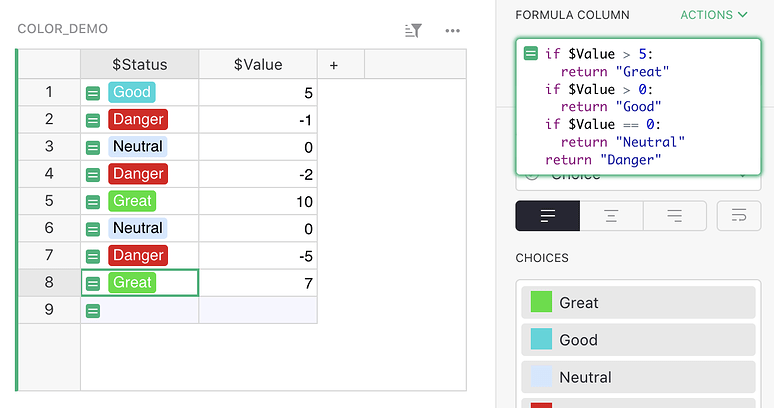
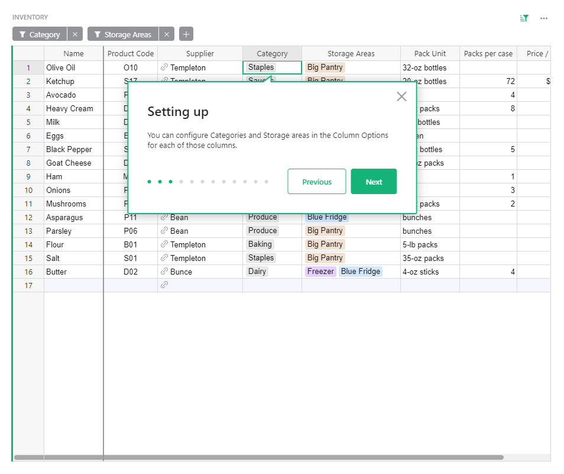
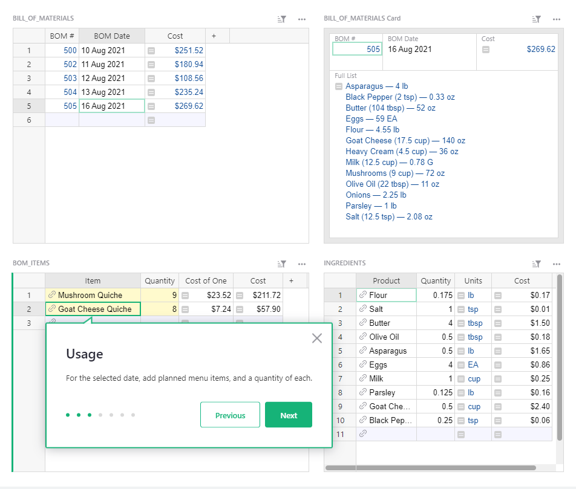
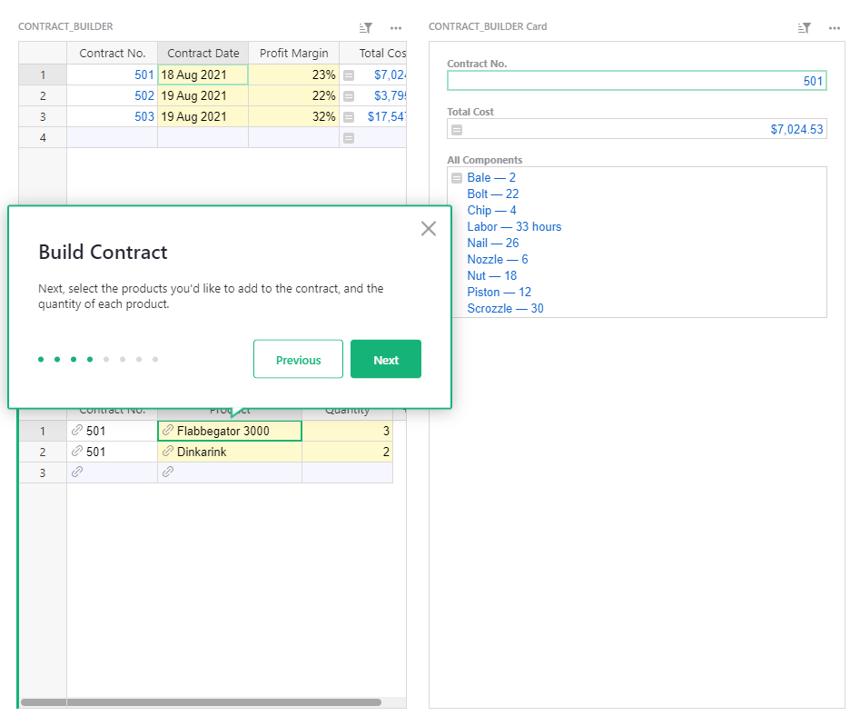

# August 2021 Newsletter

<table class="header" cellpadding="0" cellspacing="0" border="0"><tr>
  <td class="header-text">
    <table class="header-top"><tr>
      <td class="header-image">
        
      </td>
      <td class="header-top-text">
        
Grist for the Mill

        
August 2021
          &#8226; <a href="https://www.getgrist.com/">getgrist.com</a>

      </td>
    </tr></table>
    

      Welcome to our monthly newsletter of updates and tips for Grist users.
    

  </td>
</tr></table>

## What's New

### Reference Lists

It is now possible to relate a record in one table to multiple records in another table. Choose
the Reference List column type to establish a one to many relationship in your document. [Learn
more.](../col-refs.md#creating-a-new-reference-list-column)

### Embedding Grist

Have data you want to share on your website? You may now embed Grist pages as view-only data that
updates live. [Learn how.](../embedding.md)

### Pabbly Integration

You may now import data to Grist with Pabbly! [Read more on Pabbly’s website.](https://www.pabbly.com/connect/integrations/grist/)

### Row-based API

The Grist API is now more convenient with row-based (aka record-based) endpoints. [Learn more.](../api.md#tag/records)

### Edit Subdomain

Did you sign up for a team plan, but changed your mind on what subdomain name to use for your
site? You may now edit your subdomain from your billing page. Click on your profile icon in the
top-right to access your billing page.

## Formula Support

Need help with formulas? There’s a dedicated category in our [community
forum](https://community.getgrist.com/c/ask-for-help/formulas/) where you can find formulas for
common use cases, and ask for help.

[Visit the Forum](https://community.getgrist.com/c/ask-for-help/formulas/){:target="\_blank"}
{: .grist-button}

## Large Template Library

Finding the right template for your project just got easier. Click on
 Examples & Templates
(in the left-side panel of your personal or team site dashboard) to find a larger library of templates
to choose from.

[SEE ALL TEMPLATES](https://docs.getgrist.com/p/templates)
{: .grist-button}

## Quick Tips

* **Multiple Accounts.** You can sign in with multiple emails into Grist to easily switch between
  accounts. Click on your profile icon in the top-right, then select "Add Account".
* **Finding Duplicates.** Find duplicates using the formula:  
  `"DUP" if len(Products.lookupRecords(ProductCode=$ProductCode)) > 1 else ""`{: .formula}  
  For more help, [follow this guide.](https://community.getgrist.com/t/ensure-unique-values-or-detect-duplicates/76)
* **Color code conditional values.** Use a formula and colorful Choice column entries to flag records that need attention.
  [Follow our quick guide.](https://community.getgrist.com/t/colour-code-table-cells/58/5)

    

## New Templates

### Restaurant Inventory

Keep track of your restaurant inventory and supplier information, and create purchase orders right in Grist.

{:target="\_blank"}

[GO TO TEMPLATE](https://templates.getgrist.com/nc4N68DZ6MTe/Restaurant-Inventory){:target="\_blank"}
{: .grist-button .grist-button-tight}

### Restaurant Custom Orders

Build custom orders, calculate ingredient costs, and generate a bill of materials, all in one document.

{:target="\_blank"}

[GO TO TEMPLATE](https://templates.getgrist.com/e4gEm7dt4cgB/Restaurant-Custom-Orders){:target="\_blank"}
{: .grist-button .grist-button-tight}

### Custom Product Builder

Build custom products and production contracts that add up component costs and add your profit margin to the final cost.

{:target="\_blank"}

[GO TO TEMPLATE](https://templates.getgrist.com/gZmzYoGdS6b1/Custom-Product-Builder){:target="\_blank"}
{: .grist-button .grist-button-tight}

**Have questions, feedback, or need help?** Search our [Help Center](../index.md), [watch video
tutorials](https://www.youtube.com/channel/UCx0ioQrrC-bIrkmZ7ZULr0g/playlists), join our
[Community](https://community.getgrist.com), or contact us at <support@getgrist.com>.
