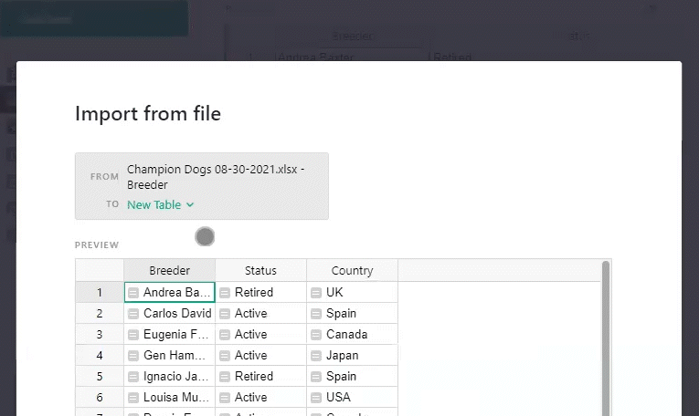
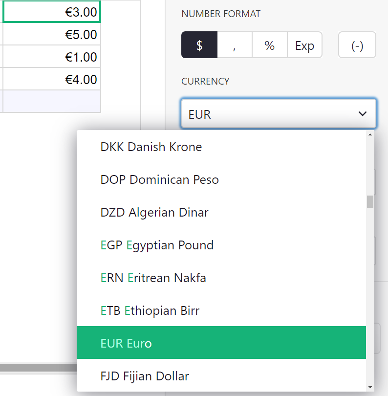
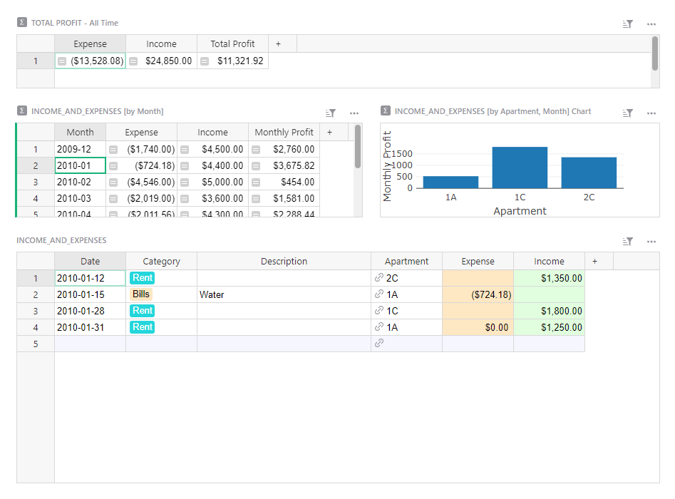
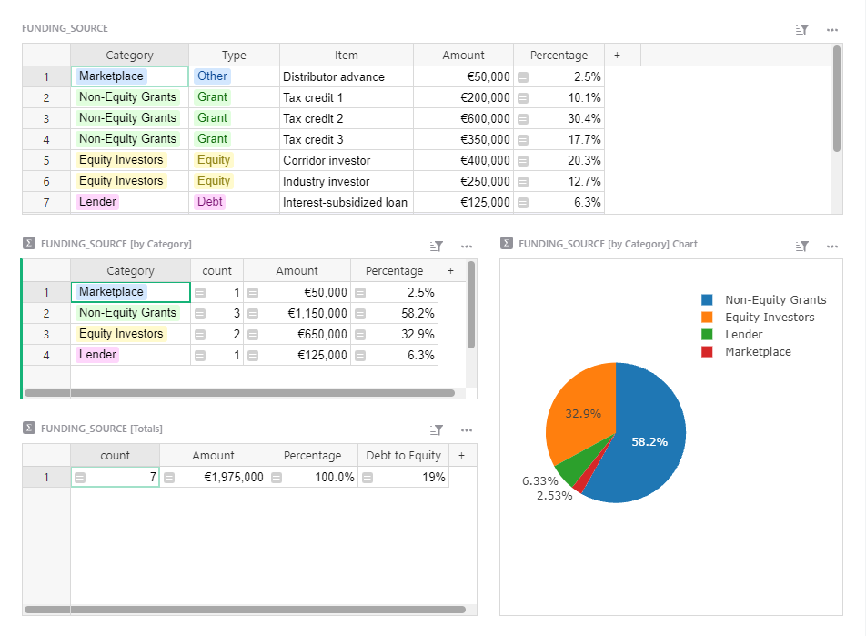
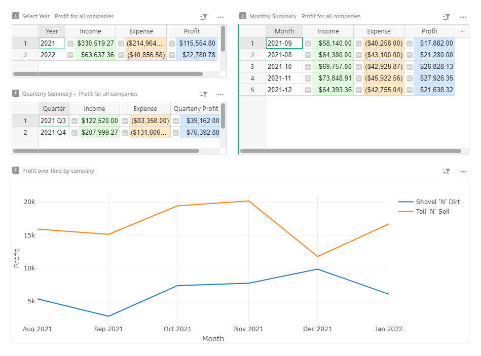
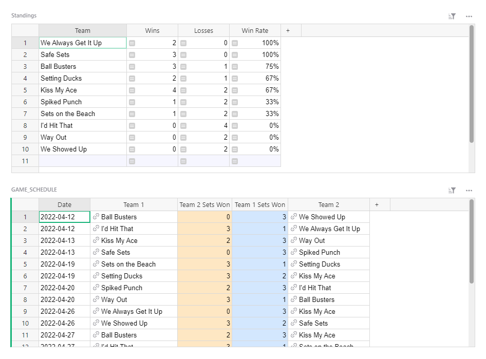
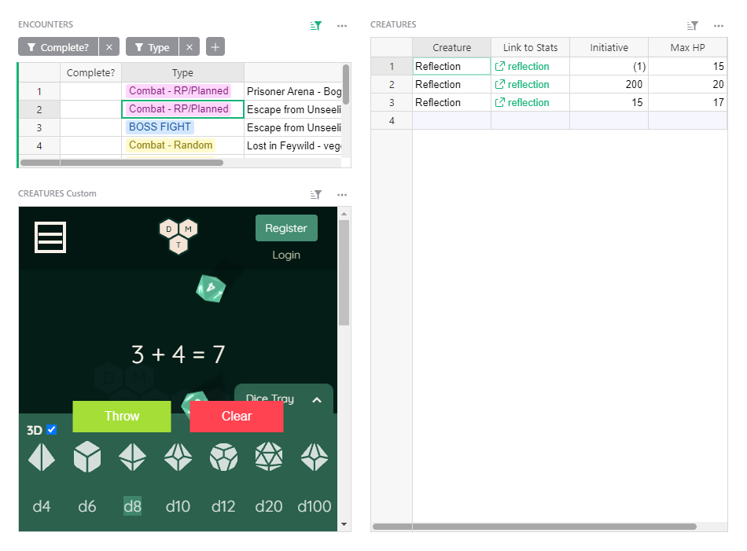

# September 2021 Newsletter

<table class="header" cellpadding="0" cellspacing="0" border="0"><tr>
  <td class="header-text">
    <table class="header-top"><tr>
      <td class="header-image">
        
      </td>
      <td class="header-top-text">
        
Grist for the Mill

        
September 2021
          &#8226; <a href="https://www.getgrist.com/">getgrist.com</a>

      </td>
    </tr></table>
    

      Welcome to our monthly newsletter of updates and tips for Grist users.
    

  </td>
</tr></table>

## What's New

### Improved Incremental Imports

You may now select a merge key when importing more data into an existing table.

### Integrately and KonnectzIT

In addition to Zapier and Pabbly Actions, you may now build integrations with Integrately and KonnectzIT. 🚀

Read more on [Integrately’s website](https://integrately.com/integrations/grist) and [KonnectzIT’s website](https://konnectzit.com/).

### International Currencies

When formatting numeric and integer columns, you may now choose from a list of global currencies. You can set the default currency in document settings. [Learn more about document settings.](https://support.getgrist.com/creating-doc/#document-settings)

**
{: .screenshot-half }

## Learning Grist

### Build with Grist Webinar

Join Grist experts on a live webinar to learn the tips and tricks that’ll help you become a Grist power creator. 💪

The webinar will go live on Monday October 18th at 3:00pm US Eastern Time (New York).

[SIGN UP FOR WEBINAR](https://www.getgrist.com/learn-grist-webinar/){:target="\_blank"}
{: .grist-button}

### Are you...Python curious?

There are many online resources for learning Python. One of Grist’s developers, Alex Hall, has a side project for learning Python called futurecoder. We recommend it!

[GO TO FUTURECODER](https://futurecoder.io/){:target="\_blank"}
{: .grist-button}

## Community Highlights

* **Extracting months and quarters from dates.** If you have a date column, you may want to [summarize those dates by month or quarter.](https://community.getgrist.com/t/recipe-for-getting-months-and-quarters-from-dates/) 

* **Embedding read-only Google Maps.** Learn how to [embed a Google Map into a Grist document.](https://community.getgrist.com/t/how-to-embed-google-map-as-an-iframe/)

* **Creating required fields.** It is possible to check if [required fields have been filled, or not.](https://community.getgrist.com/t/how-to-make-the-mandatory-field/)  

## Help spread the word?
If you’re interested in helping Grist grow, consider leaving a review on product review sites. Here’s  short list where your review could make a big impact. Thank you! 🙏

* [G2](https://www.g2.com/products/grist/)
* [Capterra](https://www.capterra.com/p/232821/Grist/)
* [TrustRadius](https://www.trustradius.com/products/grist/)

## New Templates

### Rental Management

Track tenants, leases, and income and expenses related to rental properties in one place.

{:target="\_blank"}

[GO TO TEMPLATE](https://templates.getgrist.com/5iMYwmESm33J/Rental-Management){:target="\_blank"}
{: .grist-button .grist-button-tight}

### Corporate Funding

Easily plan and summarize a company's funding structure. 

{:target="\_blank"}

[GO TO TEMPLATE](https://templates.getgrist.com/qprycQa2TVwa/Corporate-Funding){:target="\_blank"}
{: .grist-button .grist-button-tight}

### General Ledger

Build a general ledger of income and expenses related to multiple companies, and summarize data in helpful dashboards.

{:target="\_blank"}

[GO TO TEMPLATE](https://templates.getgrist.com/2YwYBWpREY2a/General-Ledger){:target="\_blank"}
{: .grist-button .grist-button-tight}

### Sports League Standings

Track a sports leagues' matches and automatically generate the season's standings.

{:target="\_blank"}

[GO TO TEMPLATE](https://templates.getgrist.com/1xJAp2uxM7tF/Sports-League-Standings){:target="\_blank"}
{: .grist-button .grist-button-tight}

### D&D Combat Tracker

Dungeon masters, use Grist to easily plan encounters, calculate key figures, and keep track of combat. (Dice roller included.)

{:target="\_blank"}

[GO TO TEMPLATE](https://templates.getgrist.com/3r2i6U4zhQLb/DD-Encounter-Tracker){:target="\_blank"}
{: .grist-button .grist-button-tight}

**Have questions, feedback, or need help?** Search our [Help Center](../index.md), [watch video
tutorials](https://www.youtube.com/channel/UCx0ioQrrC-bIrkmZ7ZULr0g/playlists), join our
[Community](https://community.getgrist.com), or contact us at <support@getgrist.com>.
