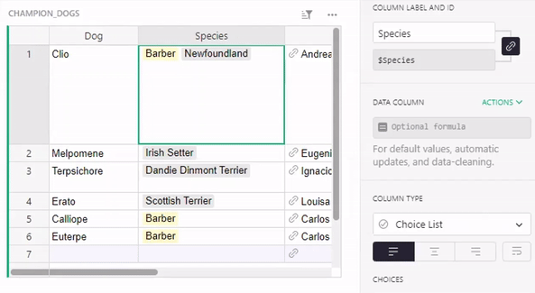
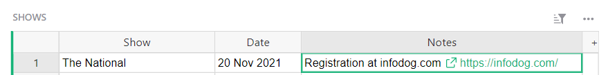
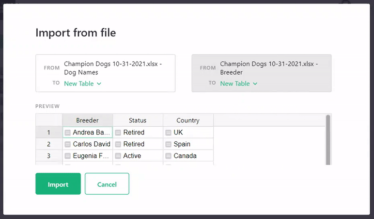
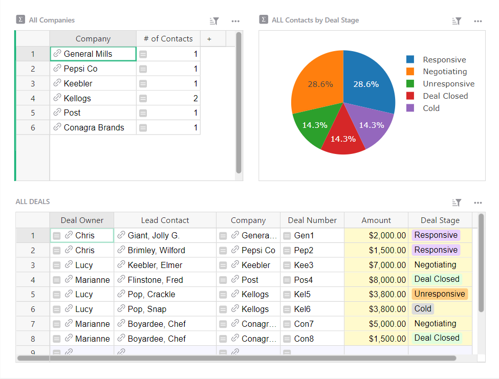
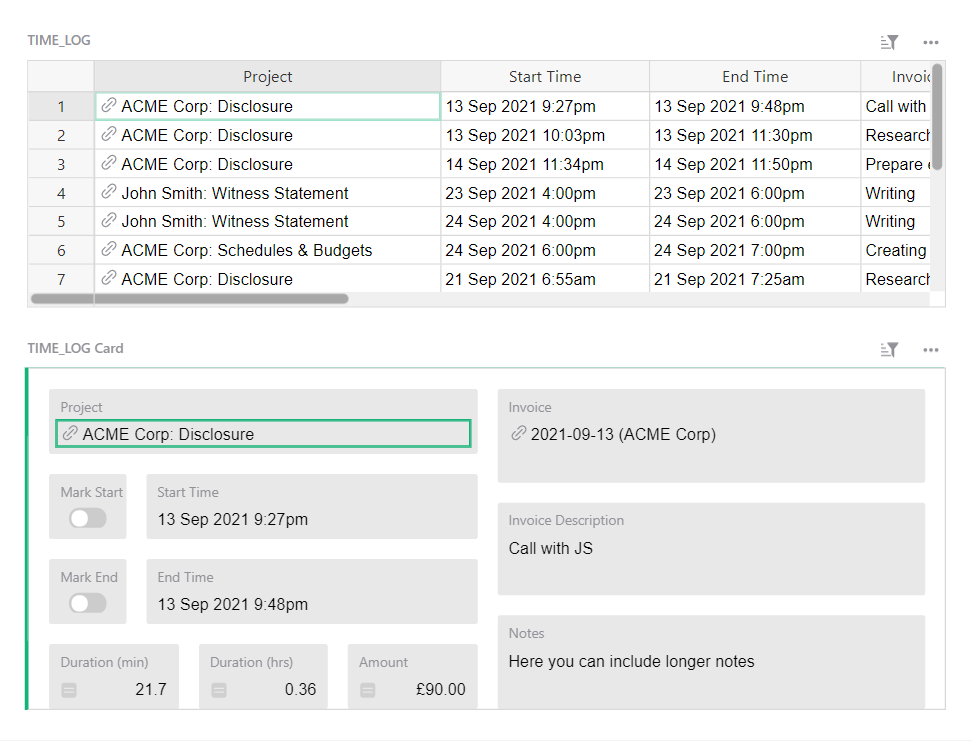
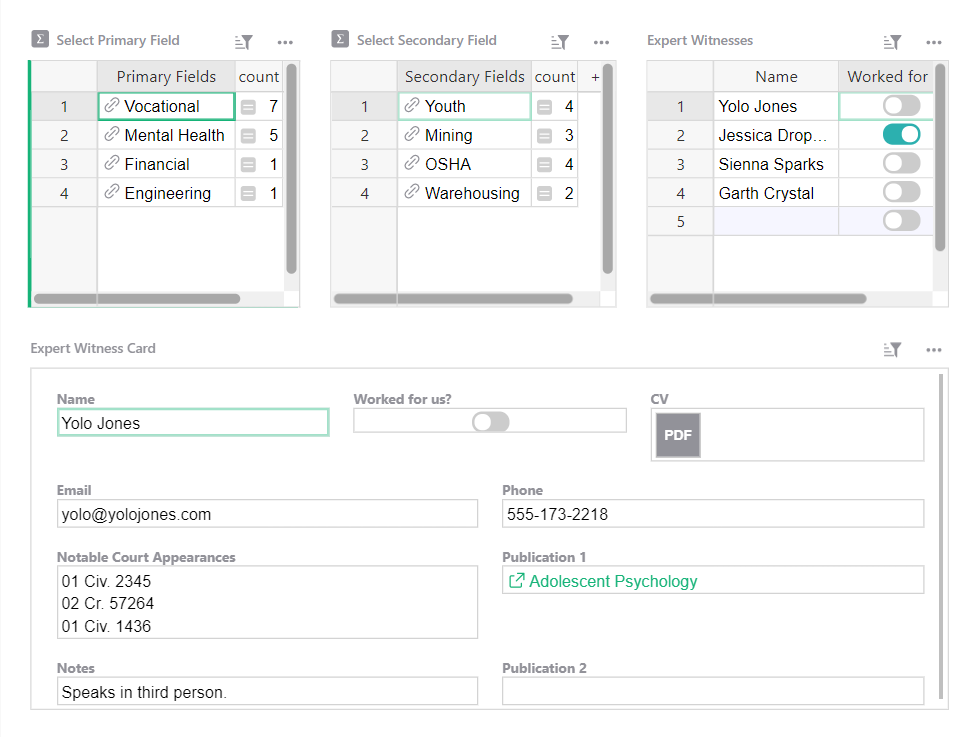
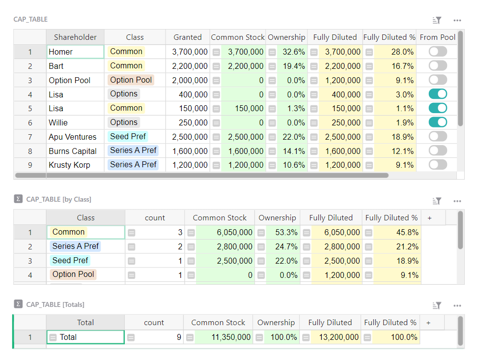
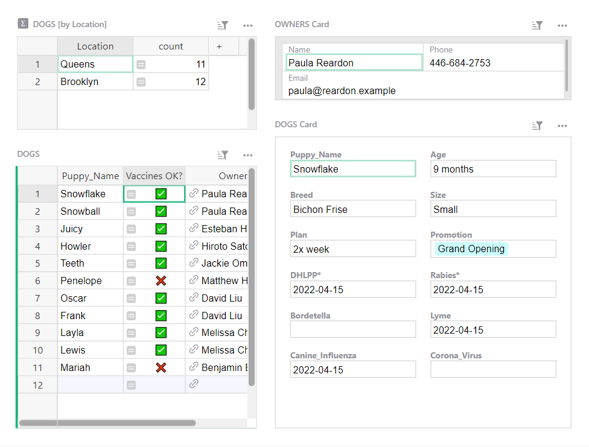
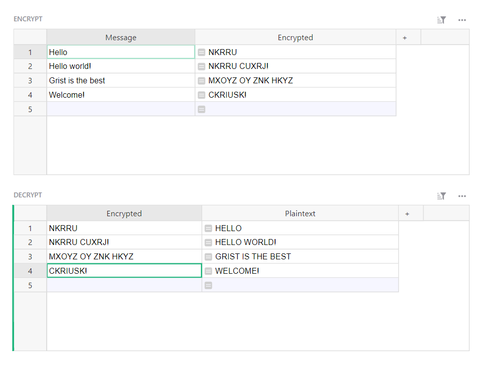

# October 2021 Newsletter

<table class="header" cellpadding="0" cellspacing="0" border="0"><tr>
  <td class="header-text">
    <table class="header-top"><tr>
      <td class="header-image">
        
      </td>
      <td class="header-top-text">
        
Grist for the Mill

        
October 2021
          &#8226; <a href="https://www.getgrist.com/">getgrist.com</a>

      </td>
    </tr></table>
    

      Welcome to our monthly newsletter of updates and tips for Grist users.
    

  </td>
</tr></table>

## What's New

### Editing Choices

You can now edit existing choice values and apply those edits to your data automatically!

### Inline Links

Text fields now automatically convert URLs into hyperlinks, including in cells that contain both plaintext and URLs.

### Preview Changes in Incremental Imports

When importing additional data to an existing table, and using a merge key to match duplicate records, you can now preview changes to your data before committing to the import. [Learn more](../imports.md#updating-existing-records).

## Learning Grist

### Build with Grist Webinar

**Sign up for November’s Webinar**

Join Grist experts on a live webinar to learn Grist best practices. Half the webinar is dedicated to a live Q&A where you can get answers to your questions. 💡

The webinar will go live on Thursday, November 18th at 12:00pm US Eastern Time (New York).

[SIGN UP FOR WEBINAR](https://www.getgrist.com/learn-grist-webinar/){:target="\_blank"}
{: .grist-button}

**Watch October’s Webinar Recording**

On October 18th we held our first Build with Grist webinar, focused on best practices to get the most out of Grist. 

Grist CEO Dmitry Sagalovskiy shared tips on adapting data from a spreadsheet to a database using the DRY principle, and building dashboards using linked widgets. 

Other topics covered include finding the most recent value from a list of historical records, filtering by several fields, understanding the lookup function and reference lookups, and more.

[WATCH RECORDING](https://www.youtube.com/watch?v=PpEs2S_0bGE){:target="\_blank"}
{: .grist-button}

### Access Rules Video

*Limiting access for team members*

Access rules are a beta feature of Grist which make it possible to limit access to parts of your data based on custom rules. The rules can be very granular and grant view or edit permissions based on a number of variables.

The most common use of access rules is for teams who want to limit which records team members can see. For example, it is often desirable for sales representatives to only see records related to their owns sales, while their manager can see all records. We cover how to set up those rules in a 5 minute video.

[WATCH VIDEO](https://youtu.be/ZL3rHdAZzfY){:target="\_blank"}
{: .grist-button}

## Community Highlights

* **Overtime Calculator.** Automatically calculate and keep track of [weekly overtime rates.](https://community.getgrist.com/t/over-time-calculator/){:target="\_blank"} 

* **Calculating terms.** Suppose you sell memberships that last 12 months and want to automatically calculate membership expiration dates. Learn how to [calculate future dates.](https://community.getgrist.com/t/what-formula-do-i-use-to-calculate-a-12-month-term-eg-enter-date-into-cell-1-and-then-cell-2-calculates-a-date-12-months-on/){:target="\_blank"}

## New Templates

### Account-based Sales Team

Track your sales team’s accounts, contacts, and deals. Access rules limit sales reps access to viewing and editing only their deals, contacts, and accounts.

{:target="\_blank"}

[GO TO TEMPLATE](https://templates.getgrist.com/38Dz6nMtzvwC/Account-based-Sales-Team){:target="\_blank"}
{: .grist-button .grist-button-tight}

### Time Tracking & Invoicing

Quickly record time spent on projects, summarize it, and create invoices.

{:target="\_blank"}

[GO TO TEMPLATE](https://templates.getgrist.com/bReAxyLmzmEQ/Tracking-Time-Invoicing){:target="\_blank"}
{: .grist-button .grist-button-tight}

### Expert Witness Database

Create a simple database of expert witnesses that may be called to testify on the stand.

{:target="\_blank"}

[GO TO TEMPLATE](https://templates.getgrist.com/pwGTfus26ck8/Expert-Witness-Database/){:target="\_blank"}
{: .grist-button .grist-button-tight}

### Cap Table

Keep track of shareholders, issued shares and options, and percentage ownership.

{:target="\_blank"}

[GO TO TEMPLATE](https://templates.getgrist.com/iXggjrCPHut9/Cap-Table){:target="\_blank"}
{: .grist-button .grist-button-tight}

### Doggie Daycare

Manage your daycare business in one place.

{:target="\_blank"}

[GO TO TEMPLATE](https://templates.getgrist.com/vAcfEKLQf3YF/Doggie-Daycare/){:target="\_blank"}
{: .grist-button .grist-button-tight}

### Ceasar Cipher

Roman Emperor Julius Ceasar used the Ceasar Cipher to encrypt messages. Write a message to encrypt it with this ancient method.

{:target="\_blank"}

[GO TO TEMPLATE](https://templates.getgrist.com/n2se5cBJty1G/Caesar-Cipher-Fun/){:target="\_blank"}
{: .grist-button .grist-button-tight}

## Help spread the word?
If you’re interested in helping Grist grow, consider leaving a review on product review sites. Here’s  short list where your review could make a big impact. Thank you! 🙏

* [G2](https://www.g2.com/products/grist/)
* [Capterra](https://www.capterra.com/p/232821/Grist/)
* [TrustRadius](https://www.trustradius.com/products/grist/)

**Have questions, feedback, or need help?** Search our [Help Center](../index.md), [watch video
tutorials](https://www.youtube.com/channel/UCx0ioQrrC-bIrkmZ7ZULr0g/playlists), join our
[Community](https://community.getgrist.com), or contact us at <support@getgrist.com>.
