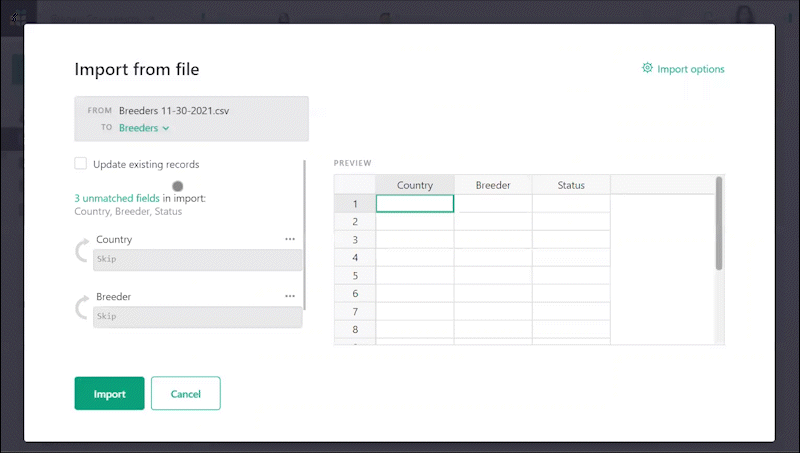
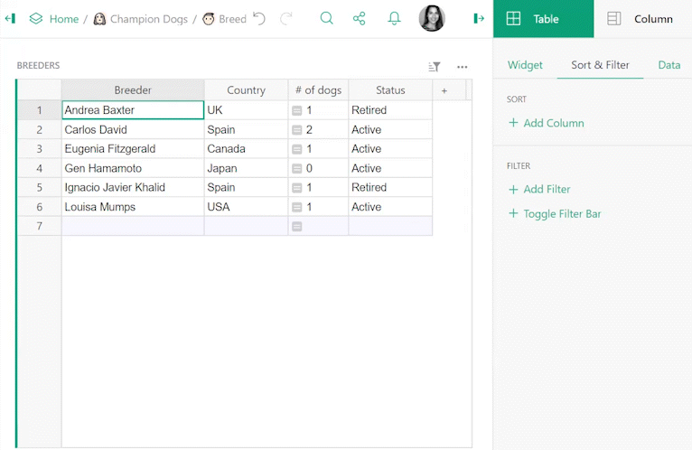
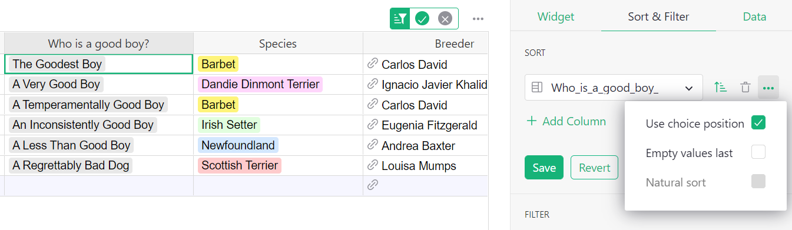
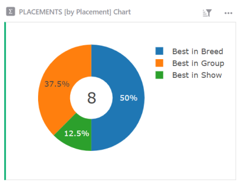
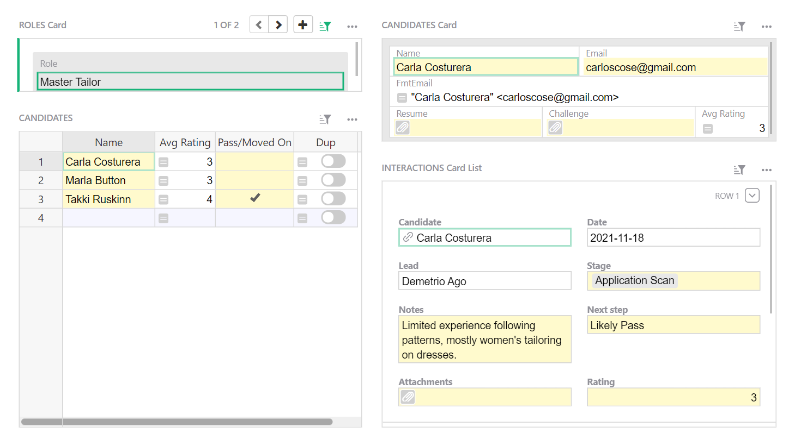
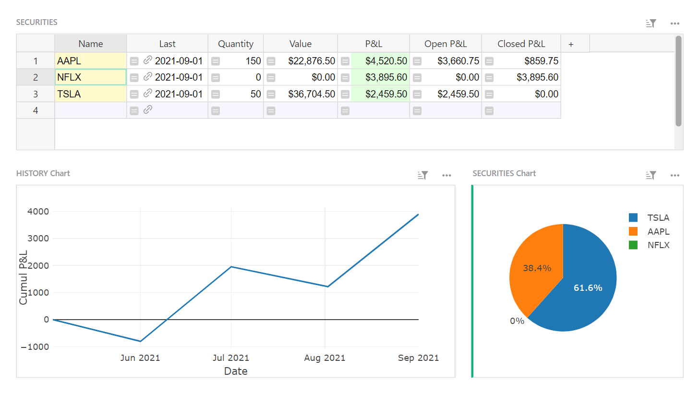
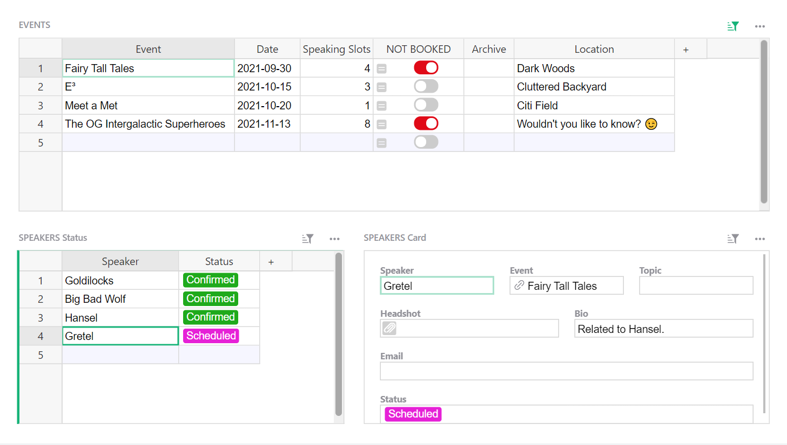

# November 2021 Newsletter

<table class="header" cellpadding="0" cellspacing="0" border="0"><tr>
  <td class="header-text">
    <table class="header-top"><tr>
      <td class="header-image">
        
      </td>
      <td class="header-top-text">
        
Grist for the Mill

        
November 2021
          &#8226; <a href="https://www.getgrist.com/">getgrist.com</a>

      </td>
    </tr></table>
    

      Welcome to our monthly newsletter of updates and tips for Grist users.
    

  </td>
</tr></table>

## What's New

### Import Column Mapping

When importing additional data to an existing table in Grist, you can now map columns in your file to columns in the Grist table. [Learn more.](../imports.md#importing-more-data)

### Filter on Hidden Columns

It is now possible to filter tables based on data in hidden columns. 👻

### More Sorting Options

There are now more sorting options available, including natural sort. Learn more about [additional sorting options.](../search-sort-filter.md#advance-sorting-options)

Note that `Choice` columns have a unique sorting option based on choice position in the choice configuration.

### Donut Chart

Grist now supports donut charts!

### Python 3.9

Python 3.9 is the new default for new documents. Compared to previous default (2.7) it has some useful packages such as [mathematical statistics functions.](https://docs.python.org/3.9/library/statistics.html) Learn more about [supported Python versions.](../python.md#supported-python-versions)

## #1 Product of the Day on Product Hunt!

Grist achieved Product of the Day on Product Hunt! 🎉🚀🐱‍🚀 Thank you for showing your support! Many Grist creators took time out of their day to leave kind reviews and words of encouragement. Thank you! 🙏

## Learning Grist

### Build with Grist Webinar

Join Grist experts on a live webinar to learn Grist best practices. 

Wednesday December 15th at 3:00pm US Eastern Time (New York).

[SIGN UP FOR DECEMBER'S WEBINAR](https://www.getgrist.com/learn-grist-webinar/){:target="\_blank"}
{: .grist-button}

During November’s webinar, Grist VP of Product Anais Concepcion discussed the difference between typical formulas and trigger formulas, and when to use which. She also shared some of her favorite formulas and dove deep into how to use reference columns in lookup formulas. 

[WATCH NOVEMBER'S RECORDING](https://www.youtube.com/watch?v=0qVDPZd2w9I){:target="\_blank"}
{: .grist-button}

### Video: Finding Duplicate Values with a Formula

Formulas are a great way to find and flag duplicate values in a column. This video breaks down a formula that finds duplicates to deepen your understanding of formulas and Grist.

[WATCH VIDEO](https://www.youtube.com/watch?v=7lNz2Mw7yyw){:target="\_blank"}
{: .grist-button}

### Community Highlights

* **Split text string into a list.** If you import a long string of text, such as keywords separated by commas, it would be useful to break that string into a list of values that may be filtered and grouped in a Choice List column. [Learn how.](https://community.getgrist.com/t/string-split-text-to-columns-delimiter/){:target="\_blank"}

* **Identifying values that are not in another table.** In the video above, the formula finds duplicates (or unique values) in the same column. Learn [how to compare values across tables.](https://community.getgrist.com/t/identifying-values-that-are-not-in-another-table/){:target="\_blank"}

## New Templates

### Recruiting

Collaboratively track job applicants, and attach resume and interview notes.

{:target="\_blank"}

[GO TO TEMPLATE](https://templates.getgrist.com/d7NBjwRKqrzp/Recruiting){:target="\_blank"}
{: .grist-button .grist-button-tight}

### Portfolio Performance

Track your portfolio value and performance, including closed and open P&L.

{:target="\_blank"}

[GO TO TEMPLATE](https://templates.getgrist.com/9B3BFbo3km1w/Portfolio-Performance){:target="\_blank"}
{: .grist-button .grist-button-tight}

### Event Speakers

Track speakers booked for events, and flag events that are not yet fully booked.

{:target="\_blank"}

[GO TO TEMPLATE](https://templates.getgrist.com/iCJe3aXg7Ha4/Event-Speakers){:target="\_blank"}
{: .grist-button .grist-button-tight}

## Help spread the word?
If you’re interested in helping Grist grow, consider leaving a review on product review sites. Here’s  short list where your review could make a big impact. Thank you! 🙏

* [G2](https://www.g2.com/products/grist/)
* [Capterra](https://www.capterra.com/p/232821/Grist/)
* [TrustRadius](https://www.trustradius.com/products/grist/)

**Have questions, feedback, or need help?** Search our [Help Center](../index.md), [watch video
tutorials](https://www.youtube.com/channel/UCx0ioQrrC-bIrkmZ7ZULr0g/playlists), share ideas in our
[Community](https://community.getgrist.com), or contact us at <support@getgrist.com>.