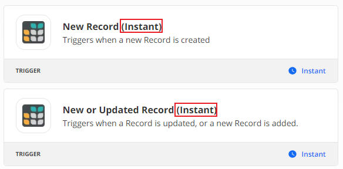
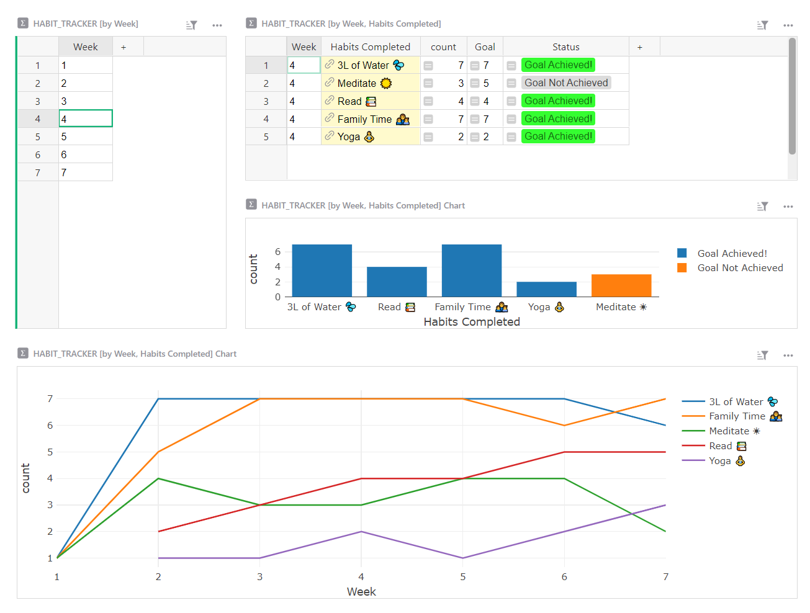
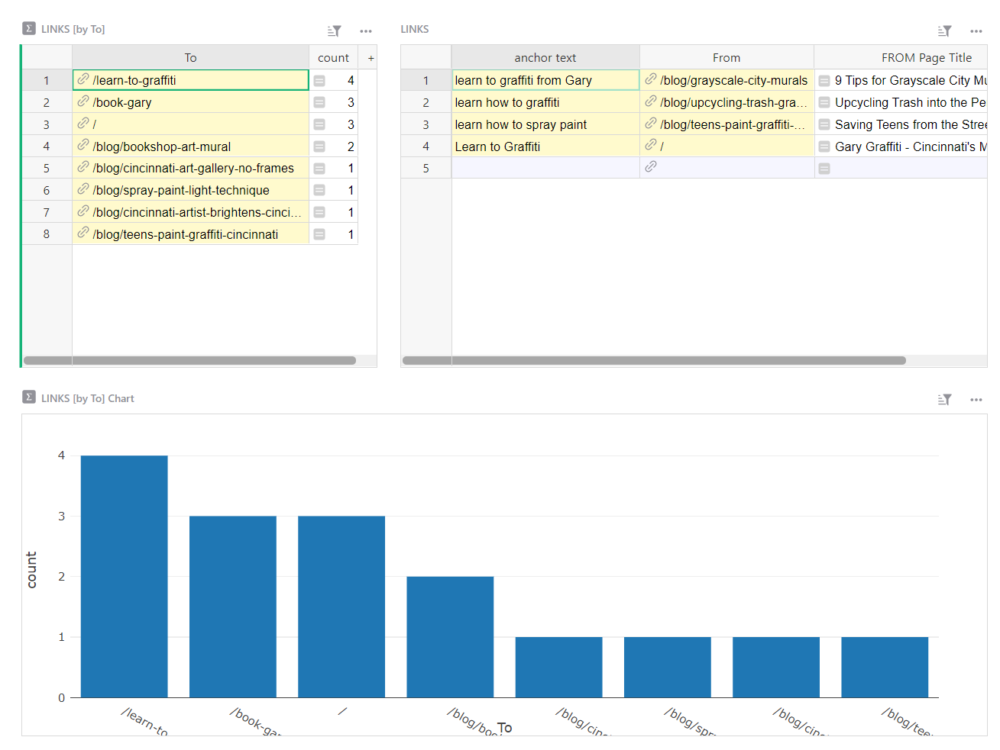
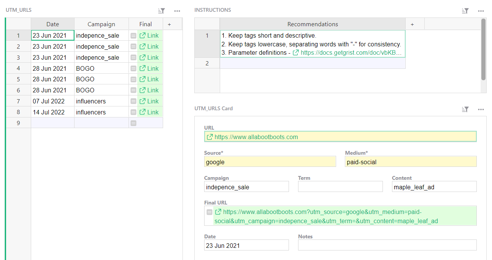
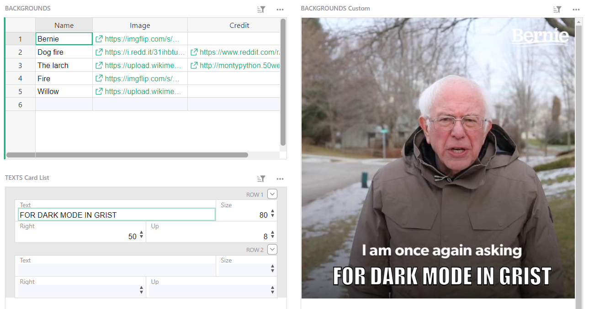

# December 2021 Newsletter

<table class="header" cellpadding="0" cellspacing="0" border="0"><tr>
  <td class="header-text">
    <table class="header-top"><tr>
      <td class="header-image">
        
      </td>
      <td class="header-top-text">
        
Grist for the Mill

        
December 2021
          &#8226; <a href="https://www.getgrist.com/">getgrist.com</a>

      </td>
    </tr></table>
    

      Welcome to our monthly newsletter of updates and tips for Grist users.
    

  </td>
</tr></table>

## What's New

### Zapier Instant Trigger

Grist’s Zapier integrations have gotten faster! Look for Zapier instant triggers when building your zaps. [Learn more about triggers.](../integrators.md#example-sending-email-alerts)

## Learning Grist

### Webinar: Build Highly Productive Layouts

Learn how to go from tables to application-like layouts. We’ll share tips on how to design for efficient workflows and data visualization. 

Wednesday January 19th at 3:00pm US Eastern Time.

[SIGN UP FOR JANUARY'S WEBINAR](https://www.getgrist.com/learn-grist-webinar/){:target="\_blank"}
{: .grist-button}

Our December's webinar addressed how to import and summarize data in Grist. Dmitry shows how to create a Grist structure that pulls insights from your data with summary tables, and then import additional data to the existing structure.

[WATCH DECEMBER'S RECORDING](https://www.youtube.com/watch?v=vAXODeSKnvM){:target="\_blank"}
{: .grist-button}

### Video: Checking Required Fields

Sometimes, certain fields are required, such as the email column of a contacts table. Learn how to use a formula to check if required fields are filled, and modify other formulas to only evaluate records that meet requirements.

[WATCH VIDEO](https://www.youtube.com/watch?v=0-S5g-HFfTk){:target="\_blank"}
{: .grist-button}

### Community Highlights

* **Create dependent sub-categories.** Dependent sub-categories can be useful for organizing data, e.g. vegetables > onion. [Learn how to set dependent sub-categories.](https://community.getgrist.com/t/how-to-create-dependent-sub-categories/414/10){:target="\_blank"}

* **How to resolve errors due to empty cells.** Formulas apply to all rows within a column. Thus when a row is empty, you’ll get an error. It’s correct but unsightly. [Here’s how to address it.](https://community.getgrist.com/t/typeerror-how-to-resolve-errors-in-a-formula-column-due-to-empty-cells/){:target="\_blank"}

* **Keeping a log of events.** Sometime it’s useful to keep a time-stamped log of events, such as records’ status changes. [Learn how to create one,](https://community.getgrist.com/t/keeping-a-log-of-events/467/5){:target="\_blank"} with a video explanation embedded in the Grist document.

## New Templates

### Habit Tracker

Set yourself up for success with your New Year resolutions! Build better habits with this simple weekly habit and progress tracker.

{:target="\_blank"}

[GO TO TEMPLATE](https://templates.getgrist.com/1BR9vm6GPTGX/Habit-Tracker){:target="\_blank"}
{: .grist-button .grist-button-tight}

### Internal Links Tracker for SEO

Optimize your SEO with an internal links tracker and simple auditing tool to find orphaned pages and most linked-to pages.

{:target="\_blank"}

[GO TO TEMPLATE](https://templates.getgrist.com/j9ZH7rPGafbH~9Hi9rVZ8yrvAFLkEgJt5ut~26/Internal-Links-Tracker-for-SEO){:target="\_blank"}
{: .grist-button .grist-button-tight}

### UTM Link Builder

Easily build and keep track of your marketing campaign’s UTM parameters.

{:target="\_blank"}

[GO TO TEMPLATE](https://templates.getgrist.com/7ukkYDiNCYKw/UTM-Link-Builder){:target="\_blank"}
{: .grist-button .grist-button-tight}

### Meme Generator

Build memes right in Grist!

{:target="\_blank"}

[GO TO TEMPLATE](https://templates.getgrist.com/gtzQwTXkgzFG/Meme-Generator){:target="\_blank"}
{: .grist-button .grist-button-tight}

## Help spread the word?
If you’re interested in helping Grist grow, consider leaving a review on product review sites. Here’s  short list where your review could make a big impact. Thank you! 🙏

* [G2](https://www.g2.com/products/grist/)
* [Capterra](https://www.capterra.com/p/232821/Grist/)
* [TrustRadius](https://www.trustradius.com/products/grist/)

**Have questions, feedback, or need help?** Search our [Help Center](../index.md), [watch video
tutorials](https://www.youtube.com/channel/UCx0ioQrrC-bIrkmZ7ZULr0g/playlists), share ideas in our
[Community](https://community.getgrist.com), or contact us at <support@getgrist.com>.