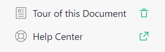
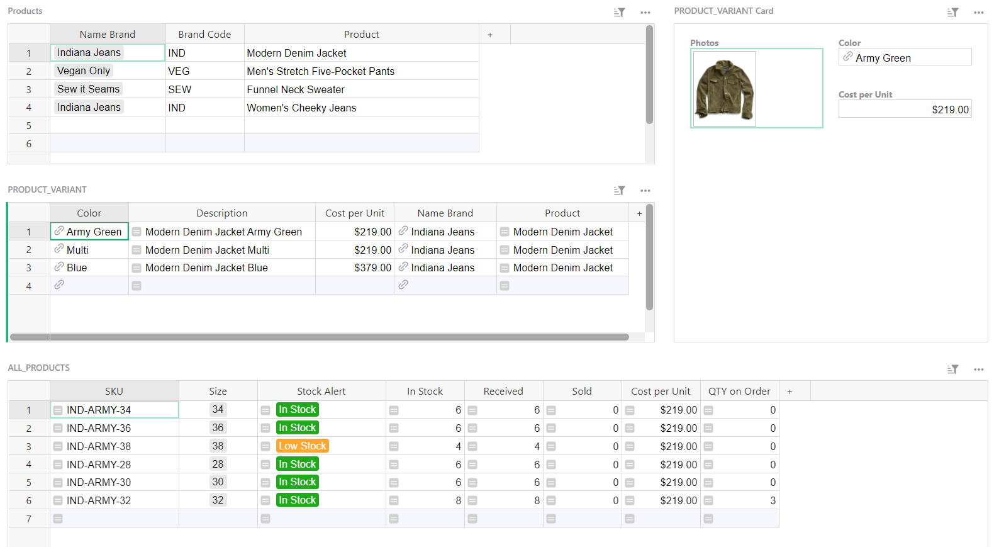
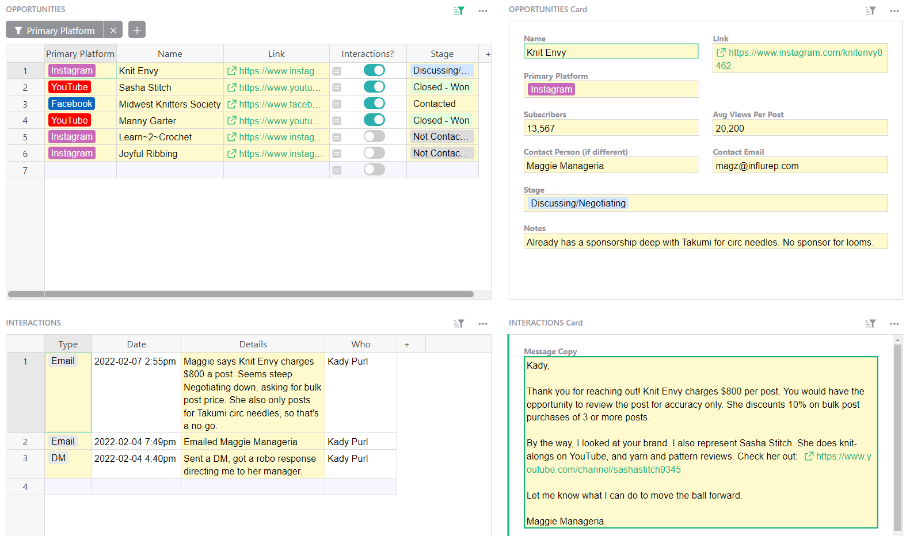
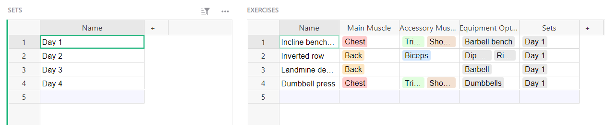
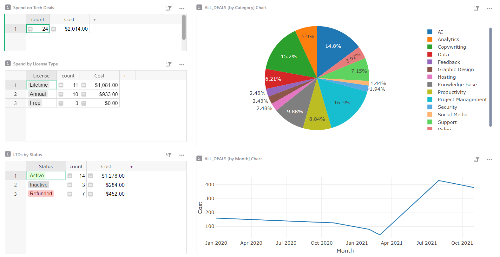

# January 2022 Newsletter

<table class="header" cellpadding="0" cellspacing="0" border="0"><tr>
  <td class="header-text">
    <table class="header-top"><tr>
      <td class="header-image">
        
      </td>
      <td class="header-top-text">
        
Grist for the Mill

        
January 2022
          &#8226; <a href="https://www.getgrist.com/">getgrist.com</a>

      </td>
    </tr></table>
    

      Welcome to our monthly newsletter of updates and tips for Grist users.
    

  </td>
</tr></table>

## What's New

### Launch and Delete Document Tours

Several templates have document tours that explain the template’s workflow. To relaunch the tour, click on “Tour of this Document” near the bottom of the left panel. To delete the document tour from your copy of a template, click the little trash icon next to “Tour of this Document.”

## Learning Grist

### Webinar: Column Types and Version Control

Work like a Grist expert! Deepen your understanding of column types, backups, and working copies of documents.

**Wednesday February 16th at 3:00pm US Eastern Time.**

[SIGN UP FOR FEBRUARY'S WEBINAR](https://www.getgrist.com/learn-grist-webinar/){:target="\_blank"}
{: .grist-button}

On January’s webinar, Natalie walked through how to build productive layouts in Grist. She covered same-record and reference-record linking, card views, sorting and filtering, summary tables, and simple charts.

[WATCH JANUARY'S RECORDING](https://www.youtube.com/watch?v=QZnKhtqJR0c){:target="\_blank"}
{: .grist-button}

### Community Highlights

* **Pull up Gmail history for a particular contact.** If you store contacts in Grist, and use Gmail to email them, there is a simple way to create a formula that will [open Gmail to a list of conversations with that contact.](https://community.getgrist.com/t/pull-up-gmail-history-for-a-particular-contact/){:target="\_blank"}

* **Toggle a switch with a condition.** Learn how to use a conditional formula in a toggle column so that the [toggle switches on or off based on the value of data in other columns.](https://community.getgrist.com/t/toggle-a-switch-with-a-condition/){:target="\_blank"}

* **Putting longer text in a card.** Sometimes long text makes a row too tall and unsightly. It may be better to show long text in its own card and use same-record linking to select the card. [Learn how.](https://community.getgrist.com/t/dealing-with-larger-text-blocks/484){:target="\_blank"}

## New Templates

### Inventory Manager

Manage your inventory, and track incoming and outgoing orders.

{:target="\_blank"}

[GO TO TEMPLATE](https://templates.getgrist.com/sXsBGDTKau1F/Inventory-Manager){:target="\_blank"}
{: .grist-button .grist-button-tight}

### Influencer Outreach

Keep track of interactions and progress in your influencer marketing campaigns.

{:target="\_blank"}

[GO TO TEMPLATE](https://templates.getgrist.com/qPxe3srL7H28/Influencer-Outreach){:target="\_blank"}
{: .grist-button .grist-button-tight}

### Exercise Planner

Build workout plans in Grist, and quickly pull them up at the gym while you're pumping iron. 💪

{:target="\_blank"}

[GO TO TEMPLATE](https://templates.getgrist.com/gJ1Szp21g5wr/Exercise-Planner/){:target="\_blank"}
{: .grist-button .grist-button-tight}

### Software Deals Tracker

If you're always excited to try the latest SaaS products, then you've probably bought many lifetime and annual deals. Track your deals and monitor upcoming expirations with this template.

{:target="\_blank"}

[GO TO TEMPLATE](https://templates.getgrist.com/viyGsuqvNF1D/Software-Deals-Tracker/){:target="\_blank"}
{: .grist-button .grist-button-tight}

## Help spread the word?
If you’re interested in helping Grist grow, consider leaving a review on product review sites. Here’s  short list where your review could make a big impact. Thank you! 🙏

* [G2](https://www.g2.com/products/grist/)
* [Capterra](https://www.capterra.com/p/232821/Grist/)
* [TrustRadius](https://www.trustradius.com/products/grist/)

## We are here to support you

**Have questions, feedback, or need help?** Search our [Help Center](../index.md), [watch video
tutorials](https://www.youtube.com/channel/UCx0ioQrrC-bIrkmZ7ZULr0g/playlists), share ideas in our
[Community](https://community.getgrist.com), or contact us at <support@getgrist.com>.
