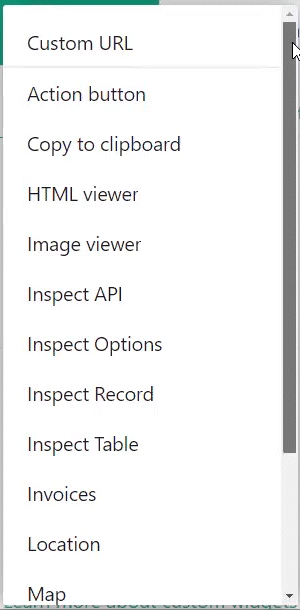
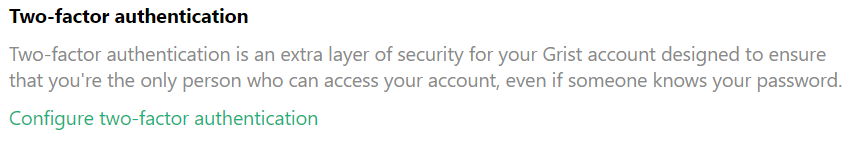
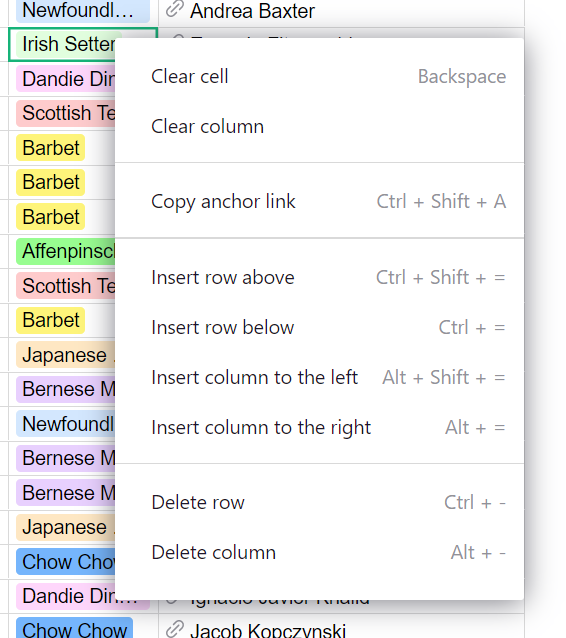
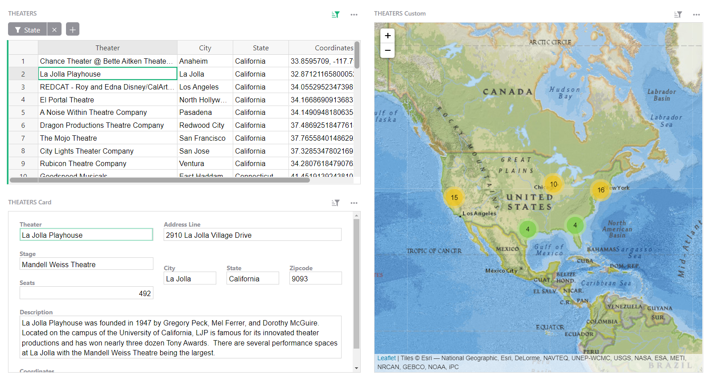
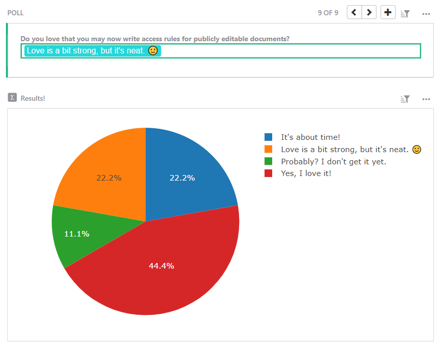
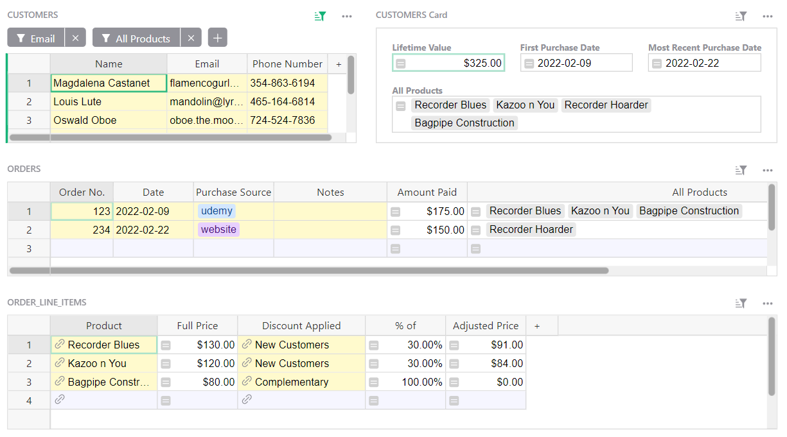
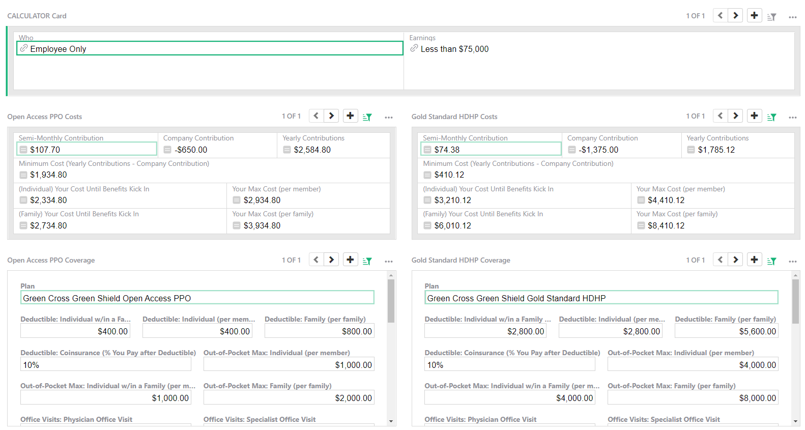

# February 2022 Newsletter

<table class="header" cellpadding="0" cellspacing="0" border="0"><tr>
  <td class="header-text">
    <table class="header-top"><tr>
      <td class="header-image">
        
      </td>
      <td class="header-top-text">
        
Grist for the Mill

        
February 2022
          &#8226; <a href="https://www.getgrist.com/">getgrist.com</a>

      </td>
    </tr></table>
    

      Welcome to our monthly newsletter of updates and tips for Grist users.
    

  </td>
</tr></table>

## What's New

### Custom Widgets Menu

Adding custom widgets just got easier! Select from a dropdown of premade widgets that are easily configurable in the creator panel. Custom widgets include

* Markdown editor
* Action button
* View image from URL
* Interactive map
* Invoices
* Print labels
* API inspector

...and more!

### Access Rules for Anonymous Users

Granular access rules may now restrict publicly-shared, editable documents. A new user attribute, user.SessionID, makes it possible to limit which data visitors to your document may see or edit. This opens up new use cases, such as [simple polling](https://templates.getgrist.com/jd234iH1zDsL/Simple-Poll){:target="\_blank"} and [community-moderated crowdsourced lists](https://templates.getgrist.com/dKztiPYamcCp/Crowdsourced-List/p/1){:target="\_blank"}. 

[TAKE OUR POLL](https://templates.getgrist.com/jd234iH1zDsL/Simple-Poll){:target="\_blank"}
{: .grist-button}

### Two Factor Authentication

Grist now supports two factor authentication for email + password logins. Navigate to your [profile settings](https://docs.getgrist.com/account){:target="\_blank"} to configure two-factor authentication with either text messages, or an authenticator app.

### Cell Context Menu

Right-clicking on any cell now opens a menu that makes editing data in Grist more convenient. 

## Learning Grist

### Webinar: Granular Access Rules

Learn how to create access rules that determine who can see which columns, tables, or rows of your data.

**Wednesday March 16th at 3:00pm US Eastern Time.**

[SIGN UP FOR MARCH'S WEBINAR](https://www.getgrist.com/learn-grist-webinar/){:target="\_blank"}
{: .grist-button}

On February’s webinar, Anais walked through column types and formatting, automatic backups, and how to work on forks of your document.

[WATCH FEBRUARY'S RECORDING](https://www.youtube.com/watch?v=bOx2ONlwkvY){:target="\_blank"}
{: .grist-button}

### Community Highlights

* **Document tours.** Our templates often have document tours. This is not yet a polished feature for users, but it’s easy to do if you would like it. [Here’s how.](https://community.getgrist.com/t/creating-document-tours/){:target="\_blank"}

* **Compare a value to a corresponding value n days ago.** Say you need to compare a value such as hospitalizations to hospitalizations 5 days ago. Natalie walks through a [formula to do just that.](https://community.getgrist.com/t/formula-for-offset-sort-of-formula/){:target="\_blank"}

* **Sum total from referencing records.** Suppose you bill for multiple services on the same invoice, and in Grist have several Services records pointing to the same Invoice records. [Learn how to sum the total hours per invoice.](https://community.getgrist.com/t/create-an-aggregated-of-a-field-in-a-linked-table/){:target="\_blank"}

## New Templates

### Crowdsourced Lists

Access rules make it easier to moderate crowdsourced lists. This template has access rules that allow contributors to add new records, and edit or update their contributions — without signing in. Contributors may view all records, but cannot edit or delete someone else’s contributions. Moderators can edit or delete any data, and they may also add new moderators to the list. 

This template also makes use of the map widget. 

{:target="\_blank"}

[GO TO TEMPLATE](https://templates.getgrist.com/dKztiPYamcCp/Crowdsourced-List/p/1){:target="\_blank"}
{: .grist-button .grist-button-tight}

### Simple Poll

With the right set of access rules, you can create polls in Grist! This template reveals how.

{:target="\_blank"}

[GO TO TEMPLATE](https://templates.getgrist.com/jd234iH1zDsL/Simple-Poll){:target="\_blank"}
{: .grist-button .grist-button-tight}

### Digital Sales CRM

Track the sale of digital products such as courses, e-books, membership programs, and more in a simple CRM.

{:target="\_blank"}

[GO TO TEMPLATE](https://templates.getgrist.com/eVgQezBkmQVc/Digital-Sales-CRM){:target="\_blank"}
{: .grist-button .grist-button-tight}

### Health Insurance Comparison

Create an easy-to-use calculator for your employees to compare health insurance plans offered by your organization.

{:target="\_blank"}

[GO TO TEMPLATE](https://templates.getgrist.com/6stpLB6PR6bR/Health-Insurance-Plan-Comparison/){:target="\_blank"}
{: .grist-button .grist-button-tight}

## Help spread the word?
If you’re interested in helping Grist grow, consider leaving a review on product review sites. Here’s  short list where your review could make a big impact. Thank you! 🙏

* [G2](https://www.g2.com/products/grist/){:target="\_blank"}
* [Capterra](https://www.capterra.com/p/232821/Grist/){:target="\_blank"}
* [TrustRadius](https://www.trustradius.com/products/grist/){:target="\_blank"}

## We are here to support you

**Have questions, feedback, or need help?** Search our [Help Center](../index.md), [watch video
tutorials](https://www.youtube.com/channel/UCx0ioQrrC-bIrkmZ7ZULr0g/playlists), share ideas in our
[Community](https://community.getgrist.com), or contact us at <support@getgrist.com>.
