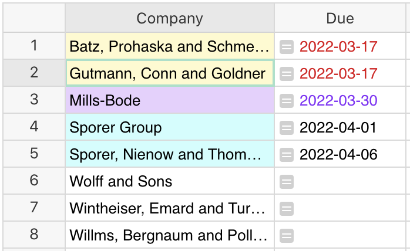
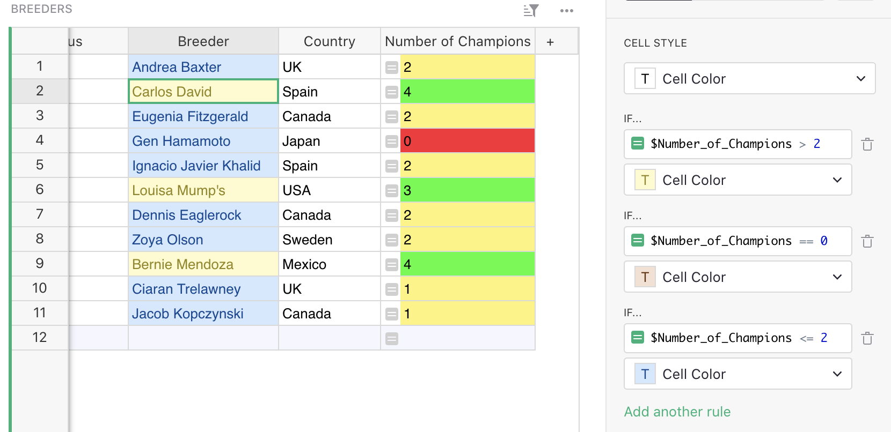
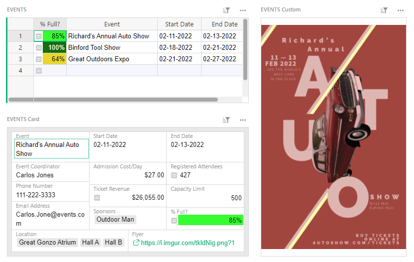
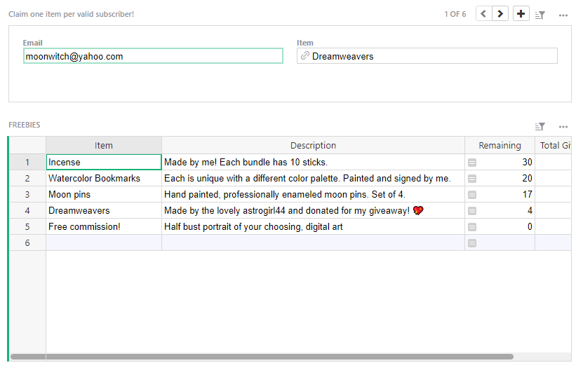
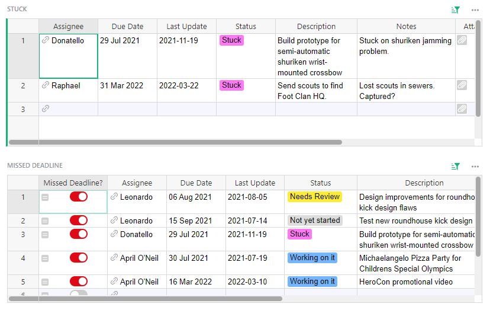

# March 2022 Newsletter

<table class="header" cellpadding="0" cellspacing="0" border="0"><tr>
  <td class="header-text">
    <table class="header-top"><tr>
      <td class="header-image">
        
      </td>
      <td class="header-top-text">
        
Grist for the Mill

        
March 2022
          &#8226; <a href="https://www.getgrist.com/">getgrist.com</a>

      </td>
    </tr></table>
    

      Welcome to our monthly newsletter of updates and tips for Grist users.
    

  </td>
</tr></table>

**In this Newsletter**
{: .newsletter-summary-header}

* **Conditional Formatting!**

    

* **Announcing the Sprouts Program**

    Let us help you build in Grist!

* **Next webinar -- custom widgets**

    Learn to add maps, invoices, and other surprises.

* **3 new templates**

    Events, giveaways, and more.

* **Grist and Wordle???**

    Improve your Wordle game: 
    
    🟨🟩🟩🟩🟩

## Sprouts Program

We’re launching a new program to help teams get up and running fast on Grist. If you know what you need, but need help building it, we’re here to help. Here’s how it works:

* **Eligibility.** Anyone with a team site is eligible for the Sprouts program (even while on free trial).
* **Schedule a free 30-minute consultation call.** Email <success@getgrist.com> and describe your use case. We'll pair you with a Grist expert on our team and schedule a time to meet. On that call, we'll estimate the scope of the work.
* **For quick projects.** If we estimate your project can be completed in less than an hour, we'll do it ourselves — for free! Many use cases fall into this category.
* **For larger projects.** For projects longer than an hour, we'll recommend a contractor who has been trained and vetted by Grist, and has quick access to our team.

  Whether you choose to work with our contractor or with someone else, we’ll schedule one more 30-minute call to make sure everyone understands the project. Based on this, the contractor will estimate the work and quote a price.

Visit [our website](https://www.getgrist.com/sprouts-program/) to submit an inquiry! 

## What's New

### Conditional Formatting

Conditional formatting is finally here! 🎊 In the creator panel in the column menu, under CELL STYLE you may now add conditional styles. Enter a formula and style the cell’s background and text color. You may add multiple conditional rules. [Learn more.](../conditional-formatting.md)

### Improved Column Type Guessing

When you import or copy and paste data, Grist is now much better at parsing data and guessing column types. Phew! That means less data cleaning when importing new data! 🎉

### New API Method for Add or Update

We added a new method to update an existing record, or, if it does not exist, add a new one. [Learn more.](https://support.getgrist.com/api/#tag/records/paths/~1docs~1{docId}~1tables~1{tableId}~1records/put)

### Grist-help Is Now Public!

Our [Help Center](../index.md) is maintained in GitHub. The [repo is now public](https://github.com/gristlabs/grist-help), so the community can help improve our documentation and tutorials. 

## Learning Grist

### Webinar: Custom Widgets

Custom widgets have gotten easier. Learn how to configure custom widgets from the menu of premade widgets in the creator panel.

**Thursday April 14th at 12:00pm US Eastern Time.**

[SIGN UP FOR MARCH'S WEBINAR](https://www.getgrist.com/learn-grist-webinar/){:target="\_blank"}
{: .grist-button}

On March’s webinar, Anais walked through how to set up access rules on private and public documents.

[WATCH MARCH'S RECORDING](https://www.youtube.com/watch?v=chDCNUHqi6w){:target="\_blank"}
{: .grist-button}

### Community Highlights

* **Improve your Wordle stats with Grist!** David Smedberg put Grist to the test by building a document that could track his Wordle stats across multiple devices and analyze his best guess words. He shared his document [on our forum](https://community.getgrist.com/t/learning-more-about-grist-using-wordle/){:target="\_blank"}. His detailed blog post about his experience is [worth a read.](https://davidsmedberg.me/posts/?id=6){:target="\_blank"} 🤩 Fantastic!

* **Apply Formula to Filtered/Visible Rows Only.** Grist applies formulas to the whole column. What if you only want to transform filtered rows? [Here’s a helpful workaround.](https://community.getgrist.com/t/apply-formula-to-filtered-visible-rows-only/){:target="\_blank"}

* **Toggle on/off if attachment present.** Suppose you have an attachment column and would like to filter for rows that have attachments. Here’s how to [toggle a switch to “on” if there is an attachment.](https://community.getgrist.com/t/formulas-based-on-absence-presence-of-attachment/){:target="\_blank"}

* **Showing images from URLs.** Here’s how to configure a custom widget to [preview images from URLs.](https://community.getgrist.com/t/showing-images-from-urls/){:target="\_blank"}

## New Templates

### Event Sponsors + Attendees

Track event registrations and ticket revenue, and reconcile sponsors and attendees.

{:target="\_blank"}

[GO TO TEMPLATE](https://templates.getgrist.com/o6xzja7Pueei/Event-Sponsors-Attendees/){:target="\_blank"}
{: .grist-button .grist-button-tight}

### Public Giveaway

Organize public giveaways on a first-come, first-serve basis. This template uses access rules to limit who can claim which gifts.

{:target="\_blank"}

[GO TO TEMPLATE](https://templates.getgrist.com/vP7WpQp89hLi/Public-Giveaway/){:target="\_blank"}
{: .grist-button .grist-button-tight}

### Project Management

Keep track of tasks by department and project, and quickly flag tasks at risk

{:target="\_blank"}

[GO TO TEMPLATE](https://templates.getgrist.com/hifkng53AxyQ/Project-Management){:target="\_blank"}
{: .grist-button .grist-button-tight}

## Help spread the word?
If you’re interested in helping Grist grow, consider leaving a review on product review sites. Here’s  short list where your review could make a big impact. Thank you! 🙏

* [G2](https://www.g2.com/products/grist/){:target="\_blank"}
* [Capterra](https://www.capterra.com/p/232821/Grist/){:target="\_blank"}
* [TrustRadius](https://www.trustradius.com/products/grist/){:target="\_blank"}

## We are here to support you

**Have questions, feedback, or need help?** Search our [Help Center](../index.md), [watch video
tutorials](https://www.youtube.com/channel/UCx0ioQrrC-bIrkmZ7ZULr0g/playlists), share ideas in our
[Community](https://community.getgrist.com), or contact us at <support@getgrist.com>.
