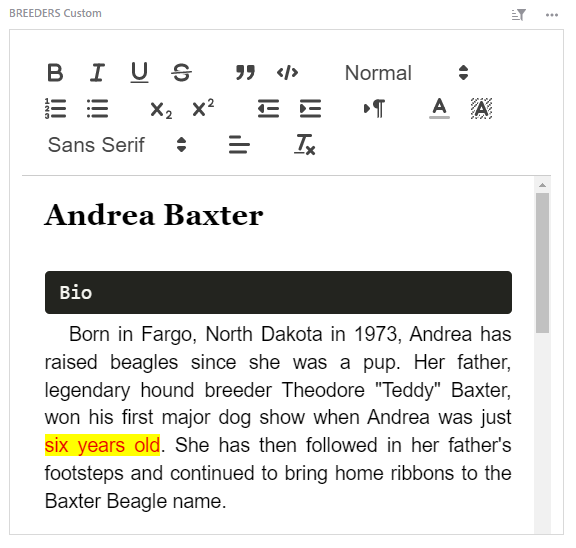
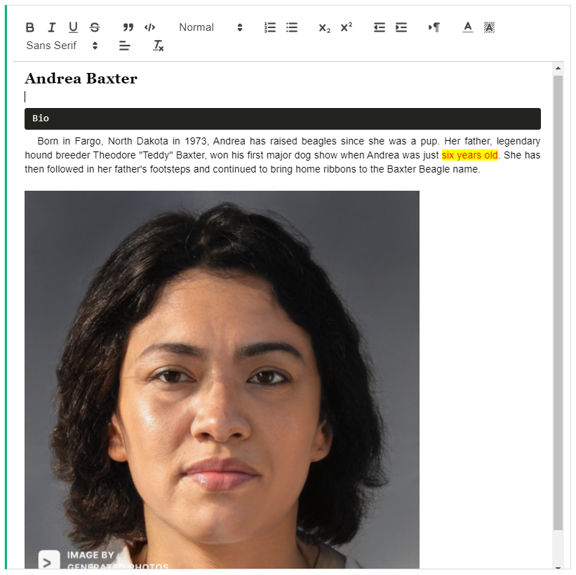
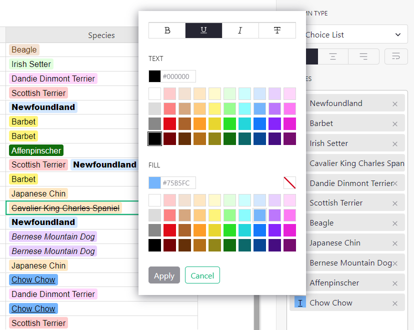
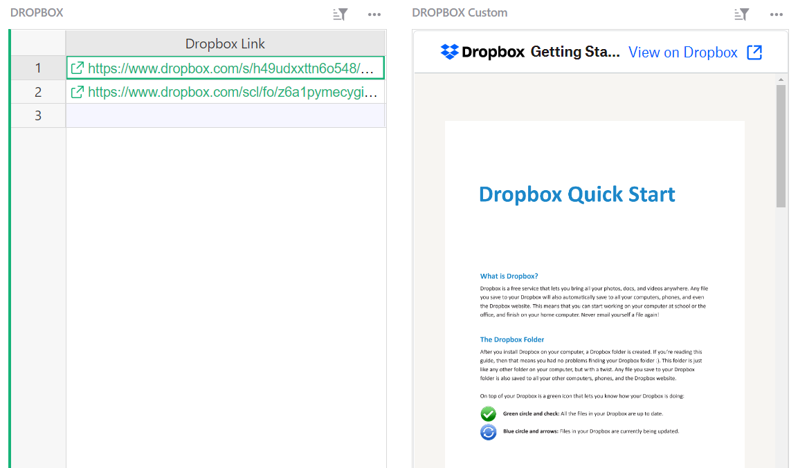
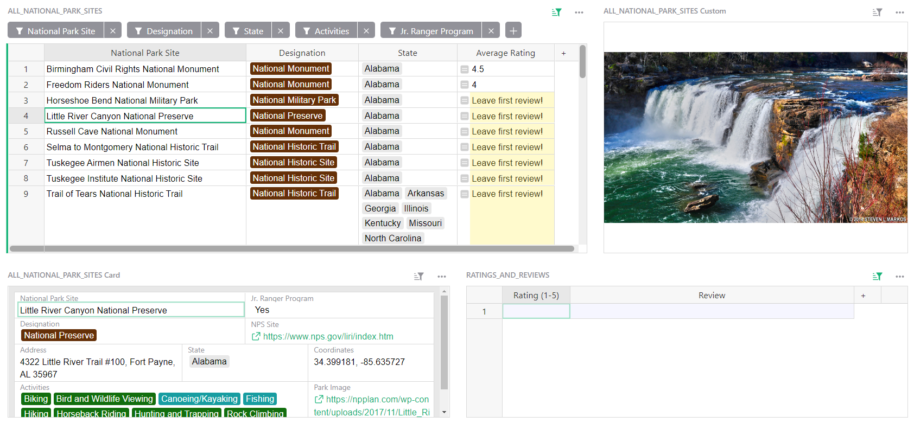
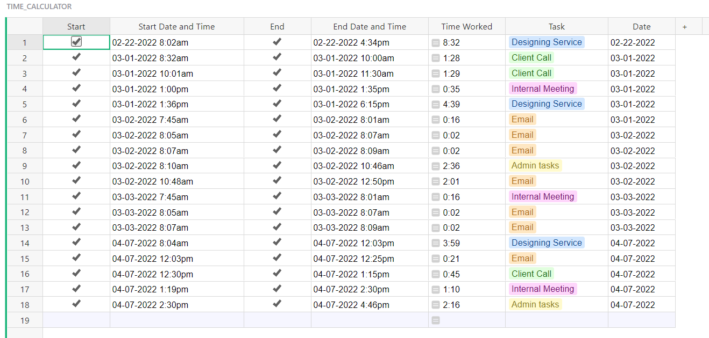
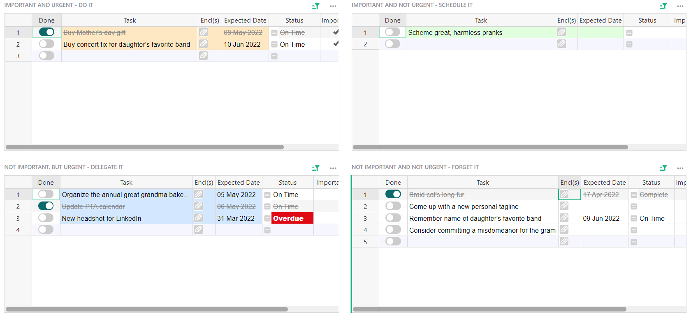

# April 2022 Newsletter

<table class="header" cellpadding="0" cellspacing="0" border="0"><tr>
  <td class="header-text">
    <table class="header-top"><tr>
      <td class="header-image">
        
      </td>
      <td class="header-top-text">
        
Grist for the Mill

        
April 2022
          &#8226; <a href="https://www.getgrist.com/">getgrist.com</a>

      </td>
    </tr></table>
    

      Welcome to our monthly newsletter of updates and tips for Grist users.
    

  </td>
</tr></table>

**In this Newsletter**
{: .newsletter-summary-header}

* **Rich Text Editor!**

    

* **National Parks Database in Grist!**

    A community-maintained resource and application built entirely in Grist.

* **New Font Options!**

    **Bold,** *italicize,* <u>underline,</u> and <s>strikethrough</s> your text.

* **Next webinar -- back to basics**

    How to build efficient workflows in Grist.

* **2 new templates**

    Simple time tracker and Covey time management matrix.  

## What's New

### Rich Text Editor

Add a notepad widget to your document and display a column’s data in a rich text editor. In the custom widget menu, select “Notepad” from the list of premade widgets.

**
{: .screenshot-half }

### New Font and Color Selector

The color picker just got more colorful! Spice up your choices and columns with more font and color options. **Bold**, *italic*, <u>underline</u>, and <s>strikethrough</s> is here! These options are also available with [conditional formatting](https://support.getgrist.com/conditional-formatting/){:target="\_blank"}.

**
{: .screenshot-half }

### Copying Column Settings

If you copy cells into an empty column, the original column’s type and options will also be copied. This includes numeric and date formatting, unconditional cell colors, and choice configurations. Note that [conditional rules](https://support.getgrist.com/conditional-formatting/){:target="\_blank"} will not be copied. 

### New Zapier Action - Create or Update Record

There is a new Grist action in Zapier. When importing external data via Zapier, you may now update existing records based on a merge key or, if there’s no match, create a new record. [Learn more on Zapier.](https://zapier.com/apps/grist/integrations){:target="\_blank"}

This builds on the recently added [add-or-update](https://support.getgrist.com/api/#tag/records/paths/~1docs~1{docId}~1tables~1{tableId}~1records/put){:target="\_blank"} API endpoint.

### Dropbox Embedder

If you store files in Dropbox, embed your files right in Grist. Select “Dropbox Embedder” from the list of custom widgets.

**
{: .screenshot-half }

## Learning Grist

### Webinar: Back to Basics

We get asked all the time how to get started in Grist. The best way to demonstrate is with a real use case. We’ll take a spreadsheet workflow and improve it in Grist. 

**Thursday May 19th at 3:00pm US Eastern Time.**

[SIGN UP FOR MAY'S WEBINAR](https://www.getgrist.com/learn-grist-webinar/){:target="\_blank"}
{: .grist-button}

On April’s webinar, Natalie walked through how to configure the most useful custom widgets.

[WATCH APRIL'S RECORDING](https://www.youtube.com/watch?v=zNLHX_ezY50){:target="\_blank"}
{: .grist-button}

### Sprouts Program

Get up and running fast with expert help. If you know what you need, but need help building it, the Sprouts program may be for you.

[LEARN MORE](https://www.getgrist.com/sprouts-program/){:target="\_blank"}
{: .grist-button}

### Community Highlights

* **Using toggle columns to create button-like experience.** Josh uses Grist on mobile to track inventory in his flower shop. He shared how he uses [toggle columns as buttons](https://community.getgrist.com/t/multi-option-toggle-buttons/){:target="\_blank"} to streamline his workflow.

* **Summarize data from multiple tables.** Sharpen your Python skills by following Natalie’s guide in how to [pull in data from multiple tables to the same summary table.](https://community.getgrist.com/t/summary-table-with-content-from-multiple-tables/){:target="\_blank"}

* **For self-hosters, a template for Grist with traefik and Docker compose.** Running Grist on your own computer is pretty easy. Hosting it to share with others requires a few more steps. [Learn how.](https://community.getgrist.com/t/a-template-for-self-hosting-grist-with-traefik-and-docker-compose/){:target="\_blank"}

## New Templates

### U.S. National Parks Database

Your one-stop resource for all national parks information! Look up parks by designation, state, activities, and more. Leave reviews and track your trips!

This database is crowdsourced and community-maintained. There’s a page in the database to submit suggestions and corrections. 

If you feel inspired to make your own crowdsourced database, check out also the simpler [crowdsourced list example](https://templates.getgrist.com/dKztiPYamcCp/Crowdsourced-List){:target="\_blank"}. Reach out on our [Community Forum](https://community.getgrist.com/) to get help or share the result!

{:target="\_blank"}

[GO TO TEMPLATE](https://templates.getgrist.com/4TRbjZXSPtR5/US-National-Park-Database){:target="\_blank"}
{: .grist-button .grist-button-tight}

### Simple Time Tracker

It’s like a stopwatch in a spreadsheet! With the added benefit of creating a log of total time spent on tasks.

{:target="\_blank"}

[GO TO TEMPLATE](https://templates.getgrist.com/np7TVHmuvFcH/Simple-Time-Tracker/){:target="\_blank"}
{: .grist-button .grist-button-tight}

### Covey Time Management Matrix

Organize your to-do list with the Covey time management method. Prioritize by what’s urgent and important.

{:target="\_blank"}

[GO TO TEMPLATE](https://templates.getgrist.com/3y8XiowkYKFA/Covey-Time-Management-Matrix/){:target="\_blank"}
{: .grist-button .grist-button-tight}

## Help spread the word?
If you’re interested in helping Grist grow, consider leaving a review on product review sites. Here’s  short list where your review could make a big impact. Thank you! 🙏

* 🌟 **New!** [Stackshare](https://stackshare.io/getgrist){:target="\_blank"}
* [Capterra](https://www.capterra.com/p/232821/Grist/){:target="\_blank"}
* [TrustRadius](https://www.trustradius.com/products/grist/){:target="\_blank"}

## We are here to support you

**Have questions, feedback, or need help?** Search our [Help Center](../index.md), [watch video
tutorials](https://www.youtube.com/channel/UCx0ioQrrC-bIrkmZ7ZULr0g/playlists), share ideas in our
[Community](https://community.getgrist.com), or contact us at <support@getgrist.com>.
