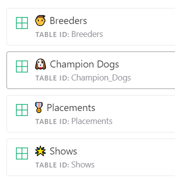
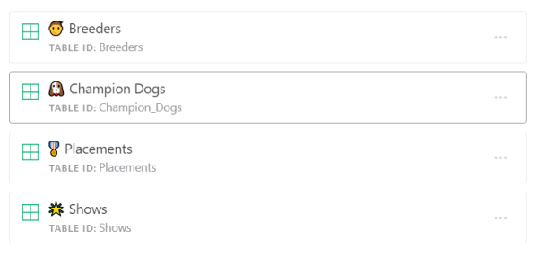
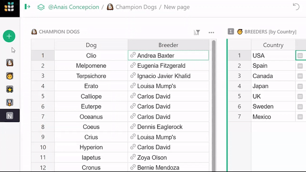
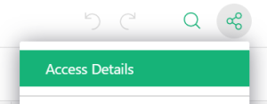
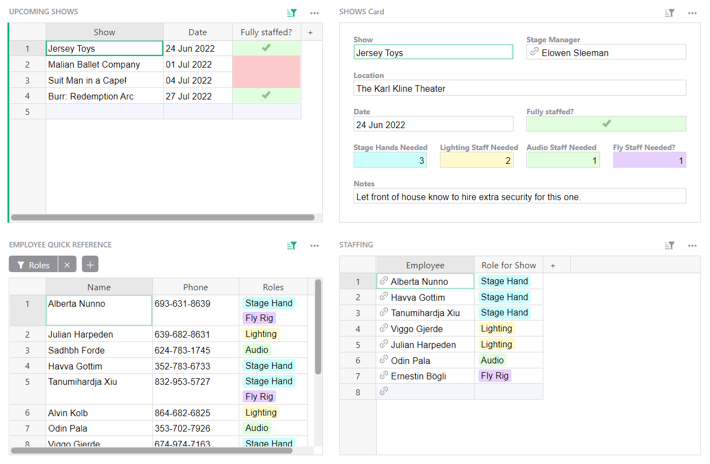

# May 2022 Newsletter

<table class="header" cellpadding="0" cellspacing="0" border="0"><tr>
  <td class="header-text">
    <table class="header-top"><tr>
      <td class="header-image">
        
      </td>
      <td class="header-top-text">
        
Grist for the Mill

        
May 2022
          &#8226; <a href="https://www.getgrist.com/">getgrist.com</a>

      </td>
    </tr></table>
    

      Welcome to our monthly newsletter of updates and tips for Grist users.
    

  </td>
</tr></table>

**In this Newsletter**
{: .newsletter-summary-header}

* **Raw Data Page!**

    

* **Link Related Data to Summary Tables**

    When linking summary tables and other widgets, you can now link on reference columns too.

* **Webinar: Expense Tracking in Grist v. Excel**

    How to build efficient workflows in Grist.

* **Shortcut to Duplicate Rows**

    <code class="keys">*Ctrl* + *Shift* + *D*</code> on Windows, or <code class="keys">*⌘* *⇧* *D*</code> on Mac.

* **2 New Templates**

    Hurricane preparedness and gig staffing.  

## What's New

### Raw Data Tables

Introducing the raw data page, a special page that lists all data tables in your document, making it easier for you to find and browse all your data. [Learn more.](../raw-data.md){:target="\_blank"}

Raw Data has been a long time in coming! In Grist, there has always been a conceptual separation between views and underlying data. As a Grist creator, you have probably found yourself in the shoes of an application developer: at one time thinking about relationships in the data, and separately designing how to present this data in convenient productive views.

Raw data makes the separation explicit. It’s a place where you can always find the underlying data, and its structure.

When creating pages, your page list can now be limited to only the most useful views, without the clutter of helper tables. Those are still available any time in the raw data view.

### Linking Referenced Data to Summary Tables

Tables that reference a summary table’s underlying data may now be linked to the summary table itself. 

**

### API Endpoint GET /attachments

New API endpoint. /attachments will return list of all attachment metadata. [Learn more.](../api.md#tag/attachments){:target="\_blank"} 

### Access Details and Leave a Document

Non-owners of documents may now view their access details and leave a document if they wish. Click on the share icon in the top-right, then “Access Details.” From the access details pop up, you may click the trash icon to leave a document.

### New Keyboard Shortcut

New keyboard shortcut for duplicating selected record(s)! <code class="keys">*Ctrl* + *Shift* + *D*</code> on Windows, or <code class="keys">*⌘* *⇧* *D*</code> on Mac. 

## Learning Grist

### Webinar: Expense Tracking in Grist v Excel

Tracking expenses in a spreadsheet can be convenient, but traditional spreadsheets require a lot of maintenance — especially with formulas. Grist can make expense tracking easier. Join us to learn how.

**Thursday June 16th at 3:00pm US Eastern Time.**

[SIGN UP FOR JUNE'S WEBINAR](https://www.getgrist.com/learn-grist-webinar/){:target="\_blank"}
{: .grist-button}

In May we went back to basics. Natalie took a data workflow in Google Sheets and transformed it into a productive dashboard in Grist.

[WATCH APRIL'S RECORDING](https://www.youtube.com/watch?v=-mNh2P_Wa6c){:target="\_blank"}
{: .grist-button}

### Sprouts Program

Get up and running fast with expert help. If you know what you need, but need help building it, the Sprouts program may be for you.

[LEARN MORE](https://www.getgrist.com/sprouts-program/){:target="\_blank"}
{: .grist-button}

### Community Highlights

* **Sequential numbers using formulas.** Check out this thread with a few examples on [how to get sequential numbers](https://community.getgrist.com/t/sequential-numbers-using-drag){:target="\_blank"} in Grist.

* **Concatenating data in columns of different types.** Concatenating text is simple, but what if you want to concatenate different types of data, such as text, reference columns, and dates? [Learn how.](https://community.getgrist.com/t/concatenate-datetime-with-reference-text){:target="\_blank"}

* **Numbers that begin with zero.** Natalie shares [two methods.](https://community.getgrist.com/t/how-to-have-numbers-that-begin-with-zero){:target="\_blank"}

## New Templates

### Hurricane Preparedness

Do you live on the coast? Don't stress! Use this template to ensure you have everything you need in the event of a hurricane.

{:target="\_blank"}

[GO TO TEMPLATE](https://templates.getgrist.com/uXMbETLdfriM/Hurricane-Preparedness){:target="\_blank"}
{: .grist-button .grist-button-tight}

### Gig Staffing

Easily manage staffing for gigs and track employee timesheets. This sample data is focused on staffing for shows at a theater, but the template can be modified for catering, event staffing, and more.

{:target="\_blank"}

[GO TO TEMPLATE](https://templates.getgrist.com/sg8CccMuPrfX/Gig-Staffing/){:target="\_blank"}
{: .grist-button .grist-button-tight}

## Help spread the word?
If you’re interested in helping Grist grow, consider leaving a review on product review sites. Here’s  short list where your review could make a big impact. Thank you! 🙏

* [Stackshare](https://stackshare.io/getgrist){:target="\_blank"}
* [Capterra](https://www.capterra.com/p/232821/Grist/){:target="\_blank"}
* [TrustRadius](https://www.trustradius.com/products/grist/){:target="\_blank"}

## We are here to support you

**Have questions, feedback, or need help?** Search our [Help Center](../index.md), [watch video
tutorials](https://www.youtube.com/channel/UCx0ioQrrC-bIrkmZ7ZULr0g/playlists), share ideas in our
[Community](https://community.getgrist.com), or contact us at <support@getgrist.com>.
