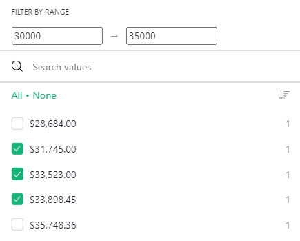
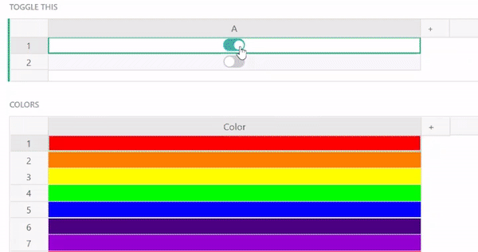
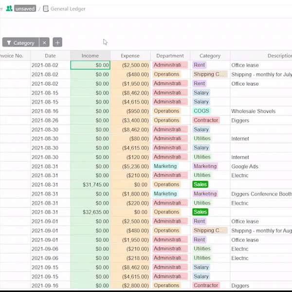
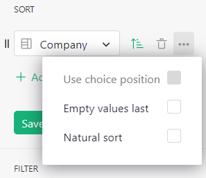
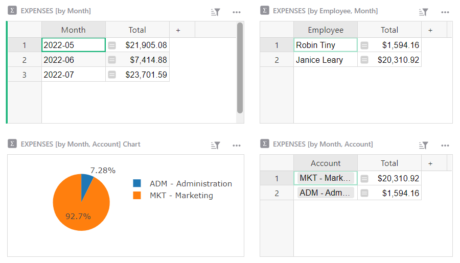
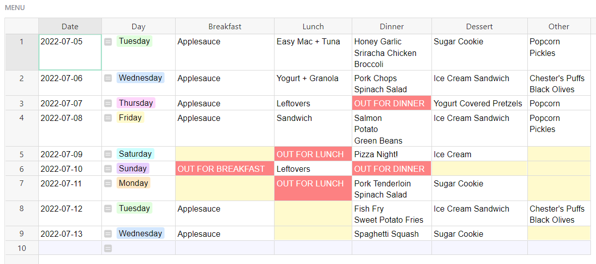

# June 2022 Newsletter

<table class="header" cellpadding="0" cellspacing="0" border="0"><tr>
  <td class="header-text">
    <table class="header-top"><tr>
      <td class="header-image">
        
      </td>
      <td class="header-top-text">
        
Grist for the Mill

        
June 2022
          &#8226; <a href="https://www.getgrist.com/">getgrist.com</a>

      </td>
    </tr></table>
    

      Welcome to our monthly newsletter of updates and tips for Grist users.
    

  </td>
</tr></table>

**In this Newsletter**
{: .newsletter-summary-header}

* **Range Filtering**

    

* **Happy Pride!**

    Check out our rainbow spreadsheet! 🌈

* **Webinar: Structuring Relational Data**

    Best tips on how to structure data in Grist.

* **2 New Templates**

    Expense tracking and meal planning.

* **PEEK(a-boo)**

    Special new function to resolve circular references in trigger formulas.  

## Happy Pride!

Hope you had a fun and colorful Pride month! We did. ***Rainbow spreadsheet!*** 🏳‍🌈

[GO TO RAINBOW SPREADSHEET](https://public.getgrist.com/3B5xAyMz4Tc5/Pride-Flag){:target="\_blank"}
{: .grist-button}

## What's New

### Range Filtering

It is now possible to filter **Numeric** and **Date** columns by a range! Keep an eye out for more improvements to filtering in the near future.

### PEEK()

PEEK () evaluates an expression without creating dependencies or requiring that referenced values are up to date, and uses whatever value it finds in a cell. This is useful for preventing circular reference errors, particularly in trigger formulas. [Learn more.](../functions.md#peek)

Here’s an example of [PEEK() in action.](https://public.getgrist.com/8gwbBVmafAac/PEEK-for-trigger-formulas/m/fork){:target="\_blank"} Note that in the trigger formula column, the two formulas can reference each other without creating a circular error.

## Learning Grist

### Webinar: Structuring Data in Grist

Before you can build productive layouts, you have to think through how to structure your data. In July, we'll share some best practices and highlight the differences in how data is structured in spreadsheets v. Grist.

**Thursday July 21st at 3:00pm US Eastern Time.**

[SIGN UP FOR JULY'S WEBINAR](https://www.getgrist.com/learn-grist-webinar/){:target="\_blank"}
{: .grist-button}

In June Anais demonstrated how Grist can simplify data workflows, such as expense tracking, when compared to traditional spreadsheets.

[WATCH JUNE'S RECORDING](https://www.youtube.com/watch?v=27sP9t-Q4m4){:target="\_blank"}
{: .grist-button}

### Sprouts Program

Get up and running fast with expert help. If you know what you need, but need help building it, the Sprouts program may be for you.

[LEARN MORE](https://www.getgrist.com/sprouts-program/){:target="\_blank"}
{: .grist-button}

### Quick Tips

* All formula columns in summary tables can be series in charts based on that summary table. For example, in the [General Ledger template](https://templates.getgrist.com/2YwYBWpREY2a/General-Ledger/){:target="\_blank"}, the Profit columns in the summary tables are used in the charts.

* There are additional sort options in the creator panel’s sort menu under the three dots icon.

* **In case you missed it.** The *Grist video player* is a custom widget that plays a video from a URL, similar to how the image viewer displays an image from a url.

### Community Highlights

* **Conditional trigger formulas.** Use a trigger formula to [conditionally autofill data in some cases, but not others.](https://community.getgrist.com/t/conditional-trigger-formulas/1098){:target="\_blank"}

* **Setting default value for reference column.** Use trigger formulas to [set default reference values.](https://community.getgrist.com/t/setting-default-value-for-a-reference-column/1080){:target="\_blank"}

## New Templates

### Expense Tracking for Teams

Manage all employee expenses in one spreadsheet! No more wrangling dozens of employees' expenses into a master list. With access rules, employees can log into Grist, view and update only their expenses, and Grist summary tables take care of the rest.

{:target="\_blank"}

[GO TO TEMPLATE](https://templates.getgrist.com/55Q2EtTbFvB1/Expense-Tracking-for-Teams){:target="\_blank"}
{: .grist-button .grist-button-tight}

### Grocery List + Meal Planner

Create recipes, build weekly menus and make a grocery list in one place!

{:target="\_blank"}

[GO TO TEMPLATE](https://templates.getgrist.com/cMQA7uuBbtMW/-Grocery-List-Meal-Planner){:target="\_blank"}
{: .grist-button .grist-button-tight}

## Help spread the word?
If you’re interested in helping Grist grow, consider leaving a review on product review sites. Here’s  short list where your review could make a big impact. Thank you! 🙏

* [Stackshare](https://stackshare.io/getgrist){:target="\_blank"}
* [Capterra](https://www.capterra.com/p/232821/Grist/){:target="\_blank"}
* [TrustRadius](https://www.trustradius.com/products/grist/){:target="\_blank"}

## We are here to support you

**Have questions, feedback, or need help?** Search our [Help Center](../index.md), [watch video
tutorials](https://www.youtube.com/channel/UCx0ioQrrC-bIrkmZ7ZULr0g/playlists), share ideas in our
[Community](https://community.getgrist.com), or contact us at <support@getgrist.com>.
