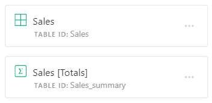
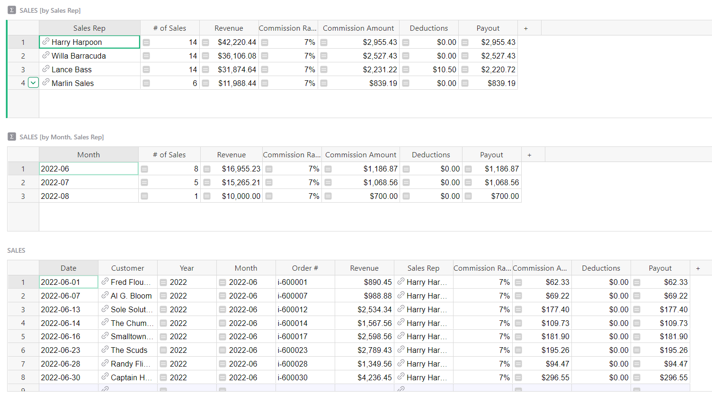
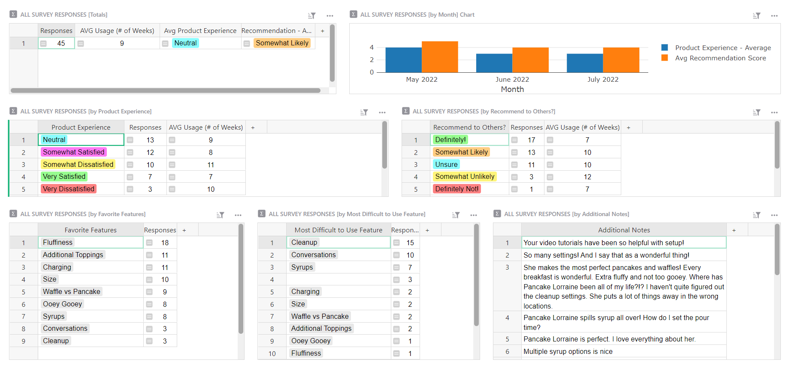
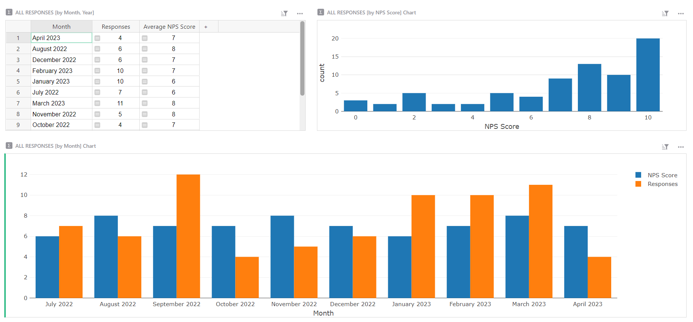

# July 2022 Newsletter

<table class="header" cellpadding="0" cellspacing="0" border="0"><tr>
  <td class="header-text">
    <table class="header-top"><tr>
      <td class="header-image">
        
      </td>
      <td class="header-top-text">
        
Grist for the Mill

        
July 2022
          &#8226; <a href="https://www.getgrist.com/">getgrist.com</a>

      </td>
    </tr></table>
    

      Welcome to our monthly newsletter of updates and tips for Grist users.
    

  </td>
</tr></table>

## Formula Cheat Sheet

New to Grist formulas and Python? Here’s a formula cheat sheet with the most commonly used functions and plenty of examples.

[GO TO CHEAT SHEET](../formula-cheat-sheet.md){:target="\_blank"}
{: .grist-button}

If you want extra formula help, we also have an in depth article focused on references and lookups with more examples. 

[GO TO ARTICLE](../references-lookups.md){:target="\_blank"}
{: .grist-button}

## Summary Tables in Raw Data

Summary tables are now listed in raw data, making it easier to see at a glance what summary tables exist anywhere in the document, and examine any of them. You can easily identify summary tables by the sigma icon.

Note also the friendlier names for summary tables, like `Sales_summary`. Anyone who has ever noticed `GristSummary_5_Sales` will know what we are talking about.

## Learning Grist

### Webinar: Relational Data and Reference Columns

August’s webinar will focus on how to relate data in Grist using reference columns, how to use related data in dynamic dashboards, and how to perform lookups.

**Thursday August 18th at 3:00pm US Eastern Time.**

[SIGN UP FOR AUGUST'S WEBINAR](https://www.getgrist.com/learn-grist-webinar/){:target="\_blank"}
{: .grist-button}

### How to structure your data

In July, Anais demonstrated how Grist can simplify data workflows, such as expense tracking, when compared to traditional spreadsheets.

[WATCH JULY'S RECORDING](https://www.youtube.com/watch?v=jWK4hBXbyKc){:target="\_blank"}
{: .grist-button}

### Community Highlights

* **Summarizing data with a pie chart.** Learn how to [create pie charts in Grist.](https://community.getgrist.com/t/creating-summarize-data-with-pie-chart/){:target="\_blank"}

* **Find and highlight duplicates with conditional formatting.** Learn how to set conditional styles based on a formula that returns [whether or not a value is a duplicate.](https://community.getgrist.com/t/blocking-duplicate-values/1170){:target="\_blank"}

### Sprouts Program

Get up and running fast with expert help. If you know what you need, but need help building it, the Sprouts program may be for you.

[LEARN MORE](https://www.getgrist.com/sprouts-program/){:target="\_blank"}
{: .grist-button}

## New Templates

### Sales Commission Dashboard

Sales and accounting teams can use this template to track sales and commission. Sales reps only see their individual sales, and the overall leaderboard. Management can see everything.

{:target="\_blank"}

[GO TO TEMPLATE](https://templates.getgrist.com/pVq4xESKtU24/Sales-Commissions-Dashboard/){:target="\_blank"}
{: .grist-button .grist-button-tight}

### User Feedback Responses

Improve your product based on customer feedback! Analyze and evaluate your user survey responses.

{:target="\_blank"}

[GO TO TEMPLATE](https://templates.getgrist.com/4ktYzGV1mUip/User-Feedback-Responses/){:target="\_blank"}
{: .grist-button .grist-button-tight}

### Net Promoter Score Results

Keep your finger on the pulse of your customers' satisfaction. Analyze and drill into your NPS survey responses.

{:target="\_blank"}

[GO TO TEMPLATE](https://templates.getgrist.com/qvND7WUcuNb2/Net-Promoter-Score-Results/){:target="\_blank"}
{: .grist-button .grist-button-tight}

## Help spread the word?
If you’re interested in helping Grist grow, consider leaving a review on product review sites. Here’s  short list where your review could make a big impact. Thank you! 🙏

* [Stackshare](https://stackshare.io/getgrist){:target="\_blank"}
* [Capterra](https://www.capterra.com/p/232821/Grist/){:target="\_blank"}
* [TrustRadius](https://www.trustradius.com/products/grist/){:target="\_blank"}

## We are here to support you

**Have questions, feedback, or need help?** Search our [Help Center](../index.md), [watch video
tutorials](https://www.youtube.com/channel/UCx0ioQrrC-bIrkmZ7ZULr0g/playlists), share ideas in our
[Community](https://community.getgrist.com), or contact us at <support@getgrist.com>.
