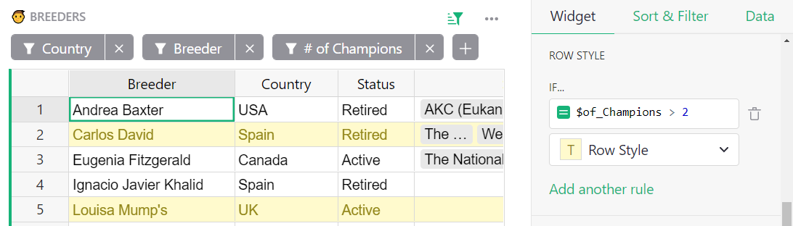
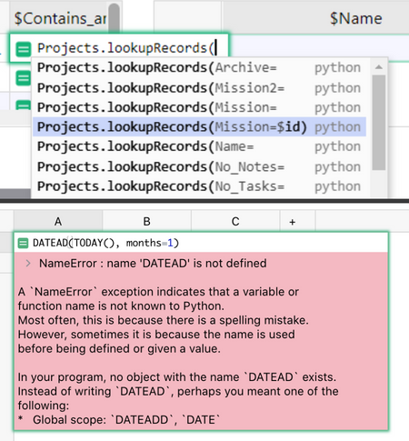
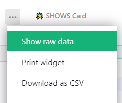
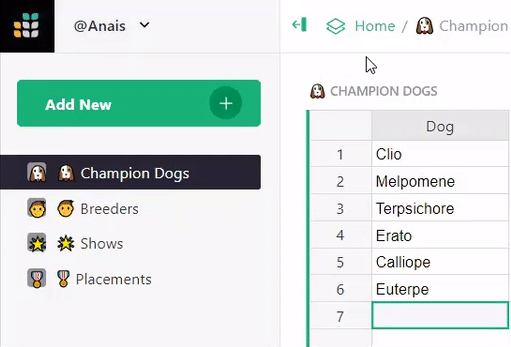
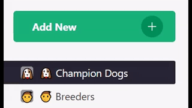
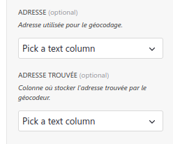
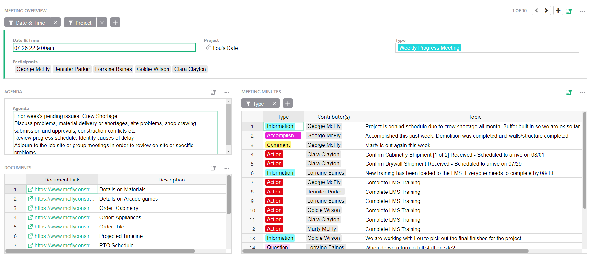
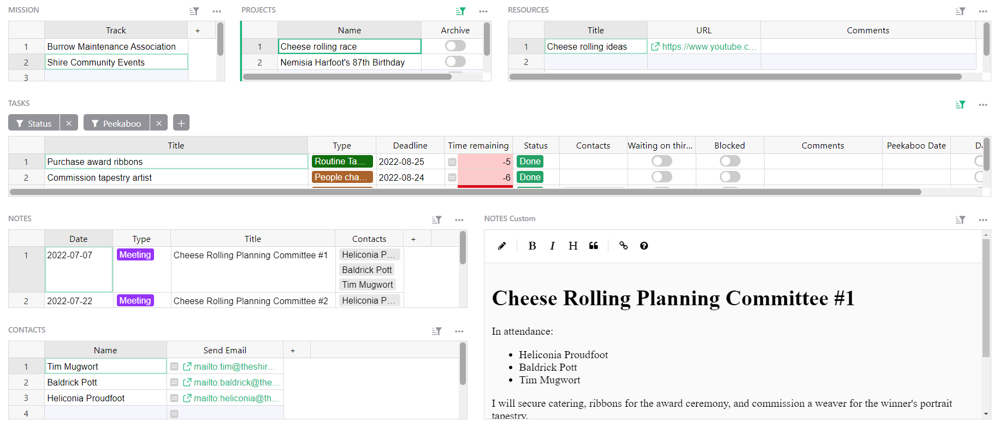

# August 2022 Newsletter

<table class="header" cellpadding="0" cellspacing="0" border="0"><tr>
  <td class="header-text">
    <table class="header-top"><tr>
      <td class="header-image">
        
      </td>
      <td class="header-top-text">
        
Grist for the Mill

        
August 2022
          &#8226; <a href="https://www.getgrist.com/">getgrist.com</a>

      </td>
    </tr></table>
    

      Welcome to our monthly newsletter of updates and tips for Grist users.
    

  </td>
</tr></table>

**In this Newsletter**
{: .newsletter-summary-header}

* **Free Team Sites**

    Unlimited team members + documents, for documents under 5,000 rows.

* **Conditional Row Styles!**

    Apply conditional styles to an entire row.

* **Better Formula Help**

    More helpful autocomplete & error messages. 💪        

* **Open Source Community Shout Out!**

    Highlights of cool contributions by OSS community. 🙏 

* **2 new templates**

    Meetings organizer & personal notebook, built by awesome users! 🎉

* **Webinar: Link Keys**

    Sharing partial data with third parties.      

## Free Team Sites

Grist is most powerful when used collaboratively. That’s why we’re now offering free team sites for your whole team. Unlimited team members + unlimited documents, for documents under 5,000 rows.  Free team sites are fully featured, too.

[CREATE FREE TEAM SITE](https://docs.getgrist.com/billing/create-team?planType=teamFree){:target="\_blank"}
{: .grist-button}

## What's New

### Conditional Row Styles

You can now apply [conditional styles](../conditional-formatting.md) to an entire row. In the creator panel, it’s under the `Table` > `Widget` tab. 

### More Helpful Formula Errors + Autocomplete

Writing and troubleshooting formulas just got a little bit easier with more helpful autocomplete suggestions and error messages. For example, in the screenshot below, the autocomplete helps write the common but hard-to-remember formula for [reverse lookups](../references-lookups.md#reverse-lookups), and the error includes a human-friendly explanation, and helpful suggestions to fix it.

Want to learn more about formulas? There is a lot about formulas in our Help Center, including this recently-added [formula cheat sheet](../formula-cheat-sheet.md).

### Open Raw Data from Widget

You can open a widget’s source table without leaving the page. In the widget menu, click on “Show raw data”. This is particularly handy for charts and custom widgets.

### Left Pane Now Auto Expands

Did you know you can collapse the left-side page menu to give yourself more space? Now, the collapsed menu auto-expands on hover, giving you more room on small screens! 🎉

### Hide Multiple Columns

You may now select multiple columns, right click to open the column menu, and hide all selected columns with a click.

## Community & Open Source Contributions 🙏

Grist is [open source](https://github.com/gristlabs/grist-core). We’re grateful to the open source community for their contributions. Here are two recent highlights.

### Quickly Rename Pages

To rename a page name, all you need to do now is click. Thank you, @LouisDelbosc!

### Custom Widgets: Add Column Description in Creator Panel

For custom widget devs: when specifying what columns your widget needs access to, you can now include a description to help guide your widget users, [as shown here](https://github.com/gristlabs/grist-core/pull/255#issue-1347880878){:target="\_blank"}. Thank you, @yohanboniface!

### Open Source + Cool Dev Highlights 👩‍💻

* **grist-core omnibus.** Paul published a grist-core omnibus to [make self-hosting easier.](https://community.getgrist.com/t/making-grist-easier-to-self-host/1325){:target="\_blank"}

* **Grist as an electron app.** User stan-donarise packaged Grist [as an electron app](https://community.getgrist.com/t/packaging-grist-as-an-electron-app/1233){:target="\_blank"} that works on Windows 7 or later. How cool is that! 😉 

* **Generate docx from template.** User stan-donarise didn’t stop there. He integrated docxtemplater into a custom widget [to generate reports and documents in Grist.](https://community.getgrist.com/t/generate-docx-from-template-custom-widget/1336/){:target="\_blank"}

## Learning Grist

### Webinar: Sharing Partial Data with Link Keys

In September we’ll explain how to use one of Grist’s coolest and least explored features: link keys. Learn how to use Grist's link keys to share partial data, such as a single row, with third parties.

**Thursday September 22nd at 3:00pm US Eastern Time.**

[SIGN UP FOR SEPTEMBER'S WEBINAR](https://www.getgrist.com/learn-grist-webinar/){:target="\_blank"}
{: .grist-button}

### Relational Data + Reference Columns

In August, Natalie dove deep into reference columns and how to use them in dashboards and formulas.

[WATCH AUGUST'S RECORDING](https://www.youtube.com/watch?v=_lm0oqKKeuw){:target="\_blank"}
{: .grist-button}

### Sprouts Program

Get up and running fast with expert help. If you know what you need, but need help building it, the Sprouts program may be for you.

[LEARN MORE](https://www.getgrist.com/sprouts-program/){:target="\_blank"}
{: .grist-button}

## New Templates

### Team Meetings Organizer

Use this template to store team meeting minutes, action items, project documentation and more. 

Thank you to Grist user Eduardo who shared this template with us. It's been lightly modified to meet more general purpose needs. 

Want to learn how this was built? Watch Natalie build it on [August’s webinar.](https://www.youtube.com/watch?v=_lm0oqKKeuw){:target="\_blank"}

{:target="\_blank"}

[GO TO TEMPLATE](https://templates.getgrist.com/4vTwsstWA6uQ/Team-Meetings-Organizer){:target="\_blank"}
{: .grist-button .grist-button-tight}

### Personal Notebook

Organize your projects, contact info, and tasks in this personal notebook. 

This template was built by Grist user Julien. It has been translated and lightly modified to meet more general purpose needs. Check out his [showcase in the community forum!](https://community.getgrist.com/t/my-use-of-grist-to-manage-my-notes-and-tasks-in-one-place/1363){:target="\_blank"}

If you have a cool template you’d like to share, we’d love to hear about it in the community showcase!

{:target="\_blank"}

[GO TO TEMPLATE](https://templates.getgrist.com/hQHXqAQXceeQ/Personal-Notebook/){:target="\_blank"}
{: .grist-button .grist-button-tight}

## Help spread the word?
If you’re interested in helping Grist grow, consider leaving a review on product review sites. Here’s  short list where your review could make a big impact. Thank you! 🙏

* [Stackshare](https://stackshare.io/getgrist){:target="\_blank"}
* [Capterra](https://www.capterra.com/p/232821/Grist/){:target="\_blank"}
* [TrustRadius](https://www.trustradius.com/products/grist/){:target="\_blank"}

## We are here to support you

**Have questions, feedback, or need help?** Search our [Help Center](../index.md), [watch video
tutorials](https://www.youtube.com/channel/UCx0ioQrrC-bIrkmZ7ZULr0g/playlists), share ideas in our
[Community](https://community.getgrist.com), or contact us at <support@getgrist.com>.
