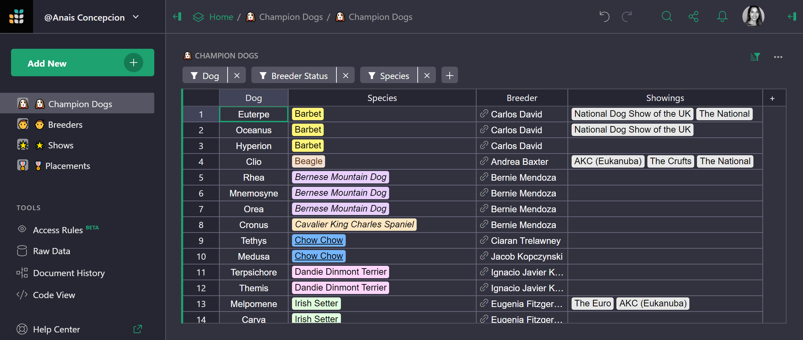
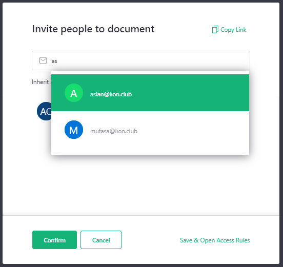
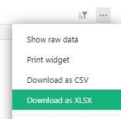
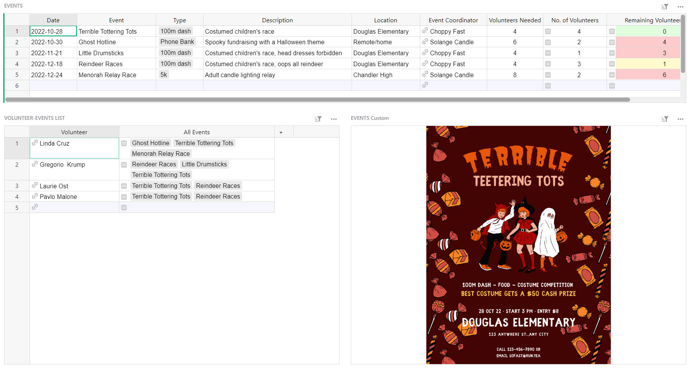

# September 2022 Newsletter

<table class="header" cellpadding="0" cellspacing="0" border="0"><tr>
  <td class="header-text">
    <table class="header-top"><tr>
      <td class="header-image">
        
      </td>
      <td class="header-top-text">
        
Grist for the Mill

        
September 2022
          &#8226; <a href="https://www.getgrist.com/">getgrist.com</a>

      </td>
    </tr></table>
    

      Welcome to our monthly newsletter of updates and tips for Grist users.
    

  </td>
</tr></table>

## What's New

### Dark Mode 🕶

Grist now comes in dark mode. 😎 

To work in dark mode, click on your user icon > profile settings > select “Dark” under the appearance setting.

## Open Source Contributions 🙏

Grist is [open source](https://github.com/gristlabs/grist-core){:target="\_blank"}. We’re grateful to the open source community for their contributions. Here are two recent highlights from a team that's not only using Grist, but is making it better for everyone. Thank you, @LouisDelbosc!

### Improved User Management with Autocomplete

When adding users to a document, the list will now autocomplete with emails of team members. This is currently available on grist-core and will land in hosted Grist by Monday, October 3rd. 

### Export Table as XLSX

It is now possible to export a table as an XLSX from the widget menu. Learn more about [exporting tables v. documents.](../exports.md)

## Learning Grist

### Webinar: Team Sites

Next month we’re kicking off a series focused on **Grist for Teams**. This series of four videos will cover everything you need to know about team sites, workspaces, collaboration, and access rules. 

In October, it’s back to team basics: team sites, workspaces, sharing, and more.

**Thursday October 20th at 3:00pm US Eastern Time.**

[SIGN UP FOR OCTOBER'S WEBINAR](https://www.getgrist.com/learn-grist-webinar/){:target="\_blank"}
{: .grist-button}

### Link Keys

On September’s webinar, Natalie demonstrated how to use Grist’s link keys to share partial data via unique links.

[WATCH SEPTEMBER'S RECORDING](https://www.youtube.com/watch?v=nF911sOgFsk){:target="\_blank"}
{: .grist-button}

### Sprouts Program

Get up and running fast with expert help. If you know what you need, but need help building it, the Sprouts program may be for you.

[LEARN MORE](https://www.getgrist.com/sprouts-program/){:target="\_blank"}
{: .grist-button}

## New Template

### Event Volunteering

Use this template to keep track of which volunteers are working which events. Link keys with access rules grant specific access for each volunteer, allowing them to view their volunteer schedule and event details without logging into Grist.

Want to learn how we built this? Watch Natalie build it on [September’s webinar.](https://www.youtube.com/watch?v=nF911sOgFsk){:target="\_blank"}

{:target="\_blank"}

[GO TO TEMPLATE](https://templates.getgrist.com/9x8X3naCQmX8/Event-Volunteering){:target="\_blank"}
{: .grist-button .grist-button-tight}

## Help spread the word?
If you’re interested in helping Grist grow, consider leaving a review on product review sites. Here’s  short list where your review could make a big impact. Thank you! 🙏

* [Stackshare](https://stackshare.io/getgrist){:target="\_blank"}
* [Capterra](https://www.capterra.com/p/232821/Grist/){:target="\_blank"}
* [TrustRadius](https://www.trustradius.com/products/grist/){:target="\_blank"}

## We are here to support you

**Have questions, feedback, or need help?** Search our [Help Center](../index.md), [watch video
tutorials](https://www.youtube.com/channel/UCx0ioQrrC-bIrkmZ7ZULr0g/playlists), share ideas in our
[Community](https://community.getgrist.com), or contact us at <support@getgrist.com>.
