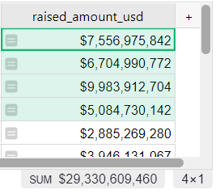
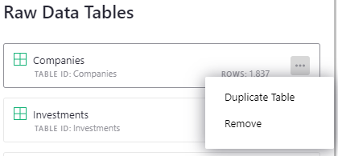
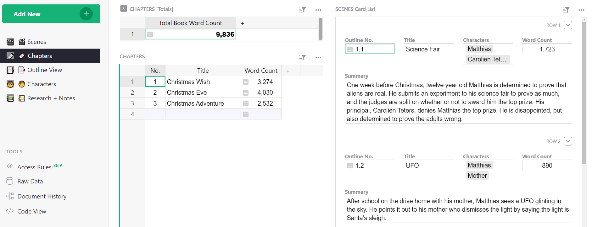
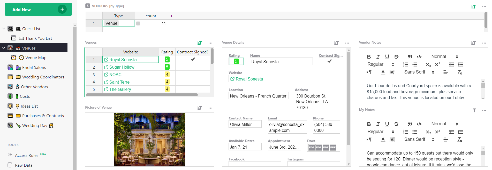

# October 2022 Newsletter

<table class="header" cellpadding="0" cellspacing="0" border="0"><tr>
  <td class="header-text">
    <table class="header-top"><tr>
      <td class="header-image">
        
      </td>
      <td class="header-top-text">
        
Grist for the Mill

        
October 2022
          &#8226; <a href="https://www.getgrist.com/">getgrist.com</a>

      </td>
    </tr></table>
    

      Welcome to our monthly newsletter of updates and tips for Grist users.
    

  </td>
</tr></table>

## What's New

### Quick Sum

Need to quickly sum or count values? Select a range, and a handy total and count will appear in the footer of the widget. *Finally!* 😉

### Duplicate Table

You can now quickly duplicate a table! Go to the raw data page and open the table’s menu. 

You may duplicate a table’s structure with or without the table’s data.

### New Table and Column API Methods

You may now add, modify and list tables and columns in a document. See our [REST API reference](../api.md) to learn more 

### Multi-column Formatting

You may now select several adjacent columns and edit their column type and formatting simultaneously, saving you time.

### New Add + Remove Rows Shortcut

Shortcuts to remove or insert a record have changed, to avoid interfering with page zoom. 

| Key (Mac) | Key (Windows) | Description | 
| - | - | - | 
| <code class="keys">*⌘* *⇧* *Enter*</code> | <code class="keys">*Ctrl* + *Shift* + *Enter*</code> | Insert a new record, before the currently selected one in an unsorted table |
| <code class="keys">*⌘* *Enter*</code> | <code class="keys">*Ctrl* + *Enter*</code> | Insert a new record, after the currently selected one in an unsorted table |
| <code class="keys">*⌘* *Delete*</code> | <code class="keys">*Ctrl* + *Backspace*</code>,<code class="keys">*Ctrl* + *Delete*</code> | Delete the currently selected record(s) |

### New PHONE_FORMAT() Function

Formatting phone numbers just got easier with a new helpful function. [Learn more about PHONE_FORMAT().](../functions.md#phone_format)

## Learning Grist

### Webinar: Building Team Workflows

In November we’re continuing our **Grist for Teams** series. November’s webinar will focus on how to build productive workflows for teams, while making use of features that make Grist easy to use by anyone on your team.

**Tuesday November 22nd at 3:00pm US Eastern Time.**

[SIGN UP FOR NOVEMBER'S WEBINAR](https://www.getgrist.com/learn-grist-webinar/){:target="\_blank"}
{: .grist-button}

### Team Basics

In October, Natalie walked us through team basics: team sites, workspaces, sharing, and more.

[WATCH OCTOBER'S RECORDING](https://www.youtube.com/watch?v=0EK-TKz_apo){:target="\_blank"}
{: .grist-button}

### Sprouts Program

Grist often surprises people with its capabilities. Schedule a **free** Sprouts call with an expert to see if Grist can address your needs.

[LEARN MORE](https://www.getgrist.com/sprouts-program/){:target="\_blank"}
{: .grist-button}

## New Templates

### Novel Planning

Every writer has their own unique process – but for most, that process involves some level of planning. Our Novel Planning Template is just in time for this year’s [NaNoWriMo](https://nanowrimo.org/){:target="\_blank"}. Keep your novel structure, outline, research and notes all in one place!

Want more guidance on how to use this template? [Read our blog.](https://www.getgrist.com/blog/a-powerful-novel-planning-template-by-grist/){:target="\_blank"}

{:target="\_blank"}

[GO TO TEMPLATE](https://templates.getgrist.com/sfCNkrvGLK1j/Novel-Planning/){:target="\_blank"}
{: .grist-button .grist-button-tight}

### Potluck Organizer

We made this template with Thanksgiving in mind, but it works for all potluck dinners! Potluck logistics can be tricky to handle, but this template makes it easy to juggle who brings what. Everyone can collaborate by writing down what they're bringing and making sure all the essentials are covered.

{:target="\_blank"}

[GO TO TEMPLATE](https://templates.getgrist.com/bnWySBocgpze/Thanksgiving-Potluck-Organizer){:target="\_blank"}
{: .grist-button .grist-button-tight}

### Wedding Planner

Recently engaged? 💍 Congratulations! Planning a wedding can be chaotic but not for you because you have Grist 😊 Use this template to organize vendor notes, guest lists, contracts and more!

{:target="\_blank"}

[GO TO TEMPLATE](https://templates.getgrist.com/mNp9G2bZ1uaE/Wedding-Planner){:target="\_blank"}
{: .grist-button .grist-button-tight}

## Help spread the word?
If you’re interested in helping Grist grow, consider leaving a review on product review sites. Here’s  short list where your review could make a big impact. Thank you! 🙏

* [Stackshare](https://stackshare.io/getgrist){:target="\_blank"}
* [Capterra](https://www.capterra.com/p/232821/Grist/){:target="\_blank"}
* [TrustRadius](https://www.trustradius.com/products/grist/){:target="\_blank"}

## We are here to support you

**Have questions, feedback, or need help?** Search our [Help Center](../index.md), [watch video
tutorials](https://www.youtube.com/channel/UCx0ioQrrC-bIrkmZ7ZULr0g/playlists), share ideas in our
[Community](https://community.getgrist.com), or contact us at <support@getgrist.com>.
