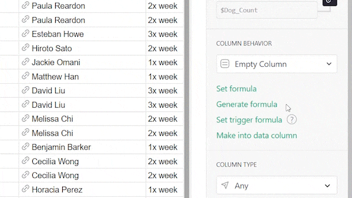
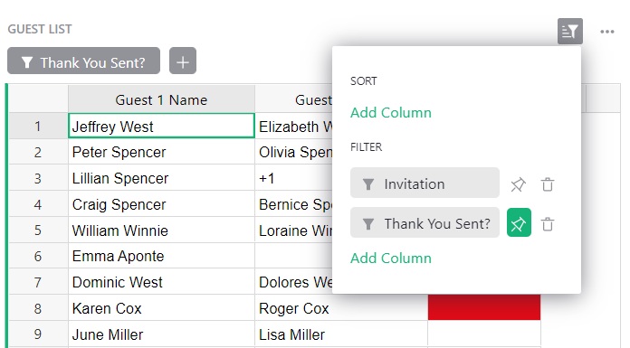
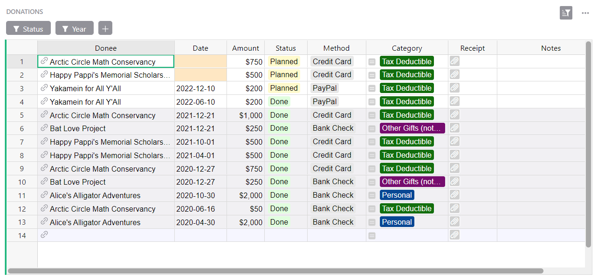
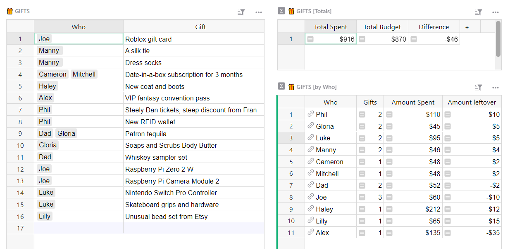
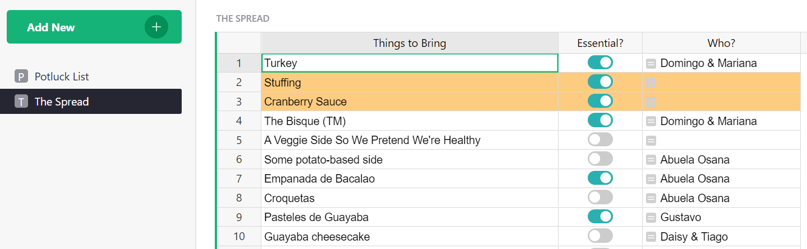

# November 2022 Newsletter

<table class="header" cellpadding="0" cellspacing="0" border="0"><tr>
  <td class="header-text">
    <table class="header-top"><tr>
      <td class="header-image">
        
      </td>
      <td class="header-top-text">
        
Grist for the Mill

        
November 2022
          &#8226; <a href="https://www.getgrist.com/">getgrist.com</a>

      </td>
    </tr></table>
    

      Welcome to our monthly newsletter of updates and tips for Grist users.
    

  </td>
</tr></table>

## Grist Experiment: Writing Python Formulas with AI

We see plenty of Grist power users who use every feature except formulas, which is a shame, but understandable. Formulas can be daunting. Imagine if writing spreadsheet formulas were as simple as asking a question.

We recently experimented with OpenAI to see how well AI could write Python formulas in Grist. The experiment yielded promising results which we’re excited to share!

While this AI-assisted formula generation feature is not yet a part of Grist, this experiment proves its future value: AI can eliminate a common struggle for today’s spreadsheet user — writing formulas correctly.  

Read more about the experiment on our blog. There’s a poll at the end where you can vote for this feature, and sign up for updates about our AI formula generation.

[READ MORE](https://www.getgrist.com/blog/ai-formula-generation-experiment/){:target="\_blank"}
{: .grist-button}

## Want to Help Grist’s Development?

We’re always working on big new features and would love early feedback from users before features are added to Grist. If you would like to test early features and provide feedback, email [success@getgrist.com](mailto:success@getgrist.com?subject=Early User Feedback){:target="\_blank"}. 

[EMAIL US](mailto:success@getgrist.com?subject=Early User Feedback){:target="\_blank"}
{: .grist-button}

## What's New

### Sort and Filter Improvements

We’ve improved the experience of sorting and filtering tables and other widgets, making it easier to use. Save and revert settings are now clearer at a glance, and the filter buttons are more flexible. 

Previously, to create filter buttons above a widget, you could either make all or none of your filters into buttons. Now, you can pin filter buttons individually. 

For example, this widget has two filters applied to the “Invitation” and “Thank You Sent?” columns. Only one of them, “Thank you Sent?”, is pinned as a button for convenience. “Invitation” is not pinned, because it is ensuring that this view only shows guests who RSVP’d yes to the wedding.

(If you need it, here’s the full [wedding planning template](https://templates.getgrist.com/mNp9G2bZ1uaE/Wedding-Planner){:target="\_blank"} — and congrats!)

## Learning Grist

### Webinar: Modifying Templates

December’s webinar will focus on how to look under the hood of a template from our [template gallery](https://docs.getgrist.com/p/templates){:target="\_blank"}, and modify it to meet your needs.

**Thursday December 15th at 3:00pm US Eastern Time.**

[SIGN UP FOR DECEMBER'S WEBINAR](https://www.getgrist.com/learn-grist-webinar/){:target="\_blank"}
{: .grist-button}

### Creator Tips for Productive Workflows

In November, Natalie shared tips for creators to get the most out of Grist while building productive workflows for teams, while making use of features that make Grist easy to use by anyone. 

[WATCH NOVEMBER'S RECORDING](https://www.youtube.com/watch?v=bzzHhOV6gwk){:target="\_blank"}
{: .grist-button}

### Sprouts Program

Grist often surprises people with its capabilities. Schedule a **free** Sprouts call with an expert to see if Grist can address your needs.

[LEARN MORE](https://www.getgrist.com/sprouts-program/){:target="\_blank"}
{: .grist-button}

## Templates

### Donations Tracking

It's always the season for giving! Keep track of your charitable donations all in one place.

For more guidance on how to use this template, [read our blog.](https://www.getgrist.com/blog/donation-tracking-template/){:target="\_blank"}

{:target="\_blank"}

[GO TO TEMPLATE](https://templates.getgrist.com/ihJgigEcm35v/Donation-Tracking){:target="\_blank"}
{: .grist-button .grist-button-tight}

### 🎄 Christmas Gifts Budget

Tis the season! Easily track and budget your holiday gifts in one place. 

{:target="\_blank"}

[GO TO TEMPLATE](https://templates.getgrist.com/dr6epxpXUcy9/-Christmas-Gifts-Budget){:target="\_blank"}
{: .grist-button .grist-button-tight}

### Potluck Organizer

We’re re-sharing this template because it may still be useful heading into the holiday season! This template handles the logistics of potluck dinners. Everyone can collaborate by writing down what they're bringing and making sure all the essentials are covered. 

For guidance on how to use it, [read our blog](https://www.getgrist.com/blog/holiday-potluck-organizer-template/){:target="\_blank"}.

{:target="\_blank"}

[GO TO TEMPLATE](https://templates.getgrist.com/bnWySBocgpze/Thanksgiving-Potluck-Organizer){:target="\_blank"}
{: .grist-button .grist-button-tight}

## Help spread the word?
If you’re interested in helping Grist grow, consider leaving a review on product review sites. Here’s  short list where your review could make a big impact. Thank you! 🙏

* [Stackshare](https://stackshare.io/getgrist){:target="\_blank"}
* [Capterra](https://www.capterra.com/p/232821/Grist/){:target="\_blank"}
* [TrustRadius](https://www.trustradius.com/products/grist/){:target="\_blank"}

## We are here to support you

**Have questions, feedback, or need help?** Search our [Help Center](../index.md), [watch video
tutorials](https://www.youtube.com/channel/UCx0ioQrrC-bIrkmZ7ZULr0g/playlists), share ideas in our
[Community](https://community.getgrist.com), or contact us at <support@getgrist.com>.
