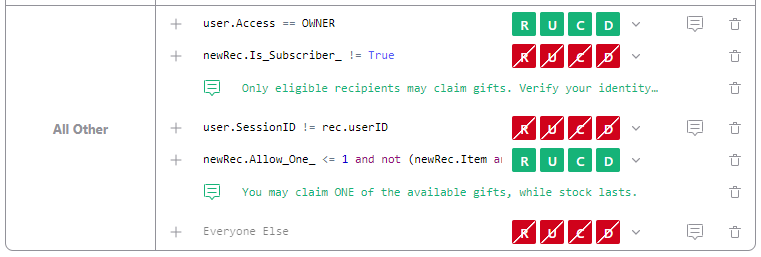

# December 2022 Newsletter

<table class="header" cellpadding="0" cellspacing="0" border="0"><tr>
  <td class="header-text">
    <table class="header-top"><tr>
      <td class="header-image">
        
      </td>
      <td class="header-top-text">
        
Grist for the Mill

        
December 2022
          &#8226; <a href="https://www.getgrist.com/">getgrist.com</a>

      </td>
    </tr></table>
    

      Welcome to our monthly newsletter of updates and tips for Grist users.
    

  </td>
</tr></table>

## What's New

### New  Date Filter with Calendar

Filtering date and datetime columns just got easier. You can now select a date range using a calendar picker. 

The bounds of the range may also be relative — for example, from `1st day of this month` to `Today`. The filter will update with each passing day.

### Snapshots in Grist Core

Previously, snapshots were available on hosted Grist and the self-managed enterprise plan, and relied on commercial cloud storage services. Now, snapshot support is also available on [Grist Core](https://github.com/gristlabs/grist-core){:target="\_blank"} — the open source version of Grist — and can work with open source self-hosted storage options such as MinIO. 🎉 Learn how to [set up snapshots](../self-managed.md#how-do-i-set-up-snapshots){:target="\_blank"}.

### Quick Delete for Invalid Table/Column Access Rules

If there are access rules for a table or column that has been deleted, there is now a convenient button to delete the rules that apply to the deleted column or table. 

You remain in control of which rules remain and which are deleted, so you don't have to worry about rules disappearing if you are reorganizing your document.

In this example, the `Breeder_Retirement` column has been deleted, so the column rule for that column should also be deleted.

### Improved UI for Memo Writing

Access rules now have a memo button to add memos to rules, making writing and editing memos more convenient.

Memos can really help colleagues understand why they can't do something, since memos are shown in a popup when an action is blocked by a rule.

### Tips

To help you and your teammates get the most out of Grist, there are now tips that appear as you explore Grist’s features. To dismiss all tips, check the “Don’t show tips” checkbox.

## Open Source Contributions

Thank you to [@jperon](https://github.com/jperon){:target="\_blank"} who created and shared a pivot table custom widget. Find it in our custom widget Github repo, [grist-widget](https://github.com/gristlabs/grist-widget/tree/master/pivottable){:target="\_blank"}.

## Learning Grist

### Webinar: Access Rules for Teams

Learn how to write access rules that manage team members’ permissions on a document.

**Thursday January 19th at 3:00pm US Eastern Time.**

[SIGN UP FOR JANUARY'S WEBINAR](https://www.getgrist.com/learn-grist-webinar/){:target="\_blank"}
{: .grist-button}

### Modifying Templates

In December, we learned how to modify a template from our [template gallery](https://docs.getgrist.com/p/templates) to better fit your workflow.

[WATCH DECEMBER'S RECORDING](https://www.youtube.com/watch?v=T1Xq4Y2jV50){:target="\_blank"}
{: .grist-button}

### Sprouts Program

Grist often surprises people with its capabilities. Schedule a **free** Sprouts call with an expert to see if Grist can address your needs.

[LEARN MORE](https://www.getgrist.com/sprouts-program/){:target="\_blank"}
{: .grist-button}

## Templates

### Church Management

Grist user Paul Janzen built a CRM for managing parishioner information at his church. He shared the template with us to include in our gallery. Thank you! 🙏

{:target="\_blank"}

[GO TO TEMPLATE](https://templates.getgrist.com/tTWqP14fKcmw/Church-Management/){:target="\_blank"}
{: .grist-button .grist-button-tight}

### Book Club

A common New Year’s resolution is to read more books. Kickstart reading habits with a book club! Use this template to keep track of book suggestions, and find books in stores and libraries with a click.

{:target="\_blank"}

[GO TO TEMPLATE](https://templates.getgrist.com/hdXy57qLiyNf/Book-Club){:target="\_blank"}
{: .grist-button .grist-button-tight}

## Want to Help Grist’s Development?

We’re always working on big new features and would love early feedback from users before features are added to Grist. If you would like to test early features and provide feedback, email [success@getgrist.com](mailto:success@getgrist.com?subject=Early User Feedback){:target="\_blank"}. 

[EMAIL US](mailto:success@getgrist.com?subject=Early User Feedback){:target="\_blank"}
{: .grist-button}

## Help spread the word?
If you’re interested in helping Grist grow, consider leaving a review on product review sites. Here’s  short list where your review could make a big impact. Thank you! 🙏

* [Stackshare](https://stackshare.io/getgrist){:target="\_blank"}
* [Capterra](https://www.capterra.com/p/232821/Grist/){:target="\_blank"}
* [TrustRadius](https://www.trustradius.com/products/grist/){:target="\_blank"}

## We are here to support you

**Have questions, feedback, or need help?** Search our [Help Center](../index.md), [watch video
tutorials](https://www.youtube.com/channel/UCx0ioQrrC-bIrkmZ7ZULr0g/playlists), share ideas in our
[Community](https://community.getgrist.com), or contact us at <support@getgrist.com>.
