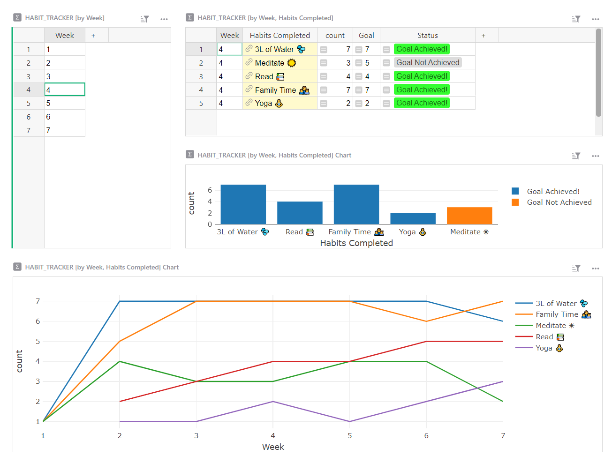
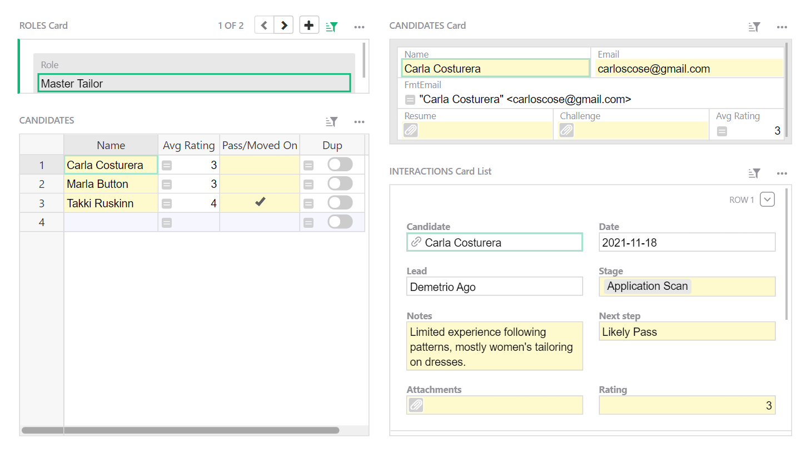

# January 2023 Newsletter

<table class="header" cellpadding="0" cellspacing="0" border="0"><tr>
  <td class="header-text">
    <table class="header-top"><tr>
      <td class="header-image">
        
      </td>
      <td class="header-top-text">
        
Grist for the Mill

        
January 2023
          &#8226; <a href="https://www.getgrist.com/">getgrist.com</a>

      </td>
    </tr></table>
    

      Welcome to our monthly newsletter of updates and tips for Grist users.
    

  </td>
</tr></table>

## What's New

### Grist en Français, Español, Português und Deutsch! 

Grist is now available in multiple languages. To set a language, click on your user icon > profile settings > select a language from the drop-down menu.

We are so grateful to the volunteers who translated Grist, namely the team at ANCT and Paul Janzen. 🙏 The ANCT developers also did the hard work of making a good chunk of the application translatable. Merci bien!

**Want to help translate Grist?**
We use [Weblate](https://hosted.weblate.org/engage/grist/){:target="\_blank"} to manage translations and welcome volunteer translators. Thanks to everyone who is pitching in. 

### Expanding Widgets

Working on small screens just got easier! It is now possible to expand widgets by clicking on the expand icon in the top-right corner. 

### View As Another User

Viewing a document as different team members is useful when testing access rules. It is now easier to cycle through members in a “View As” banner without leaving the page. 

You can also view as a team member from the three-dot menu in the Access Rules button in the left-side panel.

### Seed Rules for Granular Table Permission

When writing access rules, it’s fairly common to repeat the same rule across many tables — for example, always grant owners full read and write permissions. There is now a checkbox that will automatically grant owners full access whenever table rules are added.

Rules that are automatically added to new table rules are called seed rules. You can modify seed rules and even add [memos](../access-rules.md#access-rule-memos){:target="\_blank"} as needed.

### One-click Toggle to Deny Editor Schema Permission

By default, editors of a document have schema permissions, which allow them to modify a document's structure, views, and formulas. Formulas are powerful because a determined user can retrieve information they don't have access to by using formulas. To protect against that, editors can be denied schema permissions with an additional access rule. We've made that easier with a one-click checkbox.

### Document Settings Have Moved

You can now find document settings in the "Tools" section of the left-side panel. 

## Community Highlights

* @jperon created and shared a [QR code custom widget.](https://community.getgrist.com/t/qr-code-custom-widget/1965){:target="\_blank"} 

* @enthus1ast created an [app that periodically backs up Grist documents](https://community.getgrist.com/t/small-stand-alone-application-for-periodially-grist-backups-sqlite-xlsx-csv/1970){:target="\_blank"} in SQLite, Xlsx, and CSV file formats. 

Thank you to both! 🙏

## Learning Grist

### Webinar: Working with Dates

Dates are a common part of data. However, working with them in formulas and filters can be daunting. In this month’s webinar, we’ll share tips for working with dates.

**Thursday February 16th at 2:00pm US Eastern Time.**

[SIGN UP FOR FEBRUARY'S WEBINAR](https://www.getgrist.com/learn-grist-webinar/){:target="\_blank"}
{: .grist-button}

### Access Rules for Teams

In January, we learned how to write access rules to manage team members’ permissions on a document.

[WATCH JANUARY'S RECORDING](https://www.youtube.com/watch?v=7T9XCpZyk9c){:target="\_blank"}
{: .grist-button}

## Templates

### Habit Tracker

Set yourself up for success by building better habits! Track your progress with this simple weekly habit tracker.

{:target="\_blank"}

[GO TO TEMPLATE](https://templates.getgrist.com/1BR9vm6GPTGX/Habit-Tracker){:target="\_blank"}
{: .grist-button .grist-button-tight}

### Credit Card Expenses

Track employee credit card expenses and analyze spending in one place.

{:target="\_blank"}

[GO TO TEMPLATE](https://templates.getgrist.com/2i9WoHs2oRzK/Credit-Card-Activity-Template-AmEx){:target="\_blank"}
{: .grist-button .grist-button-tight}

### Recruiting

Use this template to track candidates applying for roles on your team. Collaboratively track job applicants, and attach resumes and interview notes.

{:target="\_blank"}

[GO TO TEMPLATE](https://templates.getgrist.com/d7NBjwRKqrzp/Recruiting){:target="\_blank"}
{: .grist-button .grist-button-tight}
## Want to Help Grist’s Development?

We’re always working on big new features and would love early feedback from users before features are added to Grist. If you would like to test early features and provide feedback, email [success@getgrist.com](mailto:success@getgrist.com?subject=Early User Feedback){:target="\_blank"}. 

[EMAIL US](mailto:success@getgrist.com?subject=Early User Feedback){:target="\_blank"}
{: .grist-button}

## Help spread the word?
If you’re interested in helping Grist grow, consider leaving a review on product review sites. Here’s  short list where your review could make a big impact. Thank you! 🙏

* [Stackshare](https://stackshare.io/getgrist){:target="\_blank"}
* [Capterra](https://www.capterra.com/p/232821/Grist/){:target="\_blank"}
* [TrustRadius](https://www.trustradius.com/products/grist/){:target="\_blank"}

## We are here to support you

**Sprouts Program.** Grist often surprises people with its capabilities. Schedule a **free** Sprouts call with an expert to see if Grist can address your needs. [Learn more.](https://www.getgrist.com/sprouts-program/){:target="\_blank"}

**Have questions, feedback, or need help?** Search our [Help Center](../index.md), [watch video
tutorials](https://www.youtube.com/channel/UCx0ioQrrC-bIrkmZ7ZULr0g/playlists), share ideas in our
[Community](https://community.getgrist.com), or contact us at <support@getgrist.com>.
