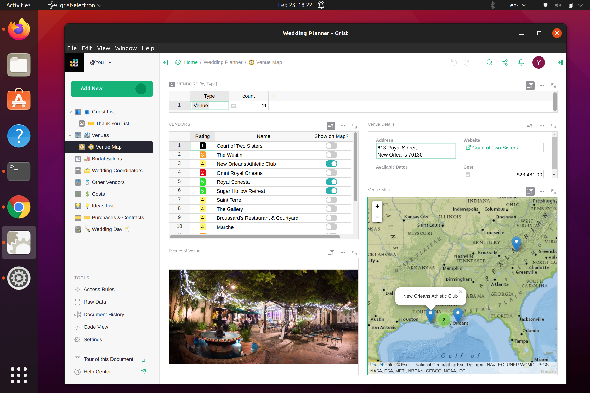
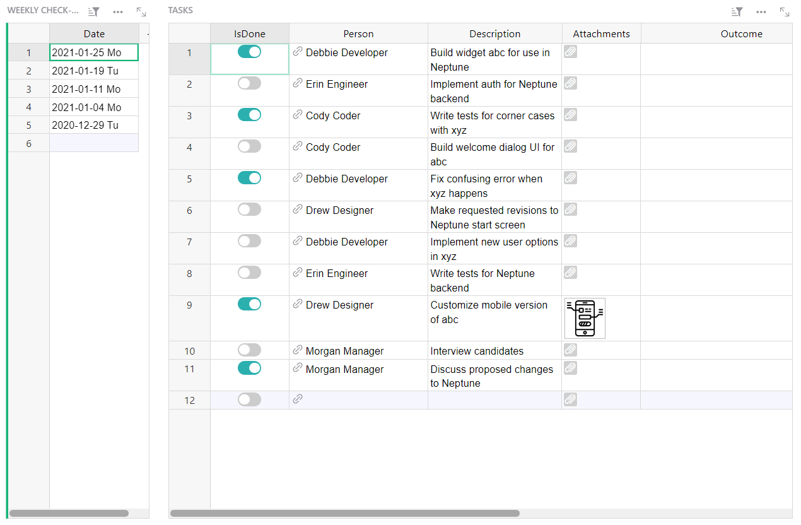
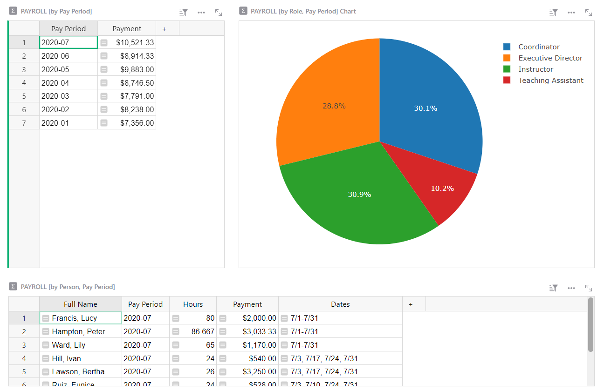

# February 2023 Newsletter

<table class="header" cellpadding="0" cellspacing="0" border="0"><tr>
  <td class="header-text">
    <table class="header-top"><tr>
      <td class="header-image">
        
      </td>
      <td class="header-top-text">
        
Grist for the Mill

        
February 2023
          &#8226; <a href="https://www.getgrist.com/">getgrist.com</a>

      </td>
    </tr></table>
    

      Welcome to our monthly newsletter of updates and tips for Grist users.
    

  </td>
</tr></table>

## More Languages to Choose From

Last month we announced that Grist is now available in multiple languages thanks to the efforts of volunteer translators. Since then, more volunteers have come forward, far exceeding our expectations. Big thank you to everyone who has translated Grist! 🙏

It is now translated into the following languages:

* Chinese
* French
* German
* Italian
* Portuguese
* Russian
* Spanish
* Ukrainian

There are also partial translations of Norwegian Bokmål and Polish. If you’re interested in completing those translations, visit our [Weblate](https://hosted.weblate.org/engage/grist/){:target="\_blank"} project to contribute to those efforts. 

If you would like us to add a new language to Weblate, let us know which language in this [community thread](https://community.getgrist.com/t/translating-grist/2086){:target="\_blank"}.

Note that the Chinese translation is brand new and will be available in the product next week.

## Dev Talk

This month we’re highlighting cool side projects that Grist engineers are passionate about.

### Grist Electron App

Paul has been working on an Electron build of Grist! It is a longstanding passion project of his to make Grist a standalone app on Windows, Mac and Linux. Last year, user @stan-donarise worked on a [Grist Electron app for Windows 7 or later](https://github.com/stan-donarise/grist-core-electron/){:target="\_blank"}. Paul took ideas from that effort, from this [forum thread](https://community.getgrist.com/t/packaging-grist-as-an-electron-app/1233){:target="\_blank"},  and from an early standalone version of Grist developed at Grist Labs.

Check out the [Grist Electron app repo on Github](https://github.com/paulfitz/grist-electron#readme){:target="\_blank"}. Use with your own Grist documents or documents you trust since there is no sandboxing — yet. 😏

### Why Sorting Is Harder Than It Seems

Every once in a while a user will report a sorting bug. Some developers may think sorting is easy. Here’s why it’s not, and a delightful deep dive into the [unexpected corners of sorting](https://www.getgrist.com/blog/why-sorting-is-harder-than-it-seems/){:target="\_blank"}.

### Large Docs Bogging You Down?

Our engineers also worked on optimizations to improve formula performance. The Python profiling tool [py-spy](https://github.com/benfred/py-spy){:target="\_blank"} was particularly helpful to know where CPU time was being spent. Tests on a large document showed a 26% improvement in performance speed. Your mileage may vary, and we’d be curious to hear if anyone noticed the speed up.

## Learning Grist

### Webinar: Data Cleaning

Typically after importing data into Grist, the next step is cleaning that data. We’ll share tips and tricks to sanitize data efficiently, including some clever Grist-only hacks.

**Thursday March 16th at 3:00pm US Eastern Time.**

[SIGN UP FOR MARCH'S WEBINAR](https://www.getgrist.com/learn-grist-webinar/){:target="\_blank"}
{: .grist-button}

### Working with Dates

In February, we learned how to work with dates in filters, summary tables, and formulas.

[WATCH FEBRUARY'S RECORDING](https://www.youtube.com/watch?v=Ul5xar9LQuI){:target="\_blank"}
{: .grist-button}

## Templates

### Task Management

Organize your team’s tasks and guide a weekly check-in.

{:target="\_blank"}

[GO TO TEMPLATE](https://templates.getgrist.com/6D8E2h2DQNwS/Task-Management){:target="\_blank"}
{: .grist-button .grist-button-tight}

### Payroll

Our simple payroll tracker is one of our most popular templates. Track employee wage information, payroll payments, and pay period payroll spending in one place.

{:target="\_blank"}

[GO TO TEMPLATE](https://templates.getgrist.com/5pHLanQNThxk/Payroll){:target="\_blank"}
{: .grist-button .grist-button-tight}

## Help spread the word?
If you’re interested in helping Grist grow, consider leaving a review on product review sites. Here’s  short list where your review could make a big impact. Thank you! 🙏

* [Stackshare](https://stackshare.io/getgrist){:target="\_blank"}
* [Capterra](https://www.capterra.com/p/232821/Grist/){:target="\_blank"}
* [TrustRadius](https://www.trustradius.com/products/grist/){:target="\_blank"}

## We are here to support you

**Sprouts Program.** Grist often surprises people with its capabilities. Schedule a **free** Sprouts call with an expert to see if Grist can address your needs. [Learn more.](https://www.getgrist.com/sprouts-program/){:target="\_blank"}

**Have questions, feedback, or need help?** Search our [Help Center](../index.md), [watch video
tutorials](https://www.youtube.com/channel/UCx0ioQrrC-bIrkmZ7ZULr0g/playlists), share ideas in our
[Community](https://community.getgrist.com), or contact us at <support@getgrist.com>.
