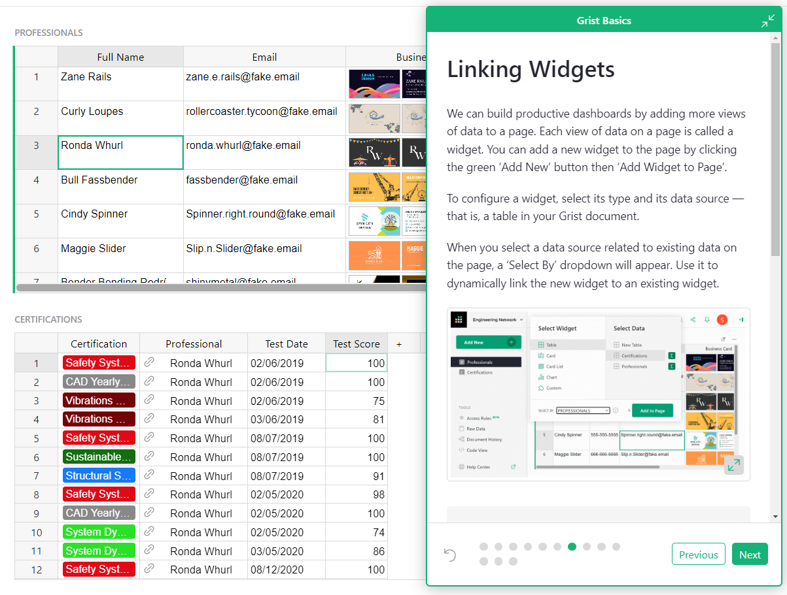
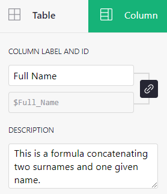
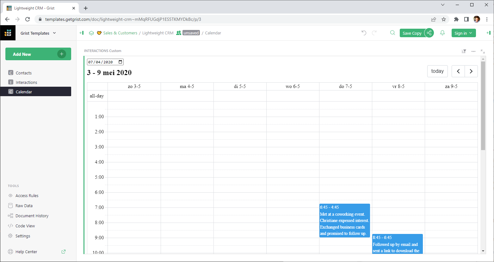
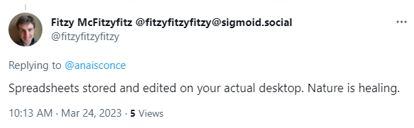
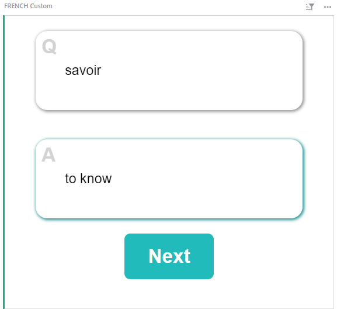

# March 2023 Newsletter

<table class="header" cellpadding="0" cellspacing="0" border="0"><tr>
  <td class="header-text">
    <table class="header-top"><tr>
      <td class="header-image">
        
      </td>
      <td class="header-top-text">
        
Grist for the Mill

        
March 2023
          &#8226; <a href="https://www.getgrist.com/">getgrist.com</a>

      </td>
    </tr></table>
    

      Welcome to our monthly newsletter of updates and tips for Grist users.
    

  </td>
</tr></table>

**In this Newsletter**
{: .newsletter-summary-header}

* **Minimizing Widgets**

    Make room on your dashboards by collapsing widgets into buttons.

* **Grist Basics Tutorial**

    An in-product, hands-on way to learn Grist.

* **User Poll**

    Let us know what you think! 👀        

* **Open Source Contributions 🙏**

    Column descriptions, calendar custom widget, and more! 

* **Flashcards Custom Widget**

    A new custom widget perfect for learning. 

* **Work at Grist!**

    Two marketing positions are now open at Grist.     

## The Big Grist Survey! 🔥

Help improve Grist by taking our 5-question user experience poll! There may even be a prize! 🌈💰

[TAKE SURVEY](https://public.getgrist.com/cxcP6cFhuVa6/Grist-Customer-Experience#a1.s5.rrnew.c5){:target="\_blank"}
{: .grist-button}

## Want to work at Grist?

Do you love Grist *and* love marketing? Check out our new job openings at [https://www.getgrist.com/jobs/](https://www.getgrist.com/jobs/){:target="\_blank"}.

## What's New

### Minimizing Widgets 

Need more room on your dashboard? Have a widget that doesn’t need to be in view at all times? You can now collapse widgets into buttons at the top of the page! The widget will expand on click and will retain dynamic linking with other widgets in the page. 

<iframe width="560" height="315" src="https://www.youtube.com/embed/AUiyv4HK7a4?rel=0" frameborder="0" allow="accelerometer; autoplay; encrypted-media; gyroscope; picture-in-picture" allowfullscreen></iframe>

### Grist Basics In-Product Tutorial

Learning Grist has never been easier! Check out our new hands-on tutorial. This [step-by-step guide](https://templates.getgrist.com/doc/woXtXUBmiN5T){:target="\_blank"} will give you the basics to go from spreadsheets to productive dashboards.

## Open Source Contributions

### Column Descriptions

Thank you to @CamilleLegeron who made it possible to add descriptions to columns. 🎉🙏 You may now set column descriptions in the creator panel. 

### Custom Widget Calendar View

@ToJans on Twitter shared his calendar custom widget, as well as a link you can incorporate into your own docs. Check out [his tweet](https://twitter.com/ToJans/status/1638156999249502215){:target="\_blank"}. It works! 💪 

### TASTEME()  ??

Last month we also received a new function from @DysfunctionalWerewolf. The TASTEME() function returns **True** for tasty text, **False** for not tasty text. It’s...useful? 🤔 @DysfunctionalWerewolf showed off the function in action on Twitter [@were_functions](https://twitter.com/were_functions/status/1633089030261821441){:target="\_blank"}.

We had fun trying to crack the pattern for what is and isn’t tasty! Let us know if your data is, uh, werewolf approved?

### Update on the Grist Electron App — Sandboxing!

Good news, everyone! The Grist electron app now has sandboxing by default. Anyone can download the app without having to compile from source or know Docker. Finally, a super easy way to run Grist locally on your computer.

Learn more on [Github](https://github.com/gristlabs/grist-electron/blob/main/README.md){:target="\_blank"}.

Find the right download file in [this list](https://github.com/gristlabs/grist-electron/releases){:target="\_blank"}.

### Sponsor Grist on Github

Want to show your support for our open source project? Post about us on all your socials and tell your friends! If you want to do even more, consider sponsoring us on Github. 🧡

We’re grateful to our first corporate sponsor Dotphoton, and to sponsor @emanuelegissi! 🙏 

[SPONSOR GRIST](https://github.com/sponsors/gristlabs){:target="\_blank"}
{: .grist-button}

## Learning Grist

### Webinar: Trigger Formulas

Grist formulas can be set to trigger on specific record events. Learn all about trigger formulas, when to use them, and common uses of trigger formulas to keep your data organized and productive.

**Wednesday April 12th at 3:00 pm US Eastern Time.**

[SIGN UP FOR APRIL'S WEBINAR](https://www.getgrist.com/learn-grist-webinar/?utm_source=newsletter&utm_medium=support-site&utm_campaign=build-webinar&utm_term=april-2023&utm_content=){:target="\_blank"}
{: .grist-button}

### Data Cleaning

In March, Natalie shared tips for cleaning your data fast in Grist, including a few Grist-only tricks.

[WATCH MARCH'S RECORDING](https://www.youtube.com/watch?v=evZQiz2kRqo){:target="\_blank"}
{: .grist-button}

## New Template and Custom Widget

### Flashcards

Ready to ace your next test? You'll score 💯 when you study with these baddies. Flashcards are one of the most effective forms of study — and with Grist they're all in one place.

{:target="\_blank"}

[GO TO TEMPLATE](https://templates.getgrist.com/keLK5sVeyfPk/Flashcards/){:target="\_blank"}
{: .grist-button .grist-button-tight}

## Help spread the word?
If you’re interested in helping Grist grow, consider leaving a review on product review sites. Here’s  short list where your review could make a big impact. Thank you! 🙏

* [Stackshare](https://stackshare.io/getgrist){:target="\_blank"}
* [Capterra](https://www.capterra.com/p/232821/Grist/){:target="\_blank"}
* [TrustRadius](https://www.trustradius.com/products/grist/){:target="\_blank"}

## We are here to support you

**Sprouts Program.** Grist often surprises people with its capabilities. Schedule a **free** Sprouts call with an expert to see if Grist can address your needs. [Learn more.](https://www.getgrist.com/sprouts-program/){:target="\_blank"}

**Have questions, feedback, or need help?** Search our [Help Center](../index.md), [watch video
tutorials](https://www.youtube.com/channel/UCx0ioQrrC-bIrkmZ7ZULr0g/playlists), share ideas in our
[Community](https://community.getgrist.com), or contact us at <support@getgrist.com>.
