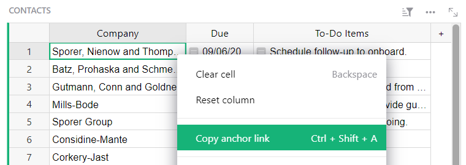
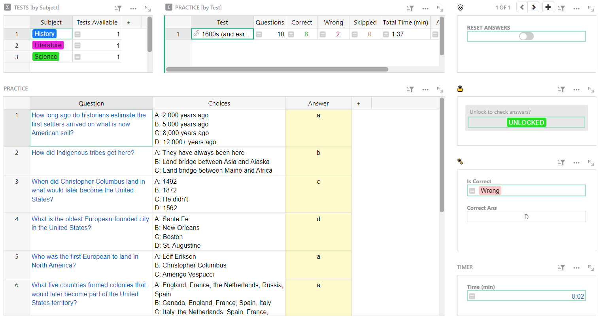

# April 2023 Newsletter

<table class="header" cellpadding="0" cellspacing="0" border="0"><tr>
  <td class="header-text">
    <table class="header-top"><tr>
      <td class="header-image">
        
      </td>
      <td class="header-top-text">
        
Grist for the Mill

        
April 2023
          &#8226; <a href="https://www.getgrist.com/">getgrist.com</a>

      </td>
    </tr></table>
    

      Welcome to our monthly newsletter of updates and tips for Grist users.
    

  </td>
</tr></table>

## Flashcards Contest: Build the Best Knowledge Deck

In May we’re sponsoring a flashcards contest. 

Build the best flashcard deck by using our [Flashcards Template](https://templates.getgrist.com/keLK5sVeyfPk/Flashcards/p/2){:target="\_blank"} to share your expertise on any topic. The community will then vote for the top **three** most mind-blowing flashcard decks. 

Each of the three winners will receive a rare and highly sought-after **Grist thermos**.

  

    
  

[LEARN MORE](https://www.getgrist.com/blog/flashcards-template-contest-grist/){:target="\_blank"}
{: .grist-button}

## What's New

### We rickrolled, and so can you

Last month we invited you to answer a Grist survey and rewarded your kindness with an April Fool’s joke: a [rickroll](https://knowyourmeme.com/memes/rickroll){:target="\_blank"} in Grist. 

The great news is that you can pay this forward whenever you like to whomever you like with any document. Take any Grist anchor link and replace the r in the URL with rr. We call it “rickrow” because that r anchors to a row. 

To find an anchor link, right click on any cell and select “copy anchor link” from the context menu (keyboard shortcut shown in menu).

In this case the anchor link is `https://templates.getgrist.com/doc/lightweight-crm#a1.s1.r20.c2`

To rickrow someone, edit the anchor link to `https://templates.getgrist.com/doc/lightweight-crm#a1.s1.rr20.c2` 

For full rickrolling, be sure the recipient can access the document!

### Grist-static: Publish data on static sites without embeds

Take a peek at our CTO Paul’s latest experiment. Grist-static offers a way to view and interact with .grist files on regular websites, with no special back-end support needed. Grist-static is great for displaying spreadsheet reports on a website, similar to PDF reports, but better! 

With grist-static, viewers will be able to change selections, and experiment with changing numbers to see what happens. Every viewer has their own copy, and their changes won't be seen by others, or stored. This would also be a scalable way to show a Grist document to millions of simultaneous users.

See some examples [here](https://gristlabs.github.io/grist-static){:target="\_blank"}.

Learn more on [Github](https://github.com/gristlabs/grist-static){:target="\_blank"}.

**We want to hear from you.**

Do you already see a use case for grist-static? Are you excited by it? Tell us by emailing us at <support@getgrist.com>, or posting in our [community forum](https://community.getgrist.com/){:target="\_blank"}. This is just the beginning for grist-static and your input helps guide our design.

### Another werewolf strike:  MOONPHASE()

Another function contribution by user [@were_functions](https://twitter.com/were_functions){:target="\_blank"} on Twitter. The MOONPHASE() function returns the phase of the moon on the given date. Here's what it tells us about the date of this newsletter: `MOONPHASE(TODAY())` is 🌓. With other arguments, we can find that it's been 8 days since new moon, or 0.27 of a month. Also that `MOONPHASE(TODAY(), "lunacy")` is 🕺. Safe for now, but it's less than a week to the next full moon. Someone ought to start taking the wolfsbane potion.

Try it yourself! Tip: Replace "lunacy" with "days" to calculate the age of the moon in days, or "fraction" to calculate the fraction of the lunar month since the new moon.

### Sponsor Grist on Github

Want to show your support for our open source project? Post about us on all your socials and tell your friends! If you want to do even more, consider sponsoring us on Github. 🧡

[SPONSOR GRIST-CORE](https://github.com/sponsors/gristlabs){:target="\_blank"}
{: .grist-button}

## Learning Grist

### Webinar: Importing Data

Many Grist users have imported spreadsheets into Grist, but not all are aware of all the cool import features that Grist offers, such as incremental imports, merge fields, and formula transformations. In May, we’ll dig into importing data like a pro.

**Tuesday May 16th at 12:00pm US Eastern Time.**

[SIGN UP FOR MAY'S WEBINAR](https://www.getgrist.com/learn-grist-webinar/?utm_source=newsletter&utm_medium=support-site&utm_campaign=build-webinar&utm_term=may-2023&utm_content=){:target="\_blank"}
{: .grist-button}

### Trigger Formulas

In April, we learned all about trigger formulas, when to use them, and common uses of trigger formulas to keep your data organized and productive.

[WATCH APRIL'S RECORDING](https://www.youtube.com/watch?v=wwzm39ADslA){:target="\_blank"}
{: .grist-button}

## New Template

### Test Prep

Create timed sample tests and flashcards to ace your next test!

{:target="\_blank"}

[GO TO TEMPLATE](https://templates.getgrist.com/31mHTkbzmXvm/Test-Prep-){:target="\_blank"}
{: .grist-button .grist-button-tight}

## Help spread the word?
If you’re interested in helping Grist grow, consider leaving a review on product review sites. Here’s  short list where your review could make a big impact. Thank you! 🙏

* [Stackshare](https://stackshare.io/getgrist){:target="\_blank"}
* [Capterra](https://www.capterra.com/p/232821/Grist/){:target="\_blank"}
* [TrustRadius](https://www.trustradius.com/products/grist/){:target="\_blank"}

## We are here to support you

**Sprouts Program.** Grist often surprises people with its capabilities. Schedule a **free** Sprouts call with an expert to see if Grist can address your needs. [Learn more.](https://www.getgrist.com/sprouts-program/){:target="\_blank"}

**Have questions, feedback, or need help?** Search our [Help Center](../index.md), [watch video
tutorials](https://www.youtube.com/channel/UCx0ioQrrC-bIrkmZ7ZULr0g/playlists), share ideas in our
[Community](https://community.getgrist.com), or contact us at <support@getgrist.com>.
