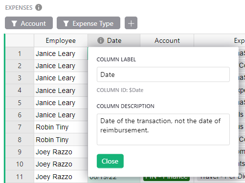
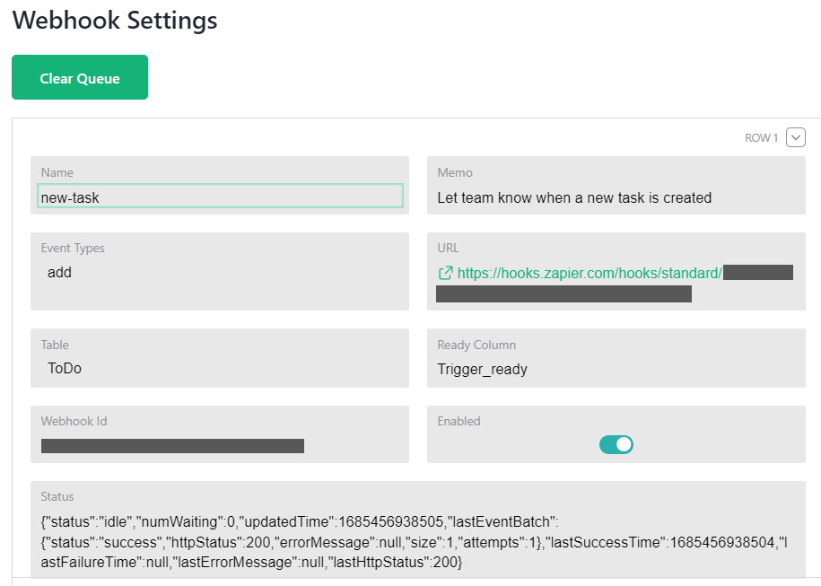
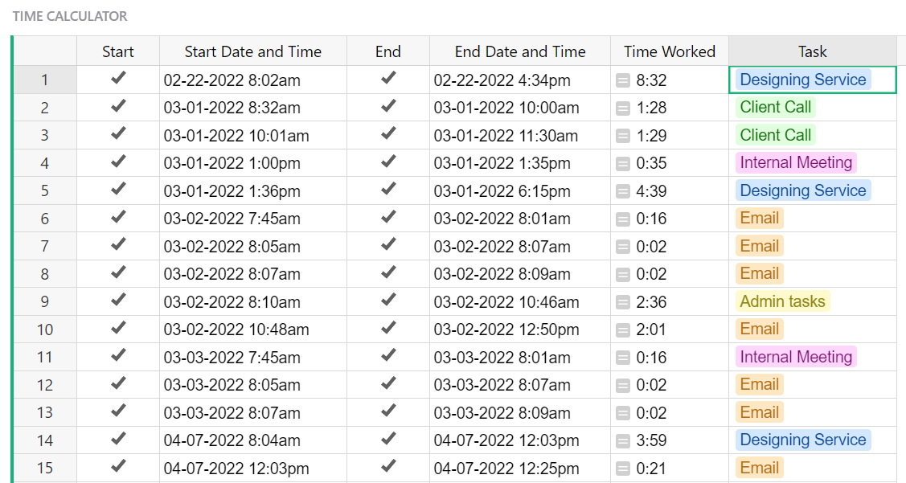

# May 2023 Newsletter

<table class="header" cellpadding="0" cellspacing="0" border="0"><tr>
  <td class="header-text">
    <table class="header-top"><tr>
      <td class="header-image">
        
      </td>
      <td class="header-top-text">
        
Grist for the Mill

        
May 2023
          &#8226; <a href="https://www.getgrist.com/">getgrist.com</a>

      </td>
    </tr></table>
    

      Welcome to our monthly newsletter of updates and tips for Grist users.
    

  </td>
</tr></table>

## Flashcard Contest: Vote for the Best Deck!

In May we sponsored a flashcard contest. Grist users were invited to build the best flashcard deck by using our [Flashcards Template](https://templates.getgrist.com/keLK5sVeyfPk/Flashcards){:target="\_blank"}. Thank you for your submissions! The community will now vote for the best flashcard decks!

[VOTE](https://community.getgrist.com/t/flashcards-contest-build-the-best-knowledge-deck/2496/22){:target="\_blank"}
{: .grist-button}

## What's New

### Column and Widget Descriptions

In March @CamilleLegeron made it possible to add descriptions to columns. Now, columns with descriptions have an info icon in their headers, which when hovered over or clicked reveal the respective description. This feature has been enabled on widgets as well, providing even more context to your team.

To set a column or widget description, click into the title to open the renaming dialog which now includes a description field. Alternatively, descriptions may be set in the creator panel.

### Webhooks!

We're happy to release beta webhooks support! 🎉 Webhooks are one way to send information from Grist to other apps. For example, if a record is updated in Grist, send a message in Slack. When in a document, navigate to the Settings page listed the left-side panel under “Tools”. The “Manage Webhooks” button at the bottom will take you to the webhooks page. 

Unofficial API support for webhooks has been available for some time, forming the basis for Zapier, Pabbly Connect, and other integrations. That API will continue to work, and is no longer limited to specific partners — you can now use it with any site.

## Learning Grist

### Webinar: Deconstructing a Template, Software Deals Tracker

When looking at our templates you may wonder why templates are structured in a particular way. Over the next four months we’ll rebuild templates with you and highlight common patterns in each document. 

In June, we’ll show you how we built the [Software Deals Tracker](https://templates.getgrist.com/viyGsuqvNF1D/Software-Deals-Tracker/p/1){:target="\_blank"}. The template has three pages, each with multiple widgets focused on different workflows, and yet the document is built on only one data table. We’ll show you why to help you anticipate your own use cases where all you need is one table with multiple views.

**Thursday June 22nd at 3:00pm US Eastern Time.**

[SIGN UP FOR JUNE'S WEBINAR](https://www.getgrist.com/learn-grist-webinar/?utm_source=newsletter&utm_medium=support-site&utm_campaign=build-webinar&utm_term=june-2023&utm_content=){:target="\_blank"}
{: .grist-button}

### Importing Data

In May, we explored all the cool import features that Grist offers, such as incremental imports, merge fields, and formula transformations. 

[WATCH MAY'S RECORDING](https://www.youtube.com/watch?v=3gBeJCYMS-Q){:target="\_blank"}
{: .grist-button}

## Templates

### Expense Tracking for Teams

Manage all employee expenses in one place. No more wrangling employees' expense spreadsheets into a master list every month. With access rules, employees can log into Grist, view and update only their expenses, and Grist takes care of the rest.

Watch [this template’s webinar](https://www.youtube.com/watch?v=27sP9t-Q4m4){:target="\_blank"} to learn more about how this template was built.

{:target="\_blank"}

[GO TO TEMPLATE](https://templates.getgrist.com/55Q2EtTbFvB1/Expense-Tracking-for-Teams){:target="\_blank"}
{: .grist-button .grist-button-tight}

### Simple Time Tracker

Like a stopwatch in a spreadsheet to create a log of time spent on tasks. 

{:target="\_blank"}

[GO TO TEMPLATE](https://templates.getgrist.com/np7TVHmuvFcH/Simple-Time-Tracker){:target="\_blank"}
{: .grist-button .grist-button-tight}

## Help spread the word?
If you’re interested in helping Grist grow, consider leaving a review on product review sites. Here’s  short list where your review could make a big impact. Thank you! 🙏

* [Stackshare](https://stackshare.io/getgrist){:target="\_blank"}
* [Capterra](https://www.capterra.com/p/232821/Grist/){:target="\_blank"}
* [TrustRadius](https://www.trustradius.com/products/grist/){:target="\_blank"}

## We are here to support you

**Sprouts Program.** Grist often surprises people with its capabilities. Schedule a **free** Sprouts call with an expert to see if Grist can address your needs. [Learn more.](https://www.getgrist.com/sprouts-program/){:target="\_blank"}

**Have questions, feedback, or need help?** Search our [Help Center](../index.md), [watch video
tutorials](https://www.youtube.com/channel/UCx0ioQrrC-bIrkmZ7ZULr0g/playlists), share ideas in our
[Community](https://community.getgrist.com), or contact us at <support@getgrist.com>.
