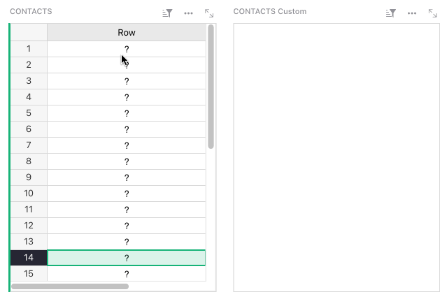
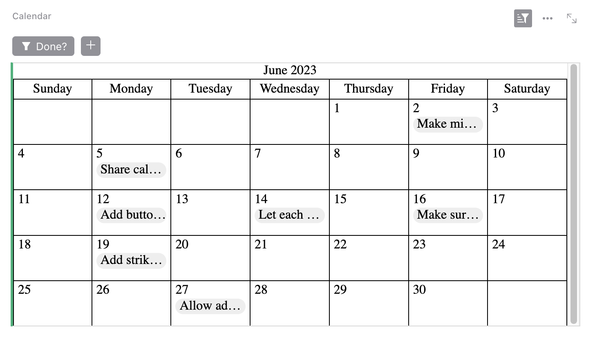
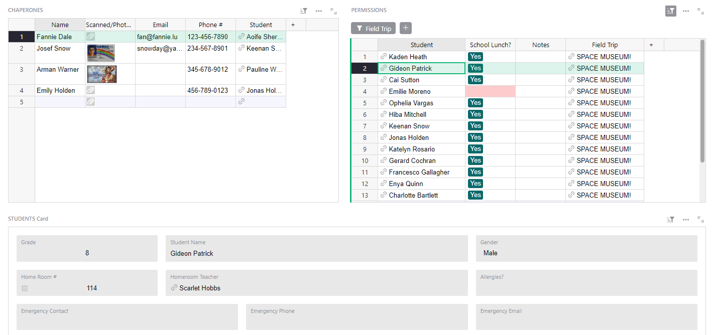
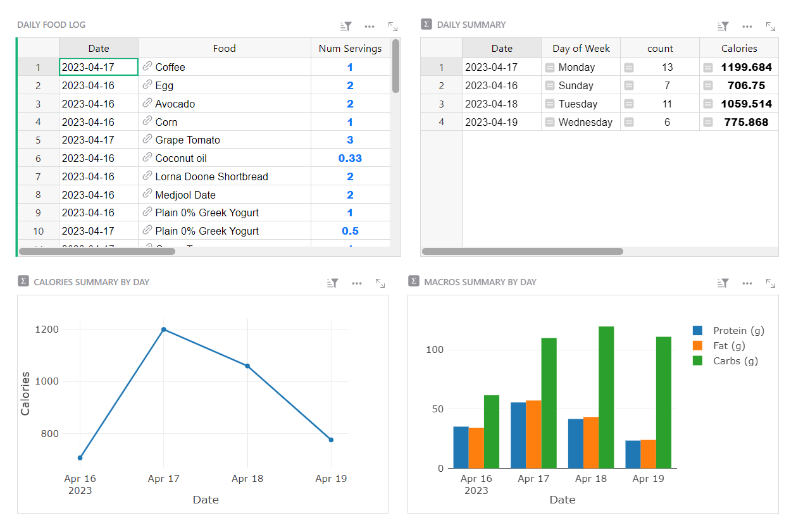
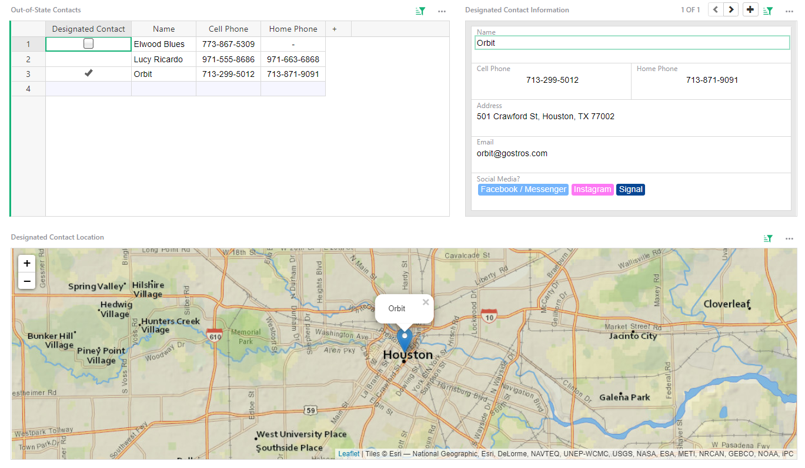

# June 2023 Newsletter

<table class="header" cellpadding="0" cellspacing="0" border="0"><tr>
  <td class="header-text">
    <table class="header-top"><tr>
      <td class="header-image">
        
      </td>
      <td class="header-top-text">
        
Grist for the Mill

        
June 2023
          &#8226; <a href="https://www.getgrist.com/">getgrist.com</a>

      </td>
    </tr></table>
    

      Welcome to our monthly newsletter of updates and tips for Grist users.
    

  </td>
</tr></table>

## What's New

### Highlighting for selector rows

A small but mighty fix. Grist now highlights the selected row linked to widgets on a page.

## Community Highlights

* @wunter8 has created a [calendar widget](https://community.getgrist.com/t/simple-calendar-widget/2676){:target="\_blank"} that is a great example of what [custom widgets](https://support.getgrist.com/widget-custom/){:target="\_blank"} can do. Who knows, maybe this could inspire an official calendar widget? 👀 (@ToJans also shared a calendar widget [back in March](https://support.getgrist.com/newsletters/2023-03/#custom-widget-calendar-view){:target="\_blank"}.)

* Database-heads will appreciate @John1’s [PostgreSQL Foreign Data Wrapper](https://community.getgrist.com/t/postgresql-grist-fdw/2678){:target="\_blank"}, which is a very neat tool that allows you to import and query Grist tables in PostgreSQL.

Working on something cool with Grist? Let us know by posting in the [Showcase forum](https://community.getgrist.com/c/showcase/8){:target="\_blank"}!

## Learning Grist

### Webinar: Deconstructing the Digital Sales CRM Template

In July we’ll rebuild our [Digital Sales CRM template](https://templates.getgrist.com/eVgQezBkmQVc/Digital-Sales-CRM){:target="\_blank"}. This template contains common structural patterns used in Grist documents for a variety of use cases. It also has common, simple examples of lookup formulas, and analyzes the same sales data two ways: lifetime revenue by customer and lifetime revenue by product.

**Thursday July 20th at 3:00pm US Eastern Time.**

[SIGN UP FOR JULY'S WEBINAR](https://www.getgrist.com/webinars/webinar-common-structures-in-grist/?utm_source=support-site&utm_medium=newsletter&utm_campaign=build-webinar&utm_term=july-2023&utm_content=){:target="\_blank"}
{: .grist-button}

### Deconstructing the Software Deals Tracker Template

In June we rebuilt the [Software Deals Tracker](https://templates.getgrist.com/viyGsuqvNF1D/Software-Deals-Tracker){:target="\_blank"}. This template has multiple pages and widgets focused on different workflows, and yet the document is built on only one data table. We show you why to help you anticipate your own use cases where all you need is one table with multiple views.

[WATCH JUNE'S RECORDING](https://www.getgrist.com/webinars/grist-webinar-june-2023/){:target="\_blank"}
{: .grist-button}

## Templates

### Field Trip Planner

Organizing a field trip requires juggling parental permissions, lunches, payments, chaperones, and other faculty. It's a lot! Bring zen to your field trip planning with this new template.

{:target="\_blank"}

[GO TO TEMPLATE](https://templates.getgrist.com/uqUVorrMc23r/Field-Trip-Planner/){:target="\_blank"}
{: .grist-button .grist-button-tight}

### Nutrition Tracker

Track your nutrition, macros, and calories with this simple template created by user Jawaad Mahmood. 🍏

Check out [Jawaad's showcase post in our community](https://community.getgrist.com/t/create-a-nutrition-tracker-for-tracking-calories-and-macro-nutrients/2483){:target="\_blank"}.

{:target="\_blank"}

[GO TO TEMPLATE](https://templates.getgrist.com/wcDYP2AqDdKz/Nutrition-Tracker/){:target="\_blank"}
{: .grist-button .grist-button-tight}

### Hurricane Preparedness

Hurricane season is a weight on the minds of many. If you’re near a coast, don’t stress! Use this template to ensure you have everything you need in the event of a hurricane.

{:target="\_blank"}

[GO TO TEMPLATE](https://templates.getgrist.com/uXMbETLdfriM/Hurricane-Preparedness){:target="\_blank"}
{: .grist-button .grist-button-tight}

## Help spread the word?
If you’re interested in helping Grist grow, consider leaving a review on product review sites. Here’s a short list where your review could make a big impact. Thank you! 🙏

* [Stackshare](https://stackshare.io/getgrist){:target="\_blank"}
* [Capterra](https://www.capterra.com/p/232821/Grist/){:target="\_blank"}
* [TrustRadius](https://www.trustradius.com/products/grist/){:target="\_blank"}
* [AlternativeTo](https://alternativeto.net/software/grist/about/){:target="\_blank"}

## We are here to support you

**Sprouts Program.** Grist often surprises people with its capabilities. Schedule a **free** Sprouts call with an expert to see if Grist can address your needs. [Learn more.](https://www.getgrist.com/sprouts-program/){:target="\_blank"}

**Have questions, feedback, or need help?** Search our [Help Center](../index.md), [watch video
tutorials](https://www.youtube.com/channel/UCx0ioQrrC-bIrkmZ7ZULr0g/playlists), share ideas in our
[Community](https://community.getgrist.com), or contact us at <support@getgrist.com>.
