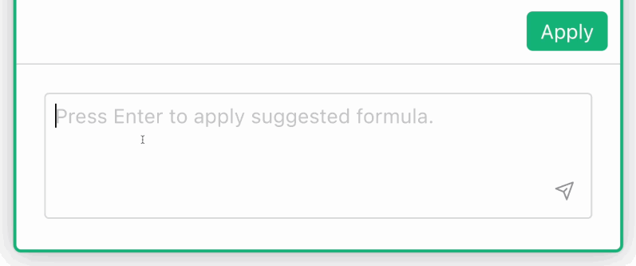
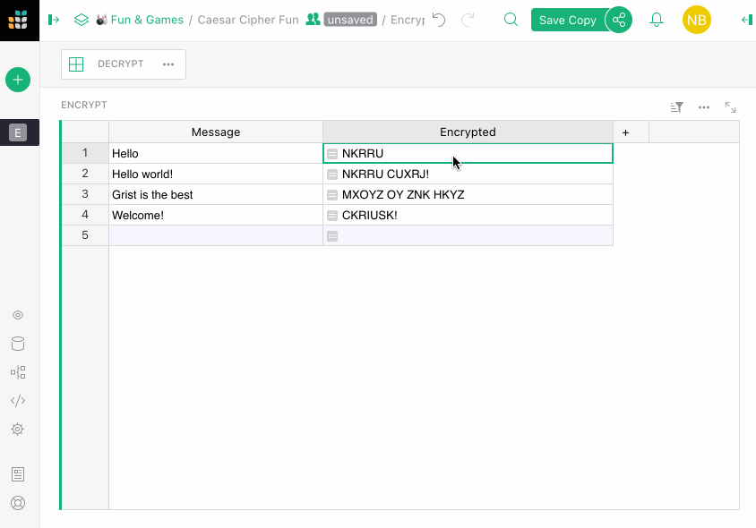
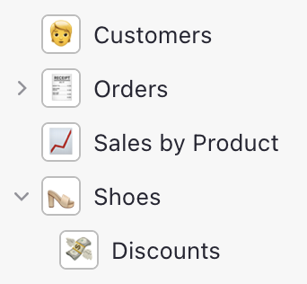
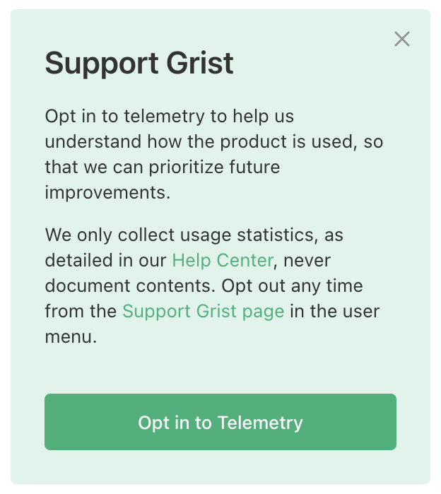
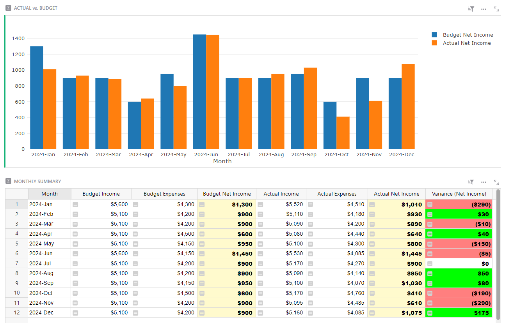

# July 2023 Newsletter

<table class="header" cellpadding="0" cellspacing="0" border="0"><tr>
  <td class="header-text">
    <table class="header-top"><tr>
      <td class="header-image">
        
      </td>
      <td class="header-top-text">
        
Grist for the Mill

        
July 2023
          &#8226; <a href="https://www.getgrist.com/">getgrist.com</a>

      </td>
    </tr></table>
    

      Welcome to our monthly newsletter of updates and tips for Grist users.
    

  </td>
</tr></table>

 

July was a big month for Grist, with a brand-new feature that brings a suite of other improvements. As always, we’d love to hear feedback and welcome any examples of cool/useful things you create with Grist.

## What's New

### AI Formula Assistant

A while ago we did [an experiment](https://www.getgrist.com/blog/ai-formula-generation-experiment/){:target="\_blank"} with AI to see how it could help Grist users with formulas. We’re excited to announce the experiment is now a feature in an integrated [AI Formula Assistant](https://www.getgrist.com/ai-formula-assistant/){:target="\_blank"}!

**TLDR:**

- Using plain language, chat with an AI to help create Grist formulas.
- Grist sends the necessary context, so no need to describe your data’s structure.
- Because the AI Assistant makes use of Grist's structure, we strongly recommend reading this quick list of [best practices](https://support.getgrist.com/ai-assistant/#best-practices){:target="\_blank"}.
- All Grist accounts get **100 credits** for free – so you can test out the assistant right now!

Check out the [full announcement](https://www.getgrist.com/ai-formula-assistant/){:target="\_blank"}. Learn how to use the assistant and how data is handled in our [help center](https://support.getgrist.com/ai-assistant/){:target="\_blank"}.

### Floating formula editor

Working on complex formulas and feeling a bit cramped? No longer! The AI Formula Assistant brings with it a new floating formula editor. Expand, collapse, and drag the editor around the screen as you please.

Just start editing any formula column and hit the expand icon at the top right of the cell. Changes made in the expanded floating editor won’t apply until you hit the Save button.

**Bonus feature: Preview changes!** Click the new Preview button in the floating editor to see how your changes will affect the column in question. Easily test formulas without updating your entire dataset. Your changes won’t apply until you hit Save.

### 🤩 Better handling of emojis on Page names

At Grist we love using emojis as visual shorthand for Page names. They’re easily recognizable, and work well when the Pages panel is minimized. Now, Grist automatically detects when an emoji is used at the start of a name and styles it accordingly.

### Telemetry for self-hosted users

We rely on product usage data to help make improvements to Grist. Self-hosters can now opt-in to sharing limited telemetry data with us. We only collect usage statistics, never document contents. 

If you’re a fan of Grist who self-hosts, opting into telemetry is one of the best ways to support us. You can read a detailed list of what we collect in our [help center](https://support.getgrist.com/telemetry-limited/){:target="\_blank"}. 

To opt in, click the opt-in button on the "Support Grist" banner on your homepage, or modify the GRIST_TELEMETRY_LEVEL environment variable as described in our [help center’s telemetry overview](https://support.getgrist.com/telemetry/){:target="\_blank"}. You may opt-out again at any time.

**
{: .screenshot-half }

## Tips & Tricks

### Access Rules: Restrict creation of new record until all mandatory fields are filled in

In the Showcase forum, Natalie takes us through how to [use Access Rules to restrict a user from creating new records until all mandatory fields are filled in](https://community.getgrist.com/t/access-rules-restrict-creation-of-new-record-until-all-mandatory-fields-are-filled-in/2822){:target="\_blank"} for existing records in a table. Very handy for data sanitation!

## Community Highlights

- @enthus1ast built a [small daemon](https://community.getgrist.com/t/infrastructure-monitoring-with-grist/2866){:target="\_blank"} (😈) as a proof-of-concept infrastructure monitoring system using Grist.
  * As a bonus, they also provided a [REST API client](https://community.getgrist.com/t/grist-api-client-for-nim-lang/2927){:target="\_blank"} written in Nim.
- @Leonard_Gallion shared some handy Python code that lets you [download documents as .grist files](https://community.getgrist.com/t/basic-python-code-to-download-documents-as-grist-files/2929){:target="\_blank"}.

Working on something cool with Grist? Let us know by posting in the [Showcase forum](https://community.getgrist.com/c/showcase/8){:target="\_blank"}!

## Learning Grist

### Webinar: Deconstructing the Class Enrollment Template

In August we’ll rebuild our [Class Enrollment Template](https://templates.getgrist.com/doc/afterschool-program){:target="\_blank"}. This template uses reference columns to relate data in five different tables. Learn when to use reference columns, in which direction, and how to use helper tables to better structure your data.

You'll also learn how to build productive dashboards that view the same data from different perspectives. 

**Thursday August 17th at 3:00pm US Eastern Time.**

[SIGN UP FOR AUGUST'S WEBINAR](https://www.getgrist.com/webinars/deconstructing-the-class-enrollment-template/?utm_source=support-newsletter&utm_medium=internal&utm_campaign=build-webinar&utm_term=august-2023&utm_content=){:target="\_blank"}
{: .grist-button}

### Deconstructing the Digital Sales CRM Template

When looking at our templates you may wonder why templates are structured in a particular way.

In July we rebuilt our Digital Sales CRM template. This template contains common structural patterns used in Grist documents for variety of use cases. It also has common, simple examples of lookup formulas, and analyzes the same sales data two ways: lifetime revenue by customer and lifetime revenue by product.

[WATCH JULY'S RECORDING](https://www.getgrist.com/webinars/webinar-common-structures-in-grist/){:target="\_blank"}
{: .grist-button}

## Templates

### Budgeting

This budget template simplifies setting a budget, tracking income and expenses, and comparing expectations with financial reality. 💸

{:target="\_blank"}

[GO TO TEMPLATE](https://templates.getgrist.com/9mWWYLe5PCZK/Personal-Budget){:target="\_blank"}
{: .grist-button .grist-button-tight}

## Help spread the word
If you’re interested in helping Grist grow, consider leaving a review on product review sites. Here’s a short list where your review could make a big impact. Thank you! 🙏

* [Stackshare](https://stackshare.io/getgrist){:target="\_blank"}
* [Capterra](https://www.capterra.com/p/232821/Grist/){:target="\_blank"}
* [TrustRadius](https://www.trustradius.com/products/grist/){:target="\_blank"}
* [AlternativeTo](https://alternativeto.net/software/grist/about/){:target="\_blank"}

## We are here to support you

**Sprouts Program.** Grist often surprises people with its capabilities. Schedule a **free** Sprouts call with an expert to see if Grist can address your needs. [Learn more.](https://www.getgrist.com/sprouts-program/){:target="\_blank"}

**Have questions, feedback, or need help?** Search our [Help Center](../index.md), [watch video
tutorials](https://www.youtube.com/channel/UCx0ioQrrC-bIrkmZ7ZULr0g/playlists), share ideas in our
[Community](https://community.getgrist.com), or contact us at <support@getgrist.com>.
