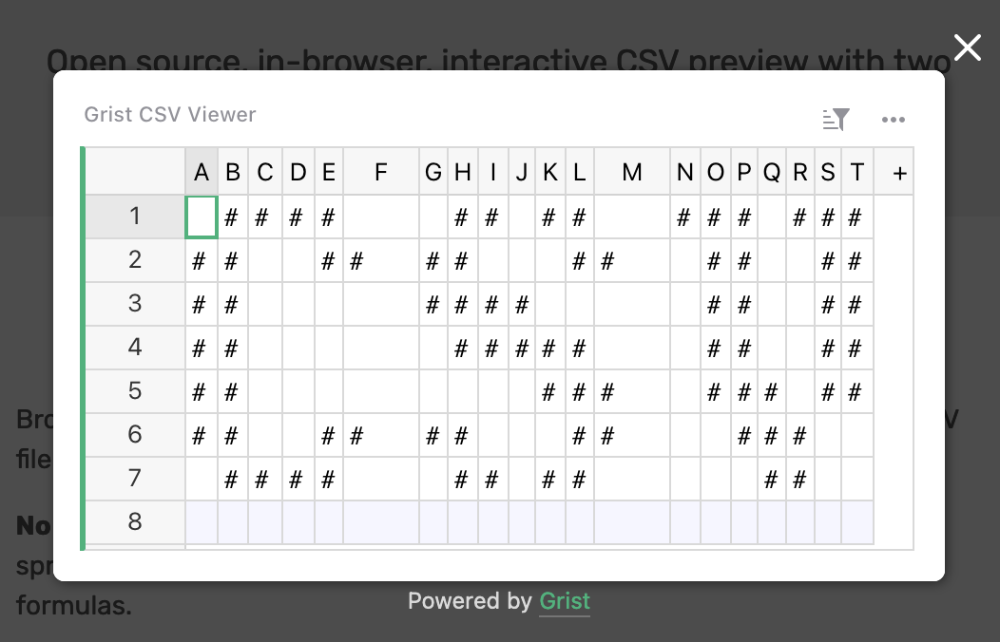
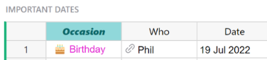
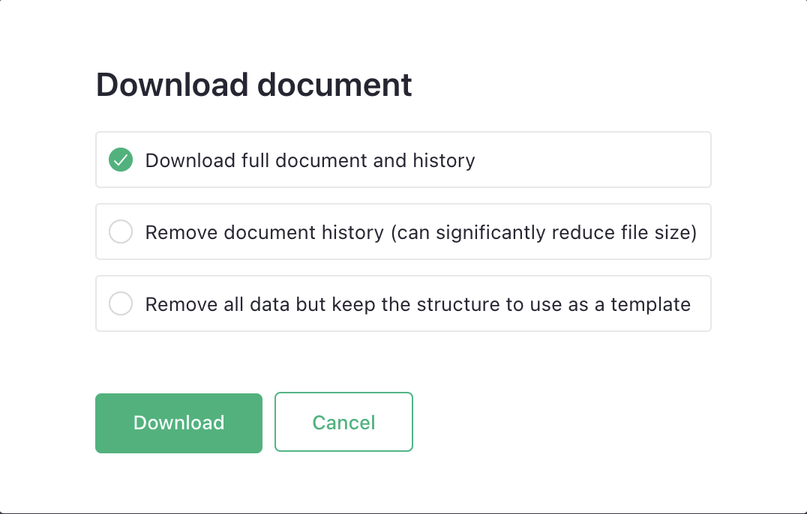
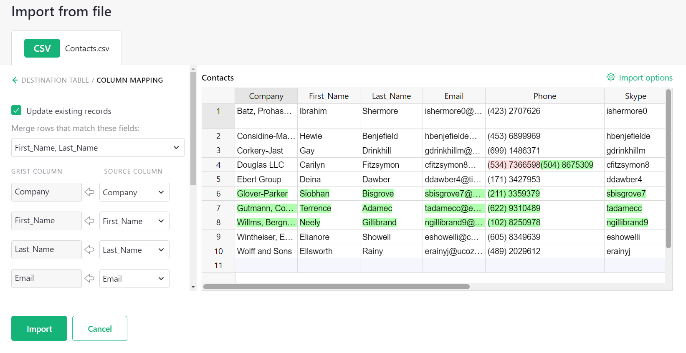
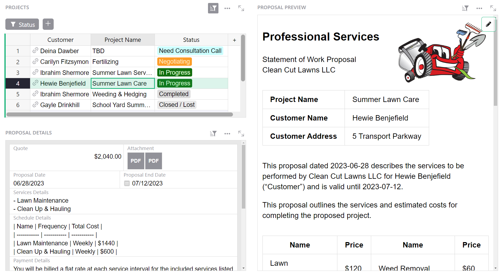

# August 2023 Newsletter

<table class="header" cellpadding="0" cellspacing="0" border="0"><tr>
  <td class="header-text">
    <table class="header-top"><tr>
      <td class="header-image">
        
      </td>
      <td class="header-top-text">
        
Grist for the Mill

        
August 2023
          &#8226; <a href="https://www.getgrist.com/">getgrist.com</a>

      </td>
    </tr></table>
    

      Welcome to our monthly newsletter of updates and tips for Grist users.
    

  </td>
</tr></table>

**In this Newsletter**
{: .newsletter-summary-header}

* **Job Opportunity**

    We're looking for a Video Creator & Graphic Designer to join our team. Come work with us!

* **Grist CSV Viewer**

    Set free the CSV! This new tool gives your site's users Grist-powered CSV previewing.

* **AI Assistant Llama Support**

    Run local Llama models with the help of `llama2-cpp-python`. 🦙    

* **`.grist` File Download Options**

    Reduce filesize by downloading without history, or make templates by downloading only a file's structure. 

* **File Importing Redesign**

    Improved support for importing multiple files/sheets and column mapping.

* **QR Code Custom Widget**

    Generate QR codes in a flash, right within Grist. 🤳

## Work at Grist

Grist is currently looking for a Video Creator & Graphic Designer who has a good understanding of spreadsheet-database tools. If you’re skilled at creating engaging videos and visually compelling graphic designs, come work with us!

This is a contract position. For more details, check out the [job description](https://www.getgrist.com/job-video-creator-graphic-designer/){:target="\_blank"}.

## What's New

### Grist CSV Viewer

Another month, another exciting update – this time for the venerable file format we all know and love, the `.csv`. The [Grist CSV Viewer](https://www.getgrist.com/grist-csv-viewer/){:target="\_blank"} is a free tool that gives CSVs the power of Grist on the web. No more downloading and opening CSVs in an external app, now you can preview and interact with CSVs in a Grist-powered spreadsheet!

The viewer is open source, supports features like filtering, sorting, copy/pasting, and even formulas. And it's easy to install, with just two lines of HTML added to any website.

[See it in action](https://www.getgrist.com/grist-csv-viewer/){:target="\_blank"}
{: .grist-button}

### AI Assistant – Support for Llama

Grist self-hosters can now use the [Llama](https://ai.meta.com/llama/){:target="\_blank"} family of self-hostable models via the [llama2-cpp-python](https://github.com/abetlen/llama-cpp-python){:target="\_blank"} wrapper by configuring the expanded [AI Assistant-related environment variables](https://github.com/gristlabs/grist-core#ai-formula-assistant-related-variables-all-optional){:target="\_blank"}.

### 𝓢𝓽𝔂𝓵𝓮𝓭 column headers

You can now style column headers! [Look!](https://support.getgrist.com/col-types/#formatting-columns){:target="\_blank"} (Thanks to @CamilleLegeron and the ANCT for the PR.)

### `.grist` file download options

You can now download a `.grist` file's structure without any data, which is useful for templating. Or you can download a `.grist` without document history which reduces file size.

In our tests, we’ve seen documents go from 10.8mb to 1.5mb after omitting file history. 😲

**
{: .screenshot-half}

### File importing redesign

File importing has been updated with a new flow, with better support for multiple files/sheets and column mapping.

## More Improvements

- Grist has been upgraded from Python 3.9 to 3.11. This update brings with it the following new features:
    - Execution should be slightly faster.
    - Additional support for the [statistics module](https://docs.python.org/3/library/statistics.html){:target="\_blank"}, including `covariance`, `correlation`, and `linear_regression` functions.
    - Support for [Structural Pattern Matching](https://peps.python.org/pep-0636/){:target="\_blank"}.
    - You can now see `^` marks pointing at the problem in tracebacks, which can help debugging errors.
- Links are now clickable in [widget](https://support.getgrist.com/page-widgets/#renaming-widgets){:target="\_blank"} and [column description](https://support.getgrist.com/col-types/#renaming-columns){:target="\_blank"} tooltips.
- Grid selection now supports `CTRL/CMD+Shift+<arrow>` shortcuts. If you've used this shortcut in other popular spreadsheet products, you'll be right at home! (Thanks to @Ocarthon for contributing to this!)

## Tips & Tricks

### Grist for spreadsheet users

New to Grist but an expert with Excel/Google Sheets? Our new [blog post](https://www.getgrist.com/blog/grist-for-spreadsheet-users/){:target="\_blank"} covers what makes Grist different and why it’s designed that way, specifically for users familiar with the usual spreadsheet apps.

### Self-hosting grist-static

The grist-static [GitHub repo](https://github.com/gristlabs/grist-static){:target="\_blank"} has been updated with extra information to help you [serve Grist on your own website or CDN](https://github.com/gristlabs/grist-static#serving-all-files-from-your-own-website-or-cdn){:target="\_blank"} – including the new CSV Viewer.

## Community Highlights

**
{: .screenshot-half}

@jperon’s nifty QR code widget from [back in January](https://community.getgrist.com/t/qr-code-custom-widget/1965){:target="\_blank"} has been officially added as a custom widget! 🎉 Scan the code above to visit the original post, and [click here](https://support.getgrist.com/widget-custom/#adding-a-custom-widget){:target="\_blank"} to learn more about Custom widgets.

Working on something cool with Grist? Let us know by posting in the [Showcase forum](https://community.getgrist.com/c/showcase/8){:target="\_blank"}!

## Learning Grist

### Webinar: Deconstructing the Payroll Template

In September we’ll rebuild our [Payroll Template](https://templates.getgrist.com/5pHLanQNThxk/Payroll/p/2). This template uses formulas to look up hourly rates based on person, role, and date. You'll also learn how to build dynamic summary dashboards that summarize data by categories and let you drill into the records in those categories.

**Thursday September 21st at 3:00pm US Eastern Time.**

[SIGN UP FOR SEPTEMBER'S WEBINAR](https://www.getgrist.com/webinars/webinar-payroll-template/?utm_source=support-newsletter&utm_medium=internal&utm_campaign=build-webinar&utm_term=september-2023){:target="\_blank"}
{: .grist-button}

### Deconstructing the Class Enrollment Template

When looking at our templates you may wonder why templates are structured in a particular way. In August we rebuilt our [Class Enrollment template](https://templates.getgrist.com/doc/afterschool-program). This template uses reference columns to relate data in five different tables. Learn when to use reference columns, in which direction, and how to use helper tables to better structure your data.

[WATCH AUGUST'S RECORDING](https://www.getgrist.com/webinars/deconstructing-the-class-enrollment-template/){:target="\_blank"}
{: .grist-button}

## Templates

### Proposals & Contracts

Natalie has created a [detailed tutorial](https://support.getgrist.com/examples/2023-07-proposals-contracts/){:target="\_blank"} showing how this (very advanced) template was created. We actually use a version of this very template at Grist to handle contracts, so it’s tried and tested!

Not only can this template be used to generate printable contracts with dynamic content, it can also generate contract templates *themselves*. So you can have several versions of dynamic contracts created from the same Grist document. 🤯

{:target="\_blank"}

[GO TO TEMPLATE](https://public.getgrist.com/nyPmvvea8c54/-Proposals-Contracts-Template){:target="\_blank"}
{: .grist-button .grist-button-tight}

## Help spread the word
If you’re interested in helping Grist grow, consider leaving a review on product review sites. Here’s a short list where your review could make a big impact. Thank you! 🙏

* [Stackshare](https://stackshare.io/getgrist){:target="\_blank"}
* [Capterra](https://www.capterra.com/p/232821/Grist/){:target="\_blank"}
* [TrustRadius](https://www.trustradius.com/products/grist/){:target="\_blank"}
* [AlternativeTo](https://alternativeto.net/software/grist/about/){:target="\_blank"}

## We are here to support you

**Sprouts Program.** Grist often surprises people with its capabilities. Schedule a **free** Sprouts call with an expert to see if Grist can address your needs. [Learn more.](https://www.getgrist.com/sprouts-program/){:target="\_blank"}

**Have questions, feedback, or need help?** Search our [Help Center](../index.md), [watch video
tutorials](https://www.youtube.com/channel/UCx0ioQrrC-bIrkmZ7ZULr0g/playlists), share ideas in our
[Community](https://community.getgrist.com), or contact us at <support@getgrist.com>.
