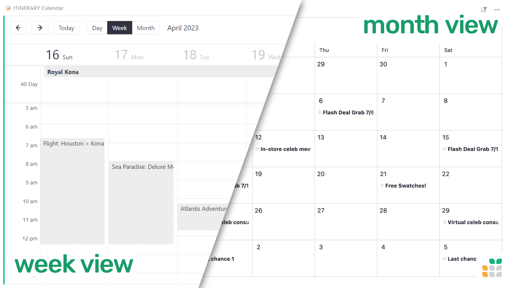
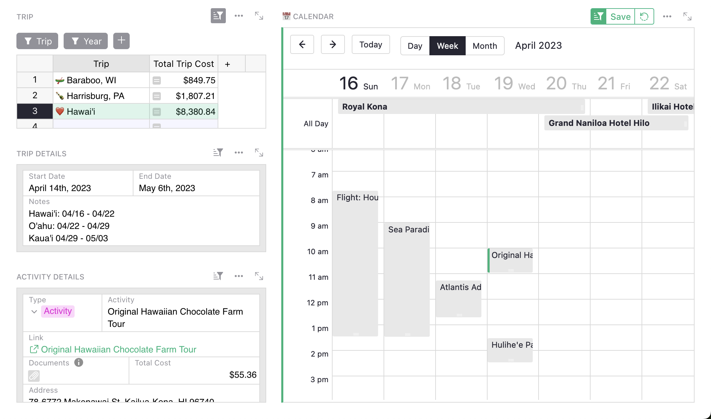
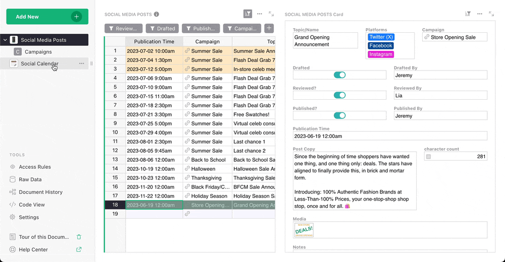

# September 2023 Newsletter

<table class="header" cellpadding="0" cellspacing="0" border="0"><tr>
  <td class="header-text">
    <table class="header-top"><tr>
      <td class="header-image">
        
      </td>
      <td class="header-top-text">
        
Grist for the Mill

        
September 2023
          &#8226; <a href="https://www.getgrist.com/">getgrist.com</a>

      </td>
    </tr></table>
    

      Welcome to our monthly newsletter of updates and tips for Grist users.
    

  </td>
</tr></table>

<!-- 

**In this Newsletter**
{: .newsletter-summary-header}

* **Job Opportunity**

    We're looking for a Video Creator & Graphic Designer to join our team. Come work with us!

* **Grist CSV Viewer**

    Set free the CSV! This new tool gives your site's users Grist-powered CSV previewing.

* **AI Assistant Llama Support**

    Run local Llama models with the help of `llama2-cpp-python`. 🦙    

* **`.grist` File Download Options**

    Reduce filesize by downloading without history, or make templates by downloading only a file's structure. 

* **File Importing Redesign**

    Improved support for importing multiple files/sheets and column mapping.

* **QR Code Custom Widget**

    Generate QR codes in a flash, right within Grist. 🤳

 -->

## What's New

### Calendar widget 🗓️

The time has come... the Official Grist Calendar Widget is here! We know its handy as we’ve already updated a bunch of our templates to include it. 😅 We’ve even created [new](https://templates.getgrist.com/ruCnQuXD25ok/Travel-Planning){:target="\_blank"} [ones](https://templates.getgrist.com/iPKJA6u6j5ur/Social-Media-Content-Calendar){:target="\_blank"} that specifically feature the calendar widget (more info below).

* Events are created using associated Date or DateTime columns 
* Day, week & month views
* Drag-and-drop event editing
* Support for cursor linking – select an event and have it update a linked widget automatically (this is helpful if you want to see an event’s details in a card widget, for example)

[SEE DOCUMENTATION](https://support.getgrist.com/widget-calendar/){:target="\_blank"}
{: .grist-button .grist-button-tight}

### SQL endpoint

Grist now has an SQL endpoint that lets you run read-only `SELECT` queries via the Grist API! This is exciting for a very “select” set of Grist users. 🤠

For example, here’s a simple SQL query performed on our [Lightweight CRM template](https://templates.getgrist.com/doc/lightweight-crm){:target="\_blank"} (these are not real emails!): [SELECT Email FROM Contacts WHERE Due IS NOT NULL](https://templates.getgrist.com/api/docs/lightweight-crm/sql?q=SELECT%20Email%20FROM%20Contacts%20WHERE%20Due%20IS%20NOT%20NULL){:target="\_blank"}

See [here](https://support.getgrist.com/api/#tag/sql){:target="\_blank"} for the complete API documentation. 

## Community Highlights

* @jperon’s found a way to create an advanced search widget using Python’s `eval` method. See the [community post](https://community.getgrist.com/t/filter-by-formula/3212){:target="\_blank"} for an example, as it’s a bit tricky to explain.
* Shout out to @prijatelj.francek for their work on the new Slovenian translation. See [here](https://community.getgrist.com/t/translating-grist/2086){:target="\_blank"} for more information on translating Grist.

Working on something cool with Grist? Let us know by posting in the [Showcase forum](https://community.getgrist.com/c/showcase/8){:target="\_blank"}!

## Learning Grist

### New orientation video

New Grist users will see an updated [orientation video](https://youtu.be/56AieR9rpww){:target="\_blank"} when they sign up, which may also be a helpful refresher for existing users.

### Webinar: Calendar

Calendars are here! Learn all the tips and tricks to get the most out of calendar views in your documents. Cards pair nicely with calendars, so we’ll dive into card widgets, too.

**Thursday October 26th at 3:00pm US Eastern Time.**

[SIGN UP FOR OCTOBER'S WEBINAR](https://www.getgrist.com/webinars/calendars-and-cards-view/?utm_source=support-newsletter&utm_medium=internal&utm_campaign=build-webinar&utm_term=october-2023){:target="\_blank"}
{: .grist-button}

### Deconstructing the Payroll Template

When looking at our templates you may wonder why templates are structured in a particular way. In September we rebuilt our [Payroll Template](https://templates.getgrist.com/5pHLanQNThxk/Payroll){:target="\_blank"}.

This template uses formulas to look up hourly rates based on person, role, and date. Learn how to build dynamic summary dashboards that summarize data by categories and let you drill into the records in those categories.

[WATCH SEPTEMBER'S RECORDING](https://www.getgrist.com/webinars/webinar-payroll-template/){:target="\_blank"}
{: .grist-button}

## Templates

### Trip Planning

Summer may be over, but that just means it’s time to plan your next trip. Use Grist’s new Trip Planning template to plan & organize multiple trips in one place, with detailed itineraries and packing lists. This template is also a great showcase for the new calendar widget!

{:target="\_blank"}

[GO TO TEMPLATE](https://templates.getgrist.com/ruCnQuXD25ok/Travel-Planning){:target="\_blank"}
{: .grist-button .grist-button-tight}

### Social Media Content Calendar

But wait, there’s more! We’ve adapted and improved the document we use internally to help keep track of our social posting and turned it into a template.

Build and track campaigns, approve content and schedule posts (text/image/video). And yes, this template makes great use of the new calendar widget as well!

{:target="\_blank"}

[GO TO TEMPLATE](https://templates.getgrist.com/iPKJA6u6j5ur/Social-Media-Content-Calendar){:target="\_blank"}
{: .grist-button .grist-button-tight}

## Help spread the word
If you’re interested in helping Grist grow, consider leaving a review on product review sites. Here’s a short list where your review could make a big impact. Thank you! 🙏

* [Stackshare](https://stackshare.io/getgrist){:target="\_blank"}
* [Capterra](https://www.capterra.com/p/232821/Grist/){:target="\_blank"}
* [TrustRadius](https://www.trustradius.com/products/grist/){:target="\_blank"}
* [AlternativeTo](https://alternativeto.net/software/grist/about/){:target="\_blank"}

## We are here to support you

**Sprouts Program.** Grist often surprises people with its capabilities. Schedule a **free** Sprouts call with an expert to see if Grist can address your needs. [Learn more.](https://www.getgrist.com/sprouts-program/){:target="\_blank"}

**Have questions, feedback, or need help?** Search our [Help Center](../index.md), [watch video
tutorials](https://www.youtube.com/channel/UCx0ioQrrC-bIrkmZ7ZULr0g/playlists), share ideas in our
[Community](https://community.getgrist.com), or contact us at <support@getgrist.com>.
