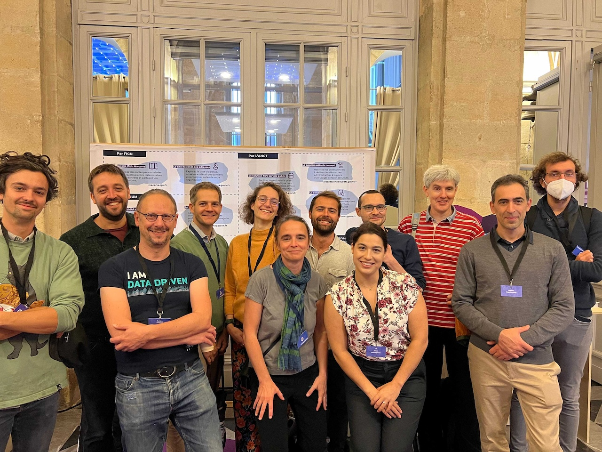

# October 2023 Newsletter

<table class="header" cellpadding="0" cellspacing="0" border="0"><tr>
  <td class="header-text">
    <table class="header-top"><tr>
      <td class="header-image">
        
      </td>
      <td class="header-top-text">
        
Grist for the Mill

        
October 2023
          &#8226; <a href="https://www.getgrist.com/">getgrist.com</a>

      </td>
    </tr></table>
    

      Welcome to our monthly newsletter of updates and tips for Grist users.
    

  </td>
</tr></table>

**In this Newsletter**
{: .newsletter-summary-header}

* **New formula shortcuts**

    There's a new menu of options when adding a column, including lookup and formula shortcuts!

* **Beta: Advanced Chart custom widget**

    Try out an experimental widget that gives Grist extended charting capabilities.

* **Beta: JupyterLite notebook widget**

    Run custom Python code in our experimental JupyterLite widget.

* **Colorful calendar events 🌈**

    You can now color events, and increased performance for large numbers of events.

* **Grist CSV Viewer file downloads**

    Users can now download CSV and XLSX files right from the Grist CSV Viewer.

* **Grist at NEC 2023 🇫🇷**

    A quick update from our trip to Bordeaux, talking about Grist and the digital commons!

## What's New

### Formula shortcuts

If you open the “Add Column” menu, you’ll see a few new options that weren’t there before: **Lookups** and **Shortcuts**. These are two types of one-click formula creation that help build out your Grist documents with ease.

1. **Lookups:** If your table references other tables, or is referenced *in* other tables, you’ll be able to access related data with a single click, and perform operations such as sum or average where applicable.
2. **Shortcuts:** Shortcuts introduce a one-click way to add common trigger formulas: timestamps, authorship stamps, detecting duplicates, and creating unique identifiers.

Learn more in our [documentation](https://support.getgrist.com/col-types/#adding-and-removing-columns){:target="\_blank"}.

### Beta feature: Advanced Chart custom widget

The Advanced Chart custom widget gives you more power and flexibility than Grist’s built-in charts, offering a wide variety of chart types as well as increased control over styling and layout.

To learn more and try it out yourself, check out our [beta docs](https://github.com/gristlabs/custom-charts-widget/blob/main/USAGE.md){:target="\_blank"}, and **remember:** regularly click the “Save” button above the widget to keep your configuration!

### Beta feature: JupyterLite notebook widget

This experimental widget lets you run custom Python code in [JupyterLite](https://jupyterlite.readthedocs.io/){:target="\_blank"}, a version of [JupyterLab](https://jupyterlab.readthedocs.io/en/stable/index.html){:target="\_blank"} running entirely in the browser. It can use the [custom widget plugin API](../code/modules/grist_plugin_api.md){:target="\_blank"} and access or modify any data in the document (subject to Access Rules), unlocking nearly unlimited possibilities for advanced users.

For more information on how to get it up and running, check out our [beta docs](https://github.com/gristlabs/jupyterlite-widget/blob/main/USAGE.md){:target="\_blank"}.

### Colorful events in the calendar widget!

**
{: .screenshot-half}

You can now color-code events in the [calendar widget](https://support.getgrist.com/widget-calendar/){:target="\_blank"}! All you need to do is assign an optional “Type” column that contains an event’s category and styling. 🎨

### Bidirectional cursor linking

Thanks to the hard work of [@jvorob](https://github.com/jvorob){:target="\_blank"} (who was with us for the summer and will be sorely missed!), cursor linking has received a significant upgrade. As part of this, two widgets can now be linked in both directions, allowing more natural cursor interaction.

Bidirectional linking makes the most sense in action:

### Grist CSV Viewer file downloads

**
{: .screenshot-half}

You can now download files displayed in the [Grist CSV Viewer](https://www.getgrist.com/grist-csv-viewer/){:target="\_blank"} as CSV and XLSX files.

### Grist Labs at NEC 2023

Some of the Grist team travelled to Bordeaux, France to talk about the no-code aspect of Grist at [NEC 2023](https://numerique-en-communs.fr/en/numerique-en-commun-2023_eng/){:target="\_blank"}, a conference focused on the [digital commons](https://www.getgrist.com/digital-commons/){:target="\_blank"}. We were able to meet Grist users serving in the public sector, and even some of our invaluable open source contributors from [ANCT](https://agence-cohesion-territoires.gouv.fr/){:target="\_blank"}.

If you’re interested in having Grist team members talk at your convention about how cool and useful Grist is, [get in touch](https://www.getgrist.com/contact/){:target="\_blank"}!

### Even more improvements!

- A stealthy but major milestone for Grist’s backend: it has been updated to Node 18.
- Open source self-hosters: Grist can now serve metrics to the [Prometheus monitoring system](https://prometheus.io/){:target="\_blank"} via a new environment variable `GRIST_PROMCLIENT_PORT`.

## Community Highlights

- @jperon is back at it again with a new [custom SQL selector widget](https://community.getgrist.com/t/custom-widget-with-pug-python-and-parcel-js/3275/1){:target="\_blank"} that leverages last month’s [SQL endpoint](https://support.getgrist.com/api/#tag/sql){:target="\_blank"}. 🤯
- Thanks to @marumaru for kicking off our Japanese translation! See [here](https://community.getgrist.com/t/translating-grist/2086){:target="\_blank"} for more information on translating Grist.

Working on something cool with Grist? Let us know by posting in the [Showcase forum](https://community.getgrist.com/c/showcase/8){:target="\_blank"}!

## Learning Grist

### Webinar: Charts and Summary Tables

In November, we'll learn how to summarize and analyze data in charts and summary tables, with tips and tricks to get more out of summary tables.

**Monday November 20th at 3:00pm US Eastern Time.**

[SIGN UP FOR NOVEMBER'S WEBINAR](https://www.getgrist.com/webinars/charts-view-and-summary-tables-webinar/?utm_source=support-newsletter&utm_medium=internal&utm_campaign=build-webinar&utm_term=november-2023){:target="\_blank"}
{: .grist-button}

### Calendars and Cards

In October, we looked at the new calendar widget and discovered the how to get the most out of calendar views in your documents. Since card widgets pair nicely with calendars, we looked at those as well.

[WATCH OCTOBER'S RECORDING](https://www.getgrist.com/webinars/calendars-and-cards-view/){:target="\_blank"}
{: .grist-button}

## Templates

We’ve gone through our roster of templates and added in a sprinkling of calendar widgets to make sure they’re as helpful as possible. Take, for example, the [Time Tracking + Invoicing template](https://templates.getgrist.com/bReAxyLmzmEQ/Tracking-Time-Invoicing){:target="\_blank"}, which now has a calendar view:

{:target="\_blank"}

[GO TO TEMPLATE](https://templates.getgrist.com/bReAxyLmzmEQ/Tracking-Time-Invoicing){:target="\_blank"}
{: .grist-button .grist-button-tight}

## Help spread the word
If you’re interested in helping Grist grow, consider leaving a review on product review sites. Here’s a short list where your review could make a big impact. Thank you! 🙏

* [Stackshare](https://stackshare.io/getgrist){:target="\_blank"}
* [Capterra](https://www.capterra.com/p/232821/Grist/){:target="\_blank"}
* [TrustRadius](https://www.trustradius.com/products/grist/){:target="\_blank"}
* [AlternativeTo](https://alternativeto.net/software/grist/about/){:target="\_blank"}

## We are here to support you

**Sprouts Program.** Grist often surprises people with its capabilities. Schedule a **free** Sprouts call with an expert to see if Grist can address your needs. [Learn more.](https://www.getgrist.com/sprouts-program/){:target="\_blank"}

**Have questions, feedback, or need help?** Search our [Help Center](../index.md), [watch video
tutorials](https://www.youtube.com/channel/UCx0ioQrrC-bIrkmZ7ZULr0g/playlists), share ideas in our
[Community](https://community.getgrist.com), or contact us at <support@getgrist.com>.
