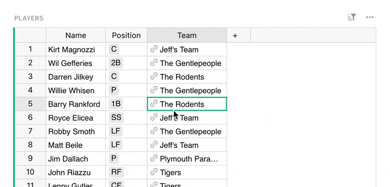
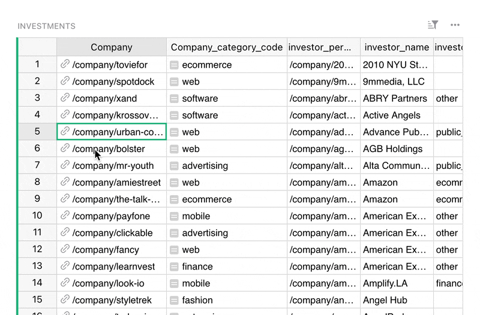
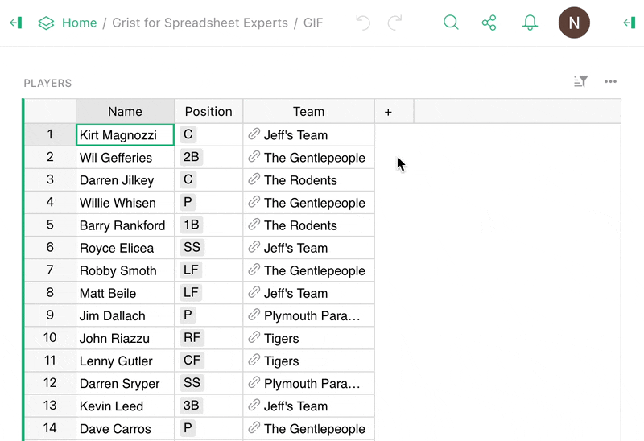
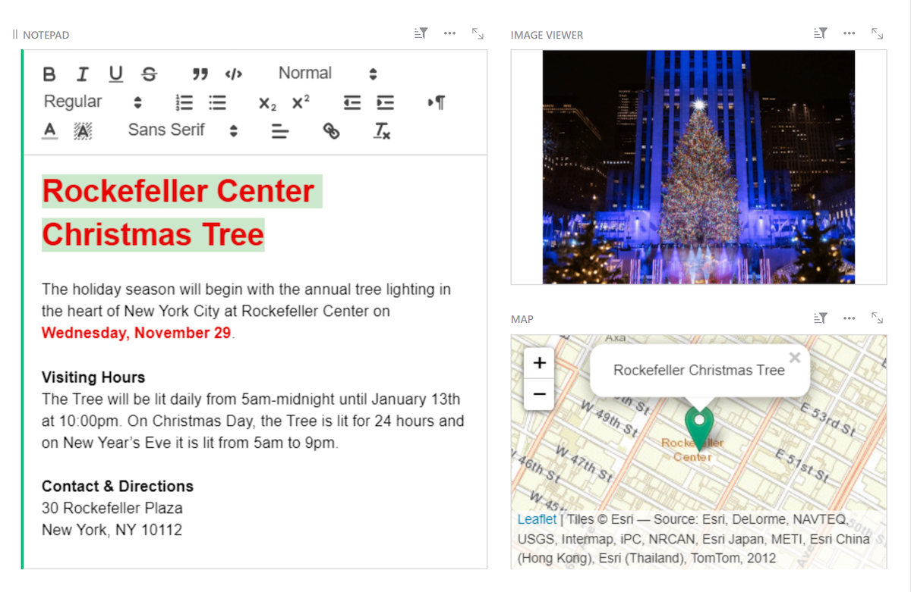

# November 2023 Newsletter

<table class="header" cellpadding="0" cellspacing="0" border="0"><tr>
  <td class="header-text">
    <table class="header-top"><tr>
      <td class="header-image">
        
      </td>
      <td class="header-top-text">
        
Grist for the Mill

        
November 2023
          &#8226; <a href="https://www.getgrist.com/">getgrist.com</a>

      </td>
    </tr></table>
    

      Welcome to our monthly newsletter of updates and tips for Grist users.
    

  </td>
</tr></table>

## What's New

### Hang out with us on Discord!

We’ve created an official [Grist Discord server](https://discord.gg/MYKpYQ3fbP){:target="\_blank"} for those interested in a place to chat about Grist and Grist-related topics. As a fun kickoff, we’re going to see how many of this year’s [Advent of Code](https://adventofcode.com/){:target="\_blank"} puzzles we can solve with Grist. 📆🧩

[JOIN DISCORD](https://discord.gg/MYKpYQ3fbP){:target="\_blank"}
{: .grist-button}

### Record cards

Don’t let the humble name fool you, this is a big one!

We all know how helpful references are. But sometimes you want to take a peek at the referenced record without changing your current view. Now you can! The “link” icon in reference and reference list columns is now an actual hyperlink, and it opens the referenced record in a pop-up.

But this doesn’t just affect references! You can also view any row in a table as a card with a single click, letting you see its base record in full.

Record cards are default card views for every table. They can be configured on the [Raw Data page](https://support.getgrist.com/raw-data/#raw-data-page){:target="\_blank"}.

### Add column with type

Our quest to improve the experience of adding new columns continues. Now you can set the column type right in the “Add Column” menu. Behold!

### Security update for self-hosters

We released a security fix earlier this month related to the suggested configuration of `grist-core` with traefik, as well as for [`grist-omnibus`](https://github.com/gristlabs/grist-omnibus){:target="\_blank"}. See this [Community update](https://community.getgrist.com/t/a-template-for-self-hosting-grist-with-traefik-and-docker-compose/856/24){:target="\_blank"} for more details.

The fix also affects those who do Grist authentication by forwarding a header for all endpoints (e.g. behind HTTP Basic Auth), as it makes a previously optional flag required. You may need to review your settings – see [this issue](https://github.com/gristlabs/grist-core/issues/750#issuecomment-1811082115){:target="\_blank"} for details.

### Grist Console Q&A

CTO Paul was able to share some fascinating Grist-related nuggets in an excellent [Console Q&A](https://console.substack.com/p/console-184){:target="\_blank"}. Learn about the origins of the name “Grist”, how (and why) we build Grist, and how we may be able to communicate with extraterrestrials. 👽 

(That last one may not be directly related to Grist.)

## Community Highlights

- Self-hosters: Grist now natively supports authentication with OpenID Connect. See the complete documentation [here](https://support.getgrist.com/install/oidc/#openid-connect){:target="\_blank"}. A huge thanks to [@fflorent](https://github.com/fflorent){:target="\_blank"} from [ANCT](https://agence-cohesion-territoires.gouv.fr/){:target="\_blank"} for their work on this PR!
- Looking for a simpler way to self-host Grist? Florent has also packaged Grist on [YunoHost](https://apps.yunohost.org/app/grist){:target="\_blank"}, a Debian-based OS designed to help democratize self-hosting. Check out [Florent’s post in our forum](https://community.getgrist.com/t/self-hosting-grist-made-easy-with-yunohost/3692){:target="\_blank"} for more information.
- Andreas Klöckner ([@inducer](https://github.com/inducer){:target="\_blank"} on GitHub) has shared not one, not two, but THREE Grist-related projects on the [Community forum](https://community.getgrist.com/t/mail-merge-availability-like-mini-doodle-whenisgood-plus-a-small-python-client/3547){:target="\_blank"}:
    * [grist-availability](https://github.com/inducer/grist-availability/){:target="\_blank"}: a tool to help with multi-person scheduling using the new calendar widget.
    * [grist-mailmerge](https://github.com/inducer/grist-mailmerge/){:target="\_blank"}: a batch emailer driven by a Grist table and a Jinja template.
    * [pygrist-mini](https://github.com/inducer/pygrist-mini){:target="\_blank"}: a tiny Grist API client for Python.
- Translations started for Arabic, Czech, Chinese (Traditional), Dutch and Thai! We’re now at 20 languages either complete or in-progress, all thanks to community contributors. See [here](https://community.getgrist.com/t/translating-grist/2086){:target="\_blank"} for more information on translating Grist.

Working on something cool with Grist? Let us know by posting in the [Showcase forum](https://community.getgrist.com/c/showcase/8){:target="\_blank"}!

## Learning Grist

### Webinar: Multimedia Views

In December, we’ll cover multimedia views so you can explore even more ways to display your data. Maps and Notepads and Video Players, oh my!

**Thursday December 14 at 3:00pm US Eastern Time.**

{:target="\_blank"}

[SIGN UP FOR DECEMBER'S WEBINAR](https://www.getgrist.com/webinars/multimedia-views/?utm_source=support-newsletter&utm_medium=internal&utm_campaign=build-webinar&utm_term=december-2023){:target="\_blank"}
{: .grist-button}

### Charts and Summary Tables

In November, we learned how to summarize and analyze data in charts and summary tables, with tips and tricks to get more out of summary tables.

[WATCH NOVEMBER'S RECORDING](https://www.getgrist.com/webinars/charts-view-and-summary-tables-webinar/){:target="\_blank"}
{: .grist-button}

## Help spread the word
If you’re interested in helping Grist grow, consider leaving a review on product review sites. Here’s a short list where your review could make a big impact. Thank you! 🙏

* [Stackshare](https://stackshare.io/getgrist){:target="\_blank"}
* [Capterra](https://www.capterra.com/p/232821/Grist/){:target="\_blank"}
* [TrustRadius](https://www.trustradius.com/products/grist/){:target="\_blank"}
* [AlternativeTo](https://alternativeto.net/software/grist/about/){:target="\_blank"}

## We are here to support you

**Sprouts Program.** Grist often surprises people with its capabilities. Schedule a **free** Sprouts call with an expert to see if Grist can address your needs. [Learn more.](https://www.getgrist.com/sprouts-program/){:target="\_blank"}

**Have questions, feedback, or need help?** Search our [Help Center](../index.md), [watch video
tutorials](https://www.youtube.com/channel/UCx0ioQrrC-bIrkmZ7ZULr0g/playlists), share ideas in our
[Community](https://community.getgrist.com), or contact us at <support@getgrist.com>.
