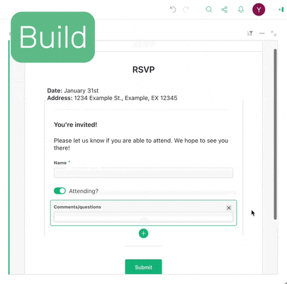
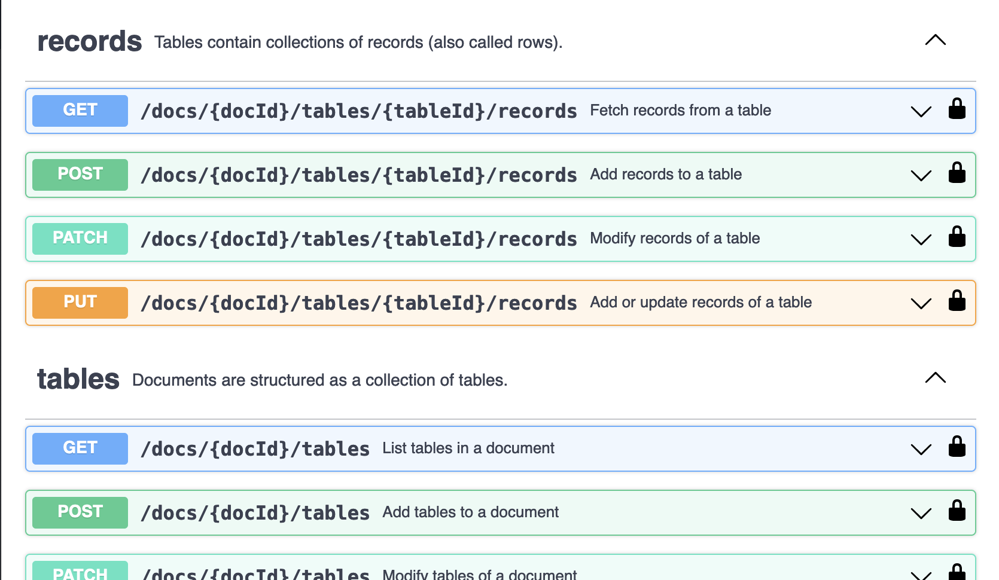
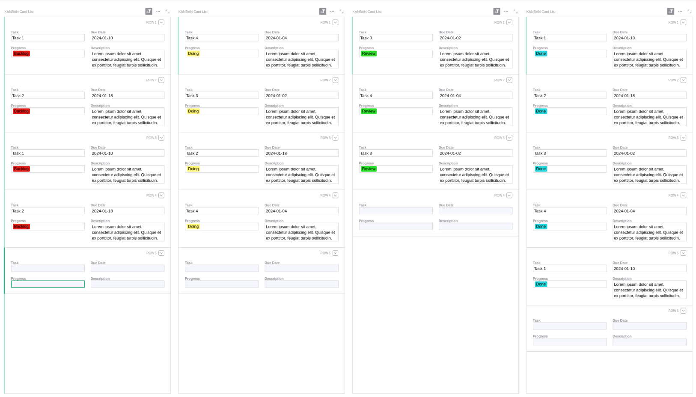
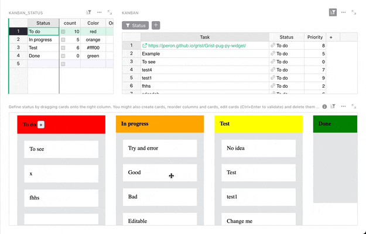
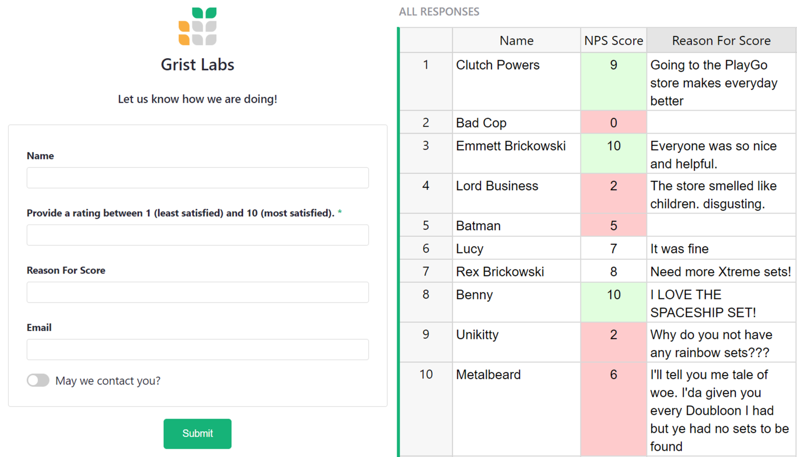

# January 2024 Newsletter

<table class="header" cellpadding="0" cellspacing="0" border="0"><tr>
  <td class="header-text">
    <table class="header-top"><tr>
      <td class="header-image">
        
      </td>
      <td class="header-top-text">
        
Grist for the Mill

        
January 2024
          &#8226; <a href="https://www.getgrist.com/">getgrist.com</a>

      </td>
    </tr></table>
    

      Welcome to our monthly newsletter of updates and tips for Grist users.
    

  </td>
</tr></table>

### Happy new year! 
If you haven’t already, remember to check out our [2023 Year in Review](https://www.getgrist.com/blog/grist-2023-year-in-review/){:target="\_blank"}. We’re extremely excited for 2024 and are kicking things off in top form. 😉

## What's New

### Grist Forms

[LEARN MORE](https://www.getgrist.com/forms/){:target="\_blank"}
{: .grist-button}

Grist Forms are now live! Build simple and effective forms right inside a Grist document and share with a click. Since the form fields come straight from Grist columns, all your data is piped directly into the correct structure, organized and ready for analysis.

* Design forms visually within Grist
* Preview, publish & share with a single click
* Analyze data in real time

But we’re not done here – we’re continuing to add features to Grist Forms. We want the best data tool to have the easiest way of collecting data. We’re also collecting feedback – either by emailing us at support@getgrist.com or by dropping us a line in our [official Discord server](https://discord.com/invite/MYKpYQ3fbP){:target="\_blank"}.

Visit our [Grist Forms page](https://www.getgrist.com/forms/){:target="\_blank"} for more information, and dive into our [Help Center](https://support.getgrist.com/widget-form/){:target="\_blank"} for complete documentation.

For a hands-on look at forms, sign up for [this month’s webinar](https://www.getgrist.com/webinars/form-widget/?utm_source=support-newsletter&utm_medium=internal&utm_campaign=build-webinar&utm_term=february-2024){:target="\_blank"} to learn all about them!

### API Console

Grist already has extensive [reference API documentation](https://support.getgrist.com/api/#section/Authentication){:target="\_blank"}, but we’re excited to launch a new [API console page](https://gristlabs.getgrist.com/apiconsole){:target="\_blank"} to allow developers to test API calls in a handy web UI. **Note:** This page uses your current session.

## Community Highlights

* Do you destruct/construct URLs often? Andreas Kloeckner ([@inducer](https://github.com/inducer){:target="\_blank"} on GitHub) has shared a [small custom widget](https://community.getgrist.com/t/widget-to-show-a-computed-url/3976){:target="\_blank"} to allow proper (clickable) viewing of computed URLs. 
* Hot on the heels of [gorist](https://github.com/CoverWhale/gorist){:target="\_blank"}, [@hooksie1](https://github.com/hooksie1){:target="\_blank"} has shared an alpha version of [vrist](https://github.com/SencilloDev/vrist){:target="\_blank"}, a Grist client in [V](https://vlang.io/){:target="\_blank"}! What’s next, TypeGrist? Grust?
* Can Grist kanban? Grist fans band together and plan, and Grist can kanban! Users on our Discord server started brainstorming, leading to several prototypes of a Grist kanban solution:
    - one that doesn’t use any custom widgets (!) by wunter8

    - and a full-blown draggable custom widget by [@jperon](https://github.com/jperon){:target="\_blank"}

Working on something cool with Grist? Let us know by posting in the [Showcase forum](https://community.getgrist.com/c/showcase/8){:target="\_blank"}!

## Learning Grist

### Webinar: Forms

February is for celebrating our love 💖…of forms! We’ll learn how to create a beautiful form view to collect data that will populate a Grist data table upon submission.

**Thursday February 22 at 3:00pm US Eastern Time.**

{:target="\_blank"}

[SIGN UP FOR FEBRUARY'S WEBINAR](https://www.getgrist.com/webinars/form-widget/?utm_source=support-newsletter&utm_medium=internal&utm_campaign=build-webinar&utm_term=february-2024){:target="\_blank"}
{: .grist-button}

### Markdown Widget Magic 🧙‍♂️

In January, we dove into our [Proposals & Contracts example](https://support.getgrist.com/examples/2023-07-proposals-contracts/){:target="\_blank"} and learned how to use the Markdown widget to create printable PDF files with data from your Grist document.

[WATCH JANUARY'S RECORDING](https://www.getgrist.com/webinars/markdown-widget-magic/){:target="\_blank"}
{: .grist-button}

## Help spread the word
If you’re interested in helping Grist grow, consider leaving a review on product review sites. Here’s a short list where your review could make a big impact. Thank you! 🙏

* [Stackshare](https://stackshare.io/getgrist){:target="\_blank"}
* [Capterra](https://www.capterra.com/p/232821/Grist/){:target="\_blank"}
* [TrustRadius](https://www.trustradius.com/products/grist/){:target="\_blank"}
* [AlternativeTo](https://alternativeto.net/software/grist/about/){:target="\_blank"}

## We are here to support you

**Sprouts Program.** Grist often surprises people with its capabilities. Schedule a **free** Sprouts call with an expert to see if Grist can address your needs. [Learn more.](https://www.getgrist.com/sprouts-program/){:target="\_blank"}

**Have questions, feedback, or need help?** Search our [Help Center](../index.md), [watch video
tutorials](https://www.youtube.com/channel/UCx0ioQrrC-bIrkmZ7ZULr0g/playlists), share ideas in our
[Community](https://community.getgrist.com), or contact us at <support@getgrist.com>.
