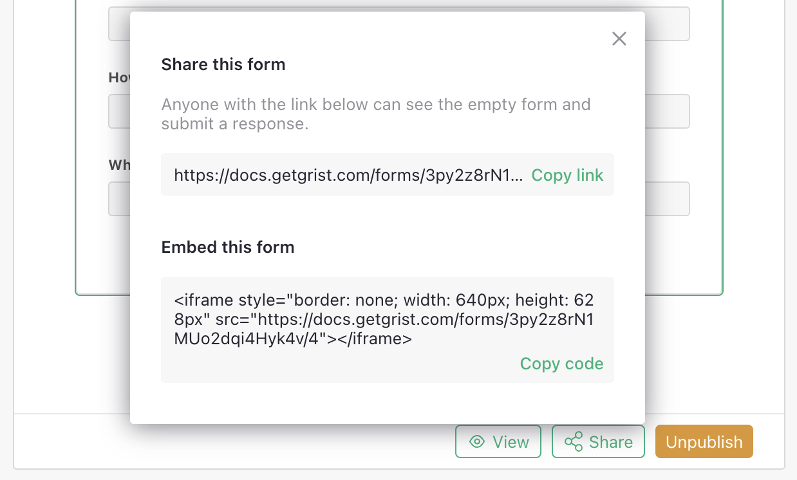

# March 2024 Newsletter

<table class="header" cellpadding="0" cellspacing="0" border="0"><tr>
  <td class="header-text">
    <table class="header-top"><tr>
      <td class="header-image">
        
      </td>
      <td class="header-top-text">
        
Grist for the Mill

        
March 2024
          &#8226; <a href="https://www.getgrist.com/">getgrist.com</a>

      </td>
    </tr></table>
    

      Welcome to our monthly newsletter of updates and tips for Grist users.
    

  </td>
</tr></table>

## What's New

### Improvements to Grist Forms

**Sections**

You can now add sections to Grist Forms. To add a section to your form, click the Add New button at the bottom of each section, and then click “Insert section above” or “Insert section below".

**Choice and reference select**

When filling out a form, you can now search for values in long choice and reference select fields, making it easier to find the exact option you’re looking for.

**Quick embed code**

If you’d like to embed a form on your website, click the share icon then “Embed this form” to reveal an embed code.

**Reset form**

A new “Reset” button is now available on published forms so that form takers can reset a form back to its initial state.

### Imports and exports - two new file formats!

**
{: .screenshot-half }

**DOO Separated Values (DSV)**

Can your spreadsheet DOO this? The DOO Separated Value (DSV) format is an important improvement to Comma Separated Values (CSV), and is now supported for both importing and exporting by Grist. DSV uses a special character from the Unicode astral plane as a separator, to better protect the integrity of your data. [Learn how.](https://www.getgrist.com/blog/how-to-fix-csv-make-it-even-more-%f0%9f%92%a9/){:target="\_blank"}

Credits: DSV was initially proposed by [Jamie Matthews](https://twitter.com/j4mie/status/804701143171497984){:target="\_blank"}. We've followed his specification precisely, but changed the file extension to avoid a conflict with Pipe Separated Values (PSV). The value of this specific character from the Unicode astral plane for testing software was first proposed by [Mathias Bynens](https://mathiasbynens.be/notes/javascript-unicode#poo-test){:target="\_blank"}.

**Tab Separated Values (TSV)**

You can now export and import data as Tab Separated Values (TSV) from the Share menu.

### Grist boot page

An early version of a diagnostics page for self-hosted Grist is now available. [Learn how to enable it.](https://github.com/gristlabs/grist-core/?tab=readme-ov-file#activating-the-boot-page-for-diagnosing-problems){:target="\_blank"}

**
{: .screenshot-half }

### Migrate from Spreadsheet.com

We’ve built a tool to help you migrate your [Spreadsheet.com](http://spreadsheet.com/){:target="\_blank"} data into Grist, including attachments and relations, without the need to manually download and upload your files. Check it out [here](https://public.getgrist.com/qYMSk6bdsLF6/Migrate-from-Spreadsheetcom/){:target="\_blank"}!

## Community highlights

[@tomnitschke](https://github.com/tomnitschke){:target="\_blank"} built some new custom widgets, including 

* An [auto action widget](https://community.getgrist.com/t/custom-widget-automatically-apply-useractions-a-k-a-the-self-clicking-action-button/4388){:target="\_blank"} that lets you automatically run user actions on page load
* A widget to [view PDF and ODT/ODF files](https://community.getgrist.com/t/custom-widget-view-pdf-and-odt-odf-files-directly-in-the-browser/4372/1){:target="\_blank"} directly in the browser
* A widget to [create DOCX or PDF files from HTML or Markdown](https://community.getgrist.com/t/custom-widget-create-docx-or-pdf-files-from-html-or-markdown/4402/1){:target="\_blank"}

You can find them [all on Github.](https://github.com/tomnitschke/gristwidgets/tree/main){:target="\_blank"}

[@jonathanperret](https://twitter.com/jonathanperret){:target="\_blank"} built a custom widget that embeds [paysage](https://paysage.xyz/){:target="\_blank"} - a collaborative, visual coding playground - into a Grist document. Um, it’s amazing? Watch the full video [here](https://twitter.com/jonathanperret/status/1766425193449164961?t=ppOCyOgqvQppdm7qezh5pQ){:target="\_blank"}.

## Learning Grist

### Webinar: AI Formula Assistant Best Practices

Grist’s AI Formula Assistant simplifies the hardest part of spreadsheets — formulas. In April’s webinar we'll share tips on how to get the most out of the assistant.

**Thursday April 25 at 3:00pm US Eastern Time.**

[SIGN UP FOR APRIL'S WEBINAR](https://www.getgrist.com/webinars/ai-formula-assistant-best-practices/?utm_source=support-newsletter&utm_medium=internal&utm_campaign=build-webinar&utm_term=april-2024){:target="\_blank"}
{: .grist-button}

### Controlling spreadsheet chaos

In March, we saw how Grist can contain spreadsheet sprawl. Similar to our previous [Grist/Excel webinar](https://www.getgrist.com/webinars/grist-webinar-expense-tracking/){:target="\_blank"}, we look at how Grist is designed to avoid many of the very familiar problems associated with spreadsheet workflows, such as merging and normalizing.

[WATCH MARCH'S RECORDING](https://www.getgrist.com/webinars/controlling-spreadsheet-chaos-grist-v-excel/){:target="\_blank"}
{: .grist-button}

## Help spread the word
If you’re interested in helping Grist grow, consider leaving a review on product review sites. Here’s a short list where your review could make a big impact. Thank you! 🙏

* [AlternativeTo](https://alternativeto.net/software/grist/about/){:target="\_blank"}
* [Capterra](https://www.capterra.com/p/232821/Grist/){:target="\_blank"}
* [G2](https://www.g2.com/products/grist){:target="\_blank"}
* [TrustRadius](https://www.trustradius.com/products/grist/){:target="\_blank"}

## We are here to support you

**Sprouts Program.** Grist often surprises people with its capabilities. Schedule a **free** Sprouts call with an expert to see if Grist can address your needs. [Learn more.](https://www.getgrist.com/sprouts-program/){:target="\_blank"}

**Have questions, feedback, or need help?** Search our [Help Center](../index.md), [watch video
tutorials](https://www.youtube.com/channel/UCx0ioQrrC-bIrkmZ7ZULr0g/playlists), share ideas in our
[Community](https://community.getgrist.com), or contact us at <support@getgrist.com>.
