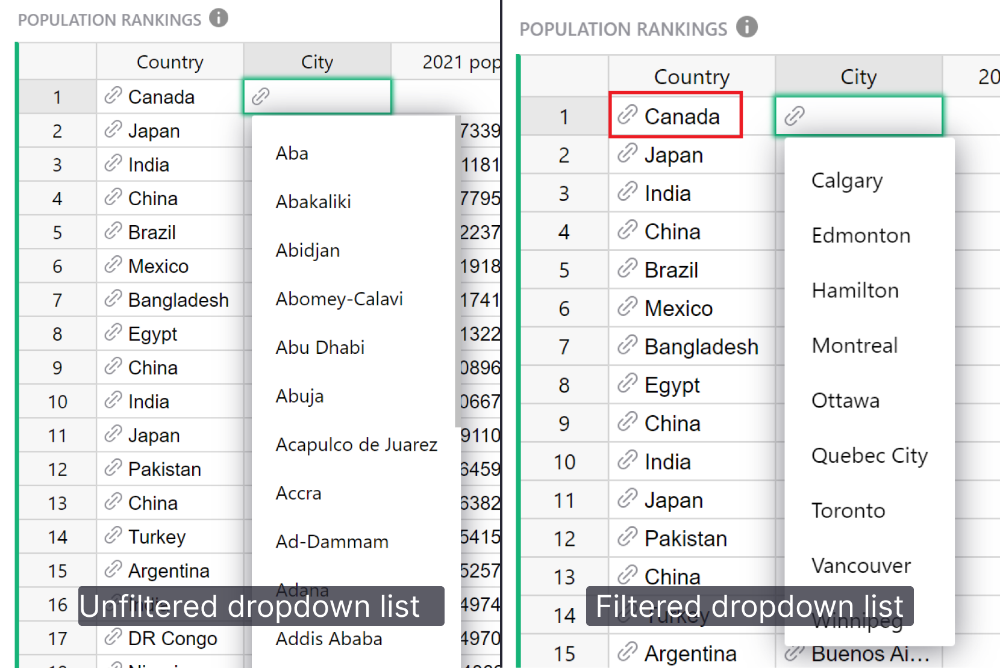

# April 2024 Newsletter

<table class="header" cellpadding="0" cellspacing="0" border="0"><tr>
  <td class="header-text">
    <table class="header-top"><tr>
      <td class="header-image">
        
      </td>
      <td class="header-top-text">
        
Grist for the Mill

        
April 2024
          &#8226; <a href="https://www.getgrist.com/">getgrist.com</a>

      </td>
    </tr></table>
    

      Welcome to our monthly newsletter of updates and tips for Grist users.
    

  </td>
</tr></table>

## Promoting your solutions built in Grist

Some users have asked us how they can sell solutions they have built in Grist. Often they’re expert in a particular problem, have solved it in Grist, and want to help others solve it too.

Before building our own Grist marketplace, we want to experiment on an existing marketplace for templates and solutions services — Gumroad: [https://gumroad.com/](https://gumroad.com/){:target="\_blank"}

If you're interested in selling Grist solutions, we'd like to partner with you. [Join our Discord](https://discord.gg/MYKpYQ3fbP){:target="\_blank"} and share your thoughts in the #sellers channel.

[LEARN MORE ON DISCORD](https://discord.gg/MYKpYQ3fbP){:target="\_blank"}
{: .grist-button}

## What's New

### Filtering reference and choice dropdown lists

When entering data into a reference or choice column you see a dropdown list of all available values to choose from. Sometimes the list can get long or confusing. You can now filter reference and choice columns’ dropdown lists by setting a condition. [Learn how.](https://support.getgrist.com/col-refs/#filtering-reference-choices-in-dropdown){:target="\_blank"}

### Use as table headers shortcut

Often when importing data from Excel to Grist, the first row contains what should be the column headers. Manually setting the correct column headers can be time consuming, but not anymore! Thank you to Camille Legeron ([@CamilleLegeron](https://github.com/CamilleLegeron){:target="\_blank"}) from the ANCT team who added a nifty shortcut to copy the values in a row to their respective columns’ labels. 🤩

**
{: .screenshot-half }

### Create new team sites in self-hosted Grist

Thanks again to Camille Legeron who made it possible to create additional team sites in self-hosted Grist. To create a new site, select “Create new team site” from the user or site menu, specify the name and domain of the new site, and click “Create site.”

### Admin console for self-hosters

The admin console for self-hosters now includes sandbox settings information and a checkbox to automatically check for Grist release updates. 🎉

### Networking improvements

Contributor Jonathan Perret ([@jonathanperret](https://github.com/jonathanperret){:target="\_blank"}) implemented a fallback mechanism for networks where WebSocket traffic is not allowed. If you or a colleague have had trouble using Grist behind a corporate network in the past, give it another shot!

## Community highlights

* @v1adimirn0va built a custom widget that displays data on a timeline. If you’re in our Discord server, check it out [here](https://discord.com/channels/1176642613022044301/1176646309223075860/1233770982955684063){:target="\_blank"}!
If you’re not in our Discord, [join our server!](https://discord.gg/MYKpYQ3fbP){:target="\_blank"}

* Andreas Klöckner ([@inducer](https://github.com/inducer){:target="\_blank"} on Github) built a tool to collect form responses and save them to existing records in a Grist document. Check it out [here](https://community.getgrist.com/t/grist-fill-form-fill-forms-with-existing-rows/4678/1){:target="\_blank"}!

Working on something cool with Grist? Let us know by posting in the [Showcase forum](https://community.getgrist.com/c/showcase/8){:target="\_blank"} or our [#grist-showcase Discord channel](https://discord.gg/MYKpYQ3fbP){:target="\_blank"}!

## Learning Grist

### Webinar: Reference and Choice Dropdown List Filtering

Filtering a reference or choice column’s dropdown list is very useful in a variety of cases. In May, we’ll show you how to write dropdown condition formulas for the most common scenarios.

**Thursday May 16 at 3:00pm US Eastern Time.**

[SIGN UP FOR MAY'S WEBINAR](https://www.getgrist.com/webinars/reference-filtering-grist-webinar/?utm_source=support-newsletter&utm_medium=internal&utm_campaign=build-webinar&utm_term=may-2024){:target="\_blank"}
{: .grist-button}

### AI Formula Assistant Best Practices

In April we covered Grist’s AI Formula Assistant which simplifies the hardest part of spreadsheets — formulas. In this webinar we share tips on how to get the most out of the assistant.

This was also Michael’s first time leading a webinar! Michael joined the Grist team as a Solutions Engineer in March. 

[WATCH APRIL'S RECORDING](https://www.getgrist.com/webinars/ai-formula-assistant-best-practices/){:target="\_blank"}
{: .grist-button}

## Migrate from Spreadsheet.com

In case you missed it, in March we built a tool to help you migrate your [Spreadsheet.com](https://www.spreadsheet.com/){:target="\_blank"} data into Grist, including attachments and relations, without the need to manually download and upload your files. Check it out [here](https://public.getgrist.com/qYMSk6bdsLF6/Migrate-from-Spreadsheetcom/){:target="\_blank"}!

## Help spread the word
If you’re interested in helping Grist grow, consider leaving a review on product review sites. Here’s a short list where your review could make a big impact. Thank you! 🙏

* [AlternativeTo](https://alternativeto.net/software/grist/about/){:target="\_blank"}
* [Capterra](https://www.capterra.com/p/232821/Grist/){:target="\_blank"}
* [G2](https://www.g2.com/products/grist){:target="\_blank"}
* [TrustRadius](https://www.trustradius.com/products/grist/){:target="\_blank"}

## We are here to support you

**Sprouts Program.** Grist often surprises people with its capabilities. Schedule a **free** Sprouts call with an expert to see if Grist can address your needs. [Learn more.](https://www.getgrist.com/sprouts-program/){:target="\_blank"}

**Have questions, feedback, or need help?** Search our [Help Center](../index.md), [watch video
tutorials](https://www.youtube.com/channel/UCx0ioQrrC-bIrkmZ7ZULr0g/playlists), share ideas in our
[Community](https://community.getgrist.com), or contact us at <support@getgrist.com>.
