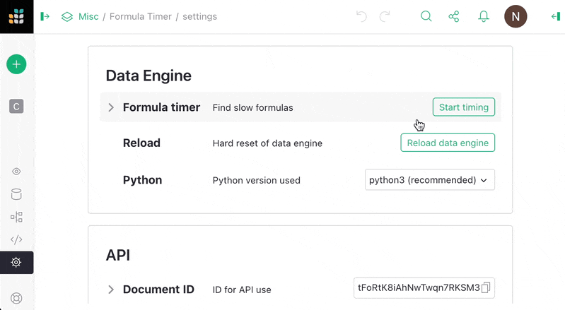
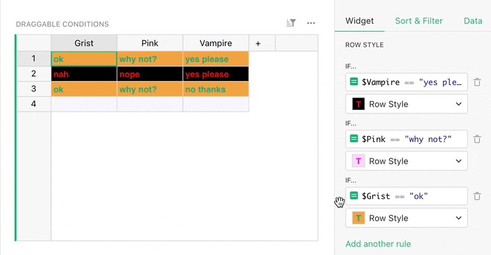

# May 2024 Newsletter

<table class="header" cellpadding="0" cellspacing="0" border="0"><tr>
  <td class="header-text">
    <table class="header-top"><tr>
      <td class="header-image">
        
      </td>
      <td class="header-top-text">
        
Grist for the Mill

        
May 2024
          &#8226; <a href="https://www.getgrist.com/">getgrist.com</a>

      </td>
    </tr></table>
    

      Welcome to our monthly newsletter of updates and tips for Grist users.
    

  </td>
</tr></table>

## What's New

### New Grist Business plan

We’ve been working hard to make sure Grist suits larger teams with complex and sensitive data. To address this segment, we’ve updated our [Pricing page](https://www.getgrist.com/pricing/){:target="\_blank"} to include a new Business plan — with a Self-Managed flavor! We’re hoping this new plan increases the transparency of pricing around Grist deployments that could use more of our support, rather than requiring organizations to reach out directly for pricing info.

There’s also a new option to subscribe annually. New Pro subscriptions are now $10 on the monthly plan, but still at $8 if paying annually. Existing Pro subscriptions are not affected by this change.

We’ve also updated our [Professional Services page](https://www.getgrist.com/professional-services/){:target="\_blank"} to include some new opportunities we have regarding getting expert help building Grist documents.

### Formula timer

Enough is enough – it’s time to put your formulas through their paces. 🏃‍♀️⏱️

It’s a common event to see a spreadsheet collapse under its own weight, like a dying star composed of conditionals. Even mighty Grist documents can slow down when the power of Python goes unchecked. But now there’s a way to diagnose your formulas before things go supernova. Introducing the [formula timer](https://support.getgrist.com/formula-timer/){:target="\_blank"}, which lets you time formulas for specific changes or for a full document reload.

For more information, read all about [saving milliseconds with the formula timer](https://www.getgrist.com/blog/optimizing-formulas-with-grists-new-formula-timer/){:target="\_blank"} — written by one of the newest additions to the Grist Labs team, Jordan! 👋

### Ordering conditional styles (with bonus draggability)

You can now easily reorder conditional styles, on both rows and columns! Don’t ask how this was accomplished previously!

### Self-hosting admin console improvements

Our new admin console is continuing to grow and develop as we work towards our ambitions of easier self-hosting. 🔜

* The app’s authentication method is now included in the “Security Settings” section. If not set up, you'll be warned. ✋🤨
* Boot panel checks are now visible (and expanded/improved based on your feedback!). We’re still iterating on this, so please let us know [on Discord](https://discord.com/invite/MYKpYQ3fbP){:target="\_blank"} if you have any more feedback.
* To make the panel more robust, it now honors emergency access via a `GRIST_BOOT_KEY` setting if authentication is broken, and should even be usable if the app has some common misconfigurations. This means you can count on the admin panel not becoming inaccessible just when you need it most!

## Community highlights

* marc.fargas has provided our community with a [excellently detailed walkthrough](https://community.getgrist.com/t/pdf-rendering-with-apitemplate-io-pipedream/4984){:target="\_blank"} of his Grist → PDF rendering pipeline. The solution does require external services (which may not be completely free), but it’s an great example of extending Grist.
* Riccardo_Polignieri has created a Python wrapper for Grist’s API called [PyGrister](https://community.getgrist.com/t/pygrister-a-python-client-for-the-grist-api/5015){:target="\_blank"}! Get more Python in your workflow!

Working on something cool with Grist? Let us know by posting in the [Showcase forum](https://community.getgrist.com/c/showcase/8){:target="\_blank"} or our [#grist-showcase Discord channel](https://discord.gg/MYKpYQ3fbP){:target="\_blank"}!

## Learning Grist

### Webinar: Reference Columns

In June, we’ll dive into what references are, how reference columns work in Grist, and explain how to use them to build productive dashboards using the [Event Speaker Template](https://templates.getgrist.com/iCJe3aXg7Ha4/Event-Speakers){:target="\_blank"}.

**Thursday June 20 at 3:00pm US Eastern Time.**

{:target="\_blank"}

[SIGN UP FOR JUNE'S WEBINAR](https://www.getgrist.com/webinars/reference-columns/?utm_source=support-newsletter&utm_medium=internal&utm_campaign=build-webinar&utm_term=june-2024){:target="\_blank"}
{: .grist-button}

### Reference and Choice Dropdown List Filtering

In May, Anais returned to look at how filtering a reference or choice column’s dropdown list is very useful in a variety of cases. See how to take advantage of one of Grist’s newest and most sneakily-powerful features.

[WATCH MAY'S RECORDING](https://www.getgrist.com/webinars/reference-filtering-grist-webinar/){:target="\_blank"}
{: .grist-button}

## Help spread the word
If you’re interested in helping Grist grow, consider leaving a review on product review sites. Here’s a short list where your review could make a big impact. Thank you! 🙏

* [AlternativeTo](https://alternativeto.net/software/grist/about/){:target="\_blank"}
* [Capterra](https://www.capterra.com/p/232821/Grist/){:target="\_blank"}
* [G2](https://www.g2.com/products/grist){:target="\_blank"}
* [TrustRadius](https://www.trustradius.com/products/grist/){:target="\_blank"}

## We are here to support you

**Professional services.** Grist often surprises people with its capabilities. Schedule a **free** call to assess your needs and help connect you with a Grist expert. [Learn more.](https://www.getgrist.com/professional-services/){:target="\_blank"}

**Have questions, feedback, or need help?** Search our [Help Center](../index.md), [watch video
tutorials](https://www.youtube.com/channel/UCx0ioQrrC-bIrkmZ7ZULr0g/playlists), share ideas in our
[Community](https://community.getgrist.com), or contact us at <support@getgrist.com>.
