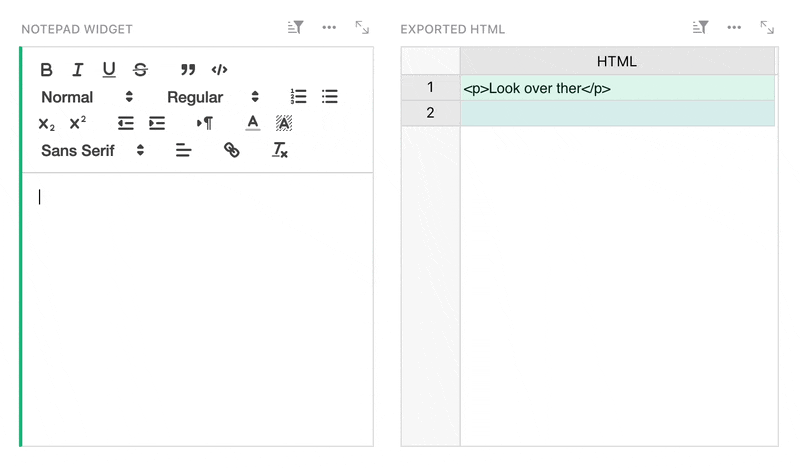
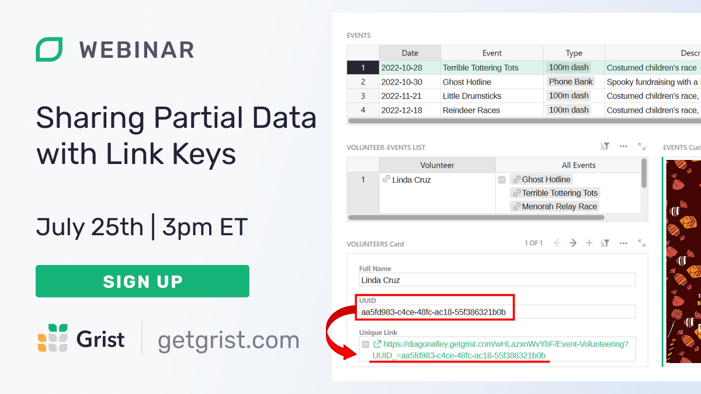

# June 2024 Newsletter

<table class="header" cellpadding="0" cellspacing="0" border="0"><tr>
  <td class="header-text">
    <table class="header-top"><tr>
      <td class="header-image">
        
      </td>
      <td class="header-top-text">
        
Grist for the Mill

        
June 2024
          &#8226; <a href="https://www.getgrist.com/">getgrist.com</a>

      </td>
    </tr></table>
    

      Welcome to our monthly newsletter of updates and tips for Grist users.
    

  </td>
</tr></table>

## What's New

Another month where the Grist community provides us with a bounty of cool contributions, for which we are constantly grateful. Keep an eye out for some sensational things we have simmering for this summer. ☀️

### New research templates 👩‍🔬

We’ve created three new templates specifically for [research labs](https://www.getgrist.com/spreadsheet-for-research-labs/){:target="\_blank"}. This is no coincidence, as we continue to hear from scientists and technicians who find Grist a welcome addition to their software stack.

1. 🧪 [Sample management](https://www.getgrist.com/templates/lab-sample-management-template/){:target="\_blank"}
2. 📋 [Project management](https://www.getgrist.com/templates/lab-project-management-template/){:target="\_blank"}
3. 📦 [Inventory management](https://www.getgrist.com/templates/lab-inventory-management-template/){:target="\_blank"}

### Self-hosters: you can now run Grist rootless 

It is now much easier to switch from gVisor to [Pyodide](https://pyodide.org/en/stable/){:target="\_blank"} sandboxing, which allows you to run a Grist container as a regular user without administrator privileges. See [this PR](https://github.com/gristlabs/grist-core/pull/1019){:target="\_blank"} for full details.

### Grist Desktop has been updated (and renamed)!

Grist Desktop (formerly Grist Electron) has received a significant update! There’s a new Windows portable build, as well as bug fixes and a `grist-core` update. Check out the full release notes and download Grist Desktop [on GitHub](https://github.com/gristlabs/grist-desktop/releases/tag/v0.2.10){:target="\_blank"}. Look for more Grist Desktop news in the coming months... 👀

## Community highlights

### Translation update

Translations into Finnish, Vietnamese, Bulgarian and Slovak are well underway! A huge thanks to all our contributors, and see [here](https://community.getgrist.com/t/translating-grist/2086){:target="\_blank"} for more information on helping translate Grist.

### OpenAPI 🤝 Grist

At the top of [Grist’s API console](https://docs.getgrist.com/apiconsole){:target="\_blank"} is a link to a YML file containing Grist’s OpenAPI spec (note, *not* OpenAI). We’re thrilled to see it used in some exciting community projects:

* ben-pr-p’s [grist-js](https://github.com/ben-pr-p/grist-js){:target="\_blank"}, a new TypeScript client. 
* yala1’s [GraphQL integration](https://community.getgrist.com/t/example-querying-grist-with-graphql/5249){:target="\_blank"} using Hasura.

### Grist chat interface with card lists 💬

On [Discord](https://discord.com/invite/MYKpYQ3fbP){:target="\_blank"}, celine de france shared a novel implementation of card lists that functions as a native chat/comments feature within Grist, complete with manual read receipts and emoji reacts. ✅👍

### Custom widget creations 🧩

* The humble [HTML viewer widget](https://support.getgrist.com/widget-custom/#html-viewer){:target="\_blank"} holds many a secret. nicobako discovered that you can [execute scripts like Mermaid.js](https://community.getgrist.com/t/execute-scripts-in-the-html-viewer-custom-widget/5235){:target="\_blank"} to create fancy charts and diagrams.
* You can now have the [notepad custom widget](https://support.getgrist.com/widget-custom/#notepad){:target="\_blank"} export regular old HTML to another column, thanks to guillett’s [recent PR](https://community.getgrist.com/t/execute-scripts-in-the-html-viewer-custom-widget/5235){:target="\_blank"}.

* Paul (Grist Labs CTO) is not exactly a “community member” (sorry Paul 😢), but his [guide to getting custom widgets running offline](https://community.getgrist.com/t/offline-grist-electron/5413/3?u=nick){:target="\_blank"} may be helpful for wannabe widget wizards.

Working on something cool with Grist? Let us know by posting in the [Showcase forum](https://community.getgrist.com/c/showcase/8){:target="\_blank"} or our [#grist-showcase Discord channel](https://discord.gg/MYKpYQ3fbP){:target="\_blank"}!

## Learning Grist

### Webinar: Link Keys

In July, we’ll explain how to use one of Grist’s coolest and least explored features: link keys. Learn how to use Grist’s link keys to share partial data – even just a single row – with third parties.

**Thursday July 25 at 3:00pm US Eastern Time.**

{:target="\_blank"}

[SIGN UP FOR JULY'S WEBINAR](https://www.getgrist.com/webinars/grist-sharing-partial-data-link-keys-2/?utm_source=support-newsletter&utm_medium=internal&utm_campaign=build-webinar&utm_term=july-2024){:target="\_blank"}
{: .grist-button}

### Reference Columns

In June, Natalie dove into what references are, how reference columns work in Grist, and explained how to use them to build productive dashboards using the [Event Speakers Template](https://templates.getgrist.com/iCJe3aXg7Ha4/Event-Speakers){:target="\_blank"}.

[WATCH JUNE'S RECORDING](https://www.getgrist.com/webinars/reference-columns/){:target="\_blank"}
{: .grist-button}

## Help spread the word
If you’re interested in helping Grist grow, consider leaving a review on product review sites. Here’s a short list where your review could make a big impact. Thank you! 🙏

* [AlternativeTo](https://alternativeto.net/software/grist/about/){:target="\_blank"}
* [Capterra](https://www.capterra.com/p/232821/Grist/){:target="\_blank"}
* [G2](https://www.g2.com/products/grist){:target="\_blank"}
* [TrustRadius](https://www.trustradius.com/products/grist/){:target="\_blank"}

## We are here to support you

**Professional services.** Grist often surprises people with its capabilities. Schedule a **free** call to assess your needs and help connect you with a Grist expert. [Learn more.](https://www.getgrist.com/professional-services/){:target="\_blank"}

**Have questions, feedback, or need help?** Search our [Help Center](../index.md), [watch video
tutorials](https://www.youtube.com/channel/UCx0ioQrrC-bIrkmZ7ZULr0g/playlists), share ideas in our
[Community Forum](https://community.getgrist.com), or contact us at <support@getgrist.com>.
