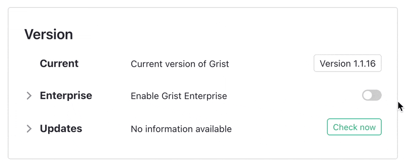
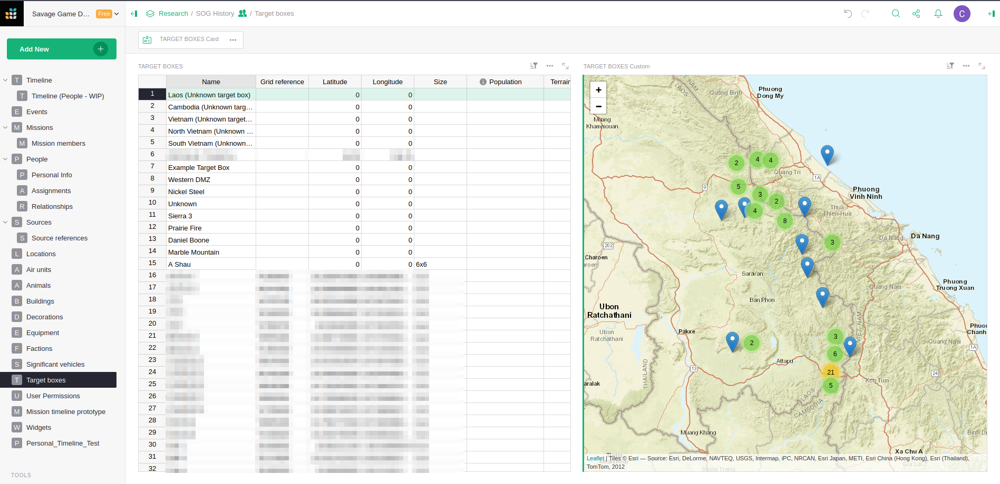

# July 2024 Newsletter

<table class="header" cellpadding="0" cellspacing="0" border="0"><tr>
  <td class="header-text">
    <table class="header-top"><tr>
      <td class="header-image">
        
      </td>
      <td class="header-top-text">
        
Grist for the Mill

        
July 2024
          &#8226; <a href="https://www.getgrist.com/">getgrist.com</a>

      </td>
    </tr></table>
    

      Welcome to our monthly newsletter of updates and tips for Grist users.
    

  </td>
</tr></table>

## What's new

### Cumulative functions: `PREVIOUS()`, `NEXT()` and `RANK()`

If you’ve ever tried to get a running total in a Grist table, or access previous values for calculations, we have some good news. We’ve added a series of new functionality related to cumulative functions that greatly expand what you can do in the grid:

* `PREVIOUS()` finds the previous record in a full table. `NEXT()` is the same, but in the other direction. 
* `RANK()` returns the rank of the record within the group, starting with 1.

Check out our complete documentation in our [Help Center](https://support.getgrist.com/functions/#cumulative){:target="\_blank"}.

### New kinds of lookups: `find.*` methods 

Even for a Python pro, it can be tricky to look up items based on nearness to a threshold, especially if the lookup needs to be efficient. These new `find.*` methods make it far easier. Essentially, `lookupRecords()` now allows search in sorted results! Here’s an example, showing the old way (🐢🙅) and the new way (🏃‍➡️): 

More details:

* The `find.*` methods are `le`, `lt`, `ge`, `gt`, and `eq` (less than or equal, less than, greater than or equal, greater than, equal).
* The `order_by` argument now supports tuples, as well as the "-" prefix to reverse order, e.g. `("Category", "-Date")`.

See the full documentation in our [Help Center](https://support.getgrist.com/functions/#find_){:target="\_blank"}.

### Tutorial progress

If you’re reading this, you probably don’t need to complete our basics tutorial. Still, we wanted to show off this cool new progress bar and hint at further onboarding improvements to help get new users up to speed! You are also now approximately 38% through this newsletter. Good job! 📈

### Grist Enterprise: now a toggle!

For our large enterprise users, installing Grist just got easier: you can now use the standard Docker image! We’ve consolidated images so that enabling and activating Enterprise is done in the admin console. This also means non-Enterprise users can trial Enterprise features like [GristConnect](https://support.getgrist.com/install/grist-connect/){:target="\_blank"} and [Azure/S3 storage](https://support.getgrist.com/install/cloud-storage/#azure){:target="\_blank"} for 30 days. The full Enterprise plan also includes installation support and professional services provided by our Grist experts. Check out our [Pricing page](https://www.getgrist.com/pricing/){:target="\_blank"} for details.

### Grist ActivePieces integration

Open source automation tool [ActivePieces](https://www.activepieces.com/){:target="\_blank"} now has [a bunch of Grist-specific actions & triggers](https://www.activepieces.com/pieces/grist){:target="\_blank"}. Thanks to Kishan Parmar for the [pull request](https://github.com/activepieces/activepieces/pull/5069){:target="\_blank"}!

### Improved column rename syncing

A [small but mighty fix](https://github.com/gristlabs/grist-core/pull/1038){:target="\_blank"} that addresses several usability frustrations across Grist. Now, when you rename a column, associated [access control](https://support.getgrist.com/access-rules/#access-rules){:target="\_blank"} and [conditional formatting](https://support.getgrist.com/conditional-formatting/){:target="\_blank"} rules update automatically! 

### Fly.io build previews for external contributors

If you’re a [`grist-core`](https://github.com/gristlabs/grist-core){:target="\_blank"} contributor working on a PR, we now have automatic previews for your work. Everyone can now see live demos, which should help move the review process along! We use [Fly.io](http://fly.io/){:target="\_blank"} to run a self-hosted instance of Grist including your code.

## User spotlight – Callum Spawforth/Savage Game Design

When he isn’t working on Grist, Callum ([@Spoffy](https://github.com/Spoffy){:target="\_blank"} on GitHub) works with the team at Savage Game Design to develop Vietnam War-era video games. The Savage team and their military advisors strive to make their game historically accurate, which means keeping track of a ton of real-world events, places, people, units, etc... and then relating them all back to each other.

The team uses Grist to build an event database as they create their storylines, treating it as a “starting point to map out what \[they\] want to happen during a certain time period.” As storylines evolve and become more complex, they connect their Grist documents with other tools like Google Docs, maintaining a link with their single source of truth. Instead of just having a Game Design Document, they now also have a Game Design Database.

## Community highlights

* A new [Basque translation](https://hosted.weblate.org/projects/grist/client/eu/){:target="\_blank"} is nearly complete, thanks to xabirequejo! See [here](https://community.getgrist.com/t/translating-grist/2086){:target="\_blank"} for more information on helping translate Grist.
* If you’ve used our [Proposals & Contracts template](https://public.getgrist.com/nyPmvvea8c54/Proposals-and-Contracts-Template/m/fork){:target="\_blank"} (or even followed [our tutorial](https://support.getgrist.com/examples/2023-07-proposals-contracts/#creating-proposals){:target="\_blank"} on how to build it!), you’ll be interested to see this updated Markdown widget templating function from [Discord](https://discord.gg/MYKpYQ3fbP){:target="\_blank"} user celine de france. This function is an easier way to replace fields within a template (even nested within references!), effectively automating the process for most cases. See their original post [here](https://discord.com/channels/1176642613022044301/1176646309223075860/1255885603153907844){:target="\_blank"}, or check out a [live demo](https://public.getgrist.com/rshLAdMBmoWJ/Markdown-reports-Celine-formula/p/16#a1.s52.r1.c36){:target="\_blank"}.

Working on something cool with Grist? Let us know by posting in the [Showcase forum](https://community.getgrist.com/c/showcase/8){:target="\_blank"} or our [#grist-showcase Discord channel](https://discord.gg/MYKpYQ3fbP){:target="\_blank"}!

## Learning Grist

### Webinar: Grist 101: A New User’s Guide

Join us for an introductory webinar designed to help new users navigate the basics of Grist. This session will provide you with the essential tools and knowledge to get started. We’ll cover key features and best practices to maximize your productivity.

Perfect for beginners, this webinar will set you on the path to becoming a Grist pro. Don’t miss out—reserve your spot today!

**Thursday August 15 at 3:00pm US Eastern Time.**

{:target="\_blank"}

[SIGN UP FOR AUGUST'S WEBINAR](https://www.getgrist.com/webinars/grist-101-new-users-guide/?utm_source=support-newsletter&utm_medium=internal&utm_campaign=build-webinar&utm_term=august-2024){:target="\_blank"}
{: .grist-button}

### Sharing Partial Data with Link Keys

In July, Natalie explained how to use one of Grist’s coolest and least explored features: link keys. We covered how to use Grist’s link keys to share partial data - even just a single row - with third parties.

[WATCH JULY'S RECORDING](https://www.getgrist.com/webinars/grist-sharing-partial-data-link-keys-2/){:target="\_blank"}
{: .grist-button}

## Help spread the word
If you’re interested in helping Grist grow, consider leaving a review on product review sites. Here’s a short list where your review could make a big impact. Thank you! 🙏

* [AlternativeTo](https://alternativeto.net/software/grist/about/){:target="\_blank"}
* [Capterra](https://www.capterra.com/p/232821/Grist/){:target="\_blank"}
* [G2](https://www.g2.com/products/grist){:target="\_blank"}
* [TrustRadius](https://www.trustradius.com/products/grist/){:target="\_blank"}

## We are here to support you

**Professional services.** Grist often surprises people with its capabilities. Schedule a **free** call to assess your needs and help connect you with a Grist expert. [Learn more.](https://www.getgrist.com/professional-services/){:target="\_blank"}

**Have questions, feedback, or need help?** Search our [Help Center](../index.md), [watch video
tutorials](https://www.youtube.com/channel/UCx0ioQrrC-bIrkmZ7ZULr0g/playlists), share ideas in our
[Community Forum](https://community.getgrist.com), or contact us at <support@getgrist.com>.
