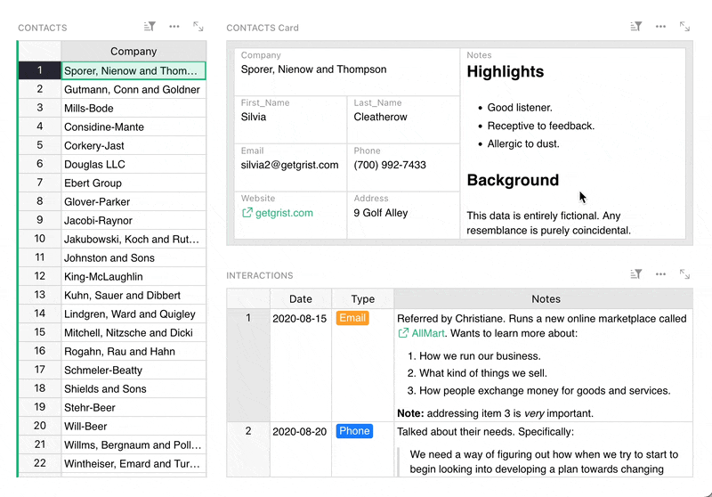
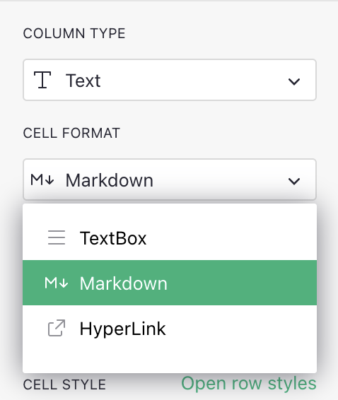
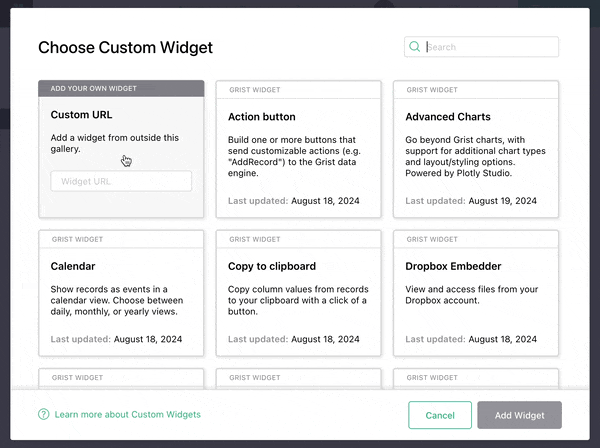
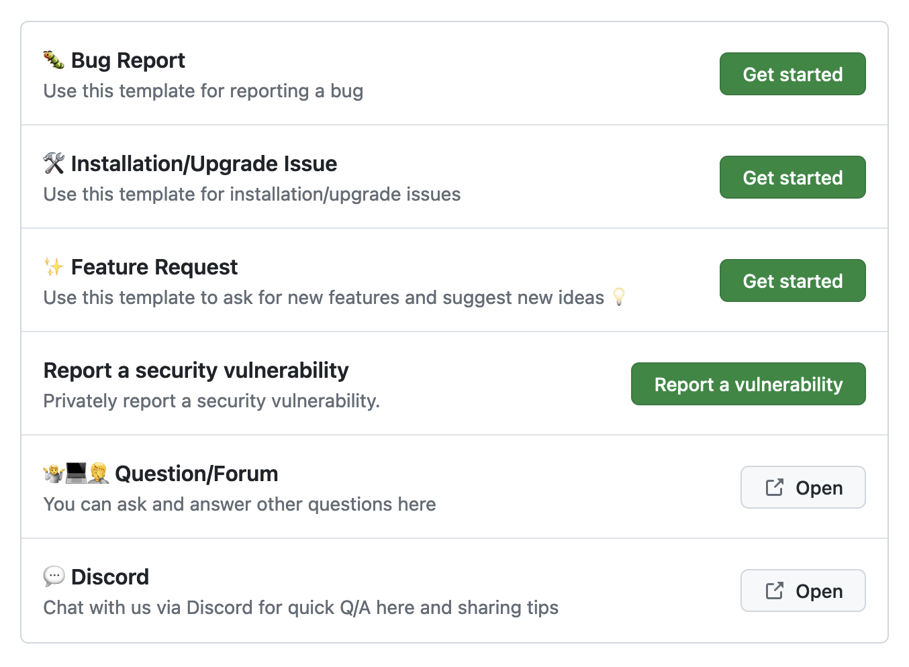
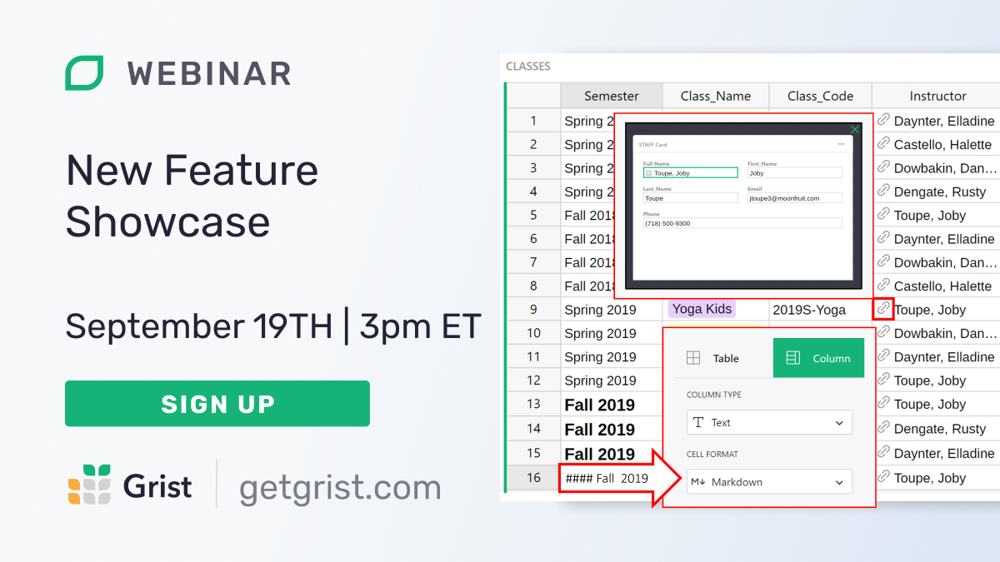

# August 2024 Newsletter

<table class="header" cellpadding="0" cellspacing="0" border="0"><tr>
  <td class="header-text">
    <table class="header-top"><tr>
      <td class="header-image">
        
      </td>
      <td class="header-top-text">
        
Grist for the Mill

        
August 2024
          &#8226; <a href="https://www.getgrist.com/">getgrist.com</a>

      </td>
    </tr></table>
    

      Welcome to our monthly newsletter of updates and tips for Grist users.
    

  </td>
</tr></table>

## What's new

### Markdown cell formatting

It’s finally here! Text columns now support Markdown. This means that you can use nearly all [Markdown syntax](https://www.markdownguide.org/basic-syntax/){:target="\_blank"} (apart from images and horizontal rules) in any cell – and even in card widgets! 

To enable Markdown in any Text column, simply select the option in the “Cell Format” dropdown in the Creator Panel:

**
{: .screenshot-half }

### New Custom Widget flow 🃏 

Adding custom widgets now has a new look! We’ve dropped the dropdown, and embraced a more spacious card-based UX. Retaining the same functionality as before, this new flow also highlights community-developed widgets, making it easier for us to include third-party widgets in the future.

For self-hosters, you can also add to this list (or make your own) following [these instructions](https://support.getgrist.com/self-managed/#how-do-i-list-custom-widgets){:target="\_blank"}.

### Webhooks documentation

Webhooks are powerful. So powerful, in fact, that creating proper documentation for them took us over a year. 🫠 But your patience is rewarded with [thorough documentation](https://support.getgrist.com/webhooks/){:target="\_blank"} by Jordi (our Systems Developer), who used his [database of homebrew NES games](https://grist.jordigh.com/o/docs/uDeR75ZAJZQZ/Jordis-NES-collection){:target="\_blank"} to get to the bottom of webhooks and their particularities.

### GitHub contribution templates

To help make contributing to `grist-core` easier and more consistent, [Florent](https://github.com/fflorent){:target="\_blank"} (inspired by [PeerTube](https://github.com/Chocobozzz/PeerTube/){:target="\_blank"}) created [several templates](https://github.com/gristlabs/grist-core/issues/new/choose){:target="\_blank"} for bug reporting, upgrade issues and feature requests.

### Self-hosters: OIDC enhancements

We’ve added some [extra security options](https://github.com/gristlabs/grist-core/pull/883){:target="\_blank"} for [OIDC](https://openid.net/developers/how-connect-works/){:target="\_blank"} authentication, enabling compatibility with new providers that have specific requirements. 

### GitLocalize translations for Grist documentation

Our friends and contributors at [ANCT](https://agence-cohesion-territoires.gouv.fr/){:target="\_blank"} have enabled [GitLocalize](https://gitlocalize.com/){:target="\_blank"} for the [Grist Help Center](https://support.getgrist.com/){:target="\_blank"}. You can see a machine-translated demo of the full docs [en Français](https://support.getgrist.com/fr/){:target="\_blank"}. To contribute, check out Vincent’s [how-to post in the Community Forum](https://community.getgrist.com/t/translation-of-the-grist-help-center-into-french/6236){:target="\_blank"}.

For translating Grist’s UI, we still use [Weblate](https://hosted.weblate.org/projects/grist/) – and are always looking for more help! A hearty thanks to all our contributors who have helped make Grist readable around the world. 🌏

## Community highlights

* [PyGrister](https://community.getgrist.com/t/pygrister-a-python-client-for-the-grist-api/5015){:target="\_blank"}, the Python client from Riccardo Polignieri mentioned last May, has been updated. It’s now on [PyPi](https://pypi.org/project/Pygrister/){:target="\_blank"}, and has [thorough documentation](https://pygrister.readthedocs.io/en/latest/index.html){:target="\_blank"} to boot. 📝
* A new [Catalan translation](https://hosted.weblate.org/projects/grist/client/ca/){:target="\_blank"} has just kicked off on Weblate, thanks to xmontero! See [here](https://community.getgrist.com/t/translating-grist/2086){:target="\_blank"} for more information on helping translate Grist.
* Antol Peshkov has created a [simple custom dropdown widget](https://community.getgrist.com/t/translating-grist/2086){:target="\_blank"} that does exactly what it sounds like. Note: if you’re self-hosting, a fix related to this widget is on it’s way to `grist-core` soon!
**
{: .screenshot-half }

Working on something cool with Grist? Let us know by posting in the [Showcase forum](https://community.getgrist.com/c/showcase/8){:target="\_blank"} or our [#grist-showcase Discord channel](https://discord.gg/MYKpYQ3fbP){:target="\_blank"}!

## Learning Grist

### Webinar: ✨ New Feature Showcase

In September, catch up on the latest Grist features that you may have missed, including Markdown in cells, cumulative functions, the formula timer, and record cards. Learn how these new tools can enhance your existing Grist docs, or give you new ideas for future workflows.

**Thursday September 19 at 3:00pm US Eastern Time.**

{:target="\_blank"}

[SIGN UP FOR SEPTEMBER'S WEBINAR](https://www.getgrist.com/webinars/grist-new-feature-showcase/?utm_source=support-newsletter&utm_medium=internal&utm_campaign=build-webinar&utm_term=september-2024){:target="\_blank"}
{: .grist-button}

### Grist 101

In August, Natalie hosted an introductory webinar designed to help new users navigate the basics of Grist. This session provided users with the essential tools and knowledge to get started. We covered key features and best practices to maximize your productivity. Perfect for beginners!

[WATCH AUGUST'S RECORDING](https://www.getgrist.com/webinars/grist-101-new-users-guide/){:target="\_blank"}
{: .grist-button}

## Help spread the word
If you’re interested in helping Grist grow, consider leaving a review on product review sites. Here’s a short list where your review could make a big impact. Thank you! 🙏

* [AlternativeTo](https://alternativeto.net/software/grist/about/){:target="\_blank"}
* [Capterra](https://www.capterra.com/p/232821/Grist/){:target="\_blank"}
* [G2](https://www.g2.com/products/grist){:target="\_blank"}
* [TrustRadius](https://www.trustradius.com/products/grist/){:target="\_blank"}

## We are here to support you

**Professional services.** Grist often surprises people with its capabilities. Schedule a **free** call to assess your needs and help connect you with a Grist expert. [Learn more.](https://www.getgrist.com/professional-services/){:target="\_blank"}

**Have questions, feedback, or need help?** Search our [Help Center](../index.md), [watch video
tutorials](https://www.youtube.com/channel/UCx0ioQrrC-bIrkmZ7ZULr0g/playlists), share ideas in our
[Community Forum](https://community.getgrist.com), or contact us at <support@getgrist.com>.