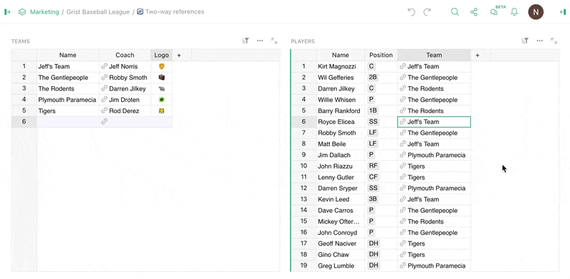
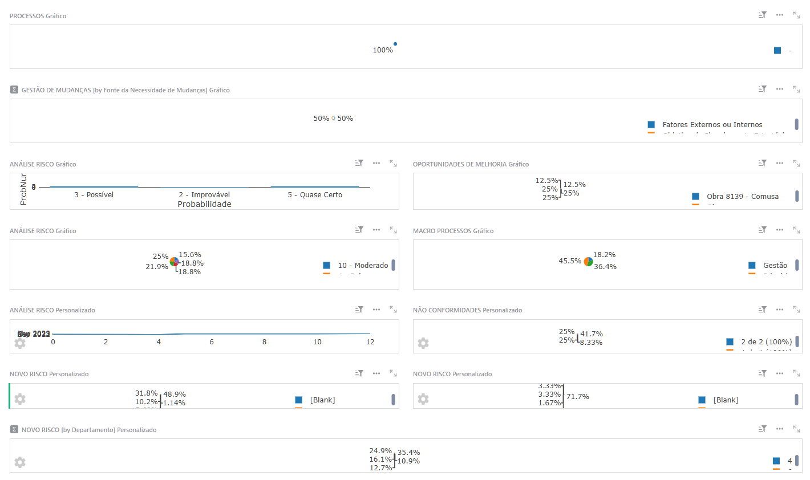
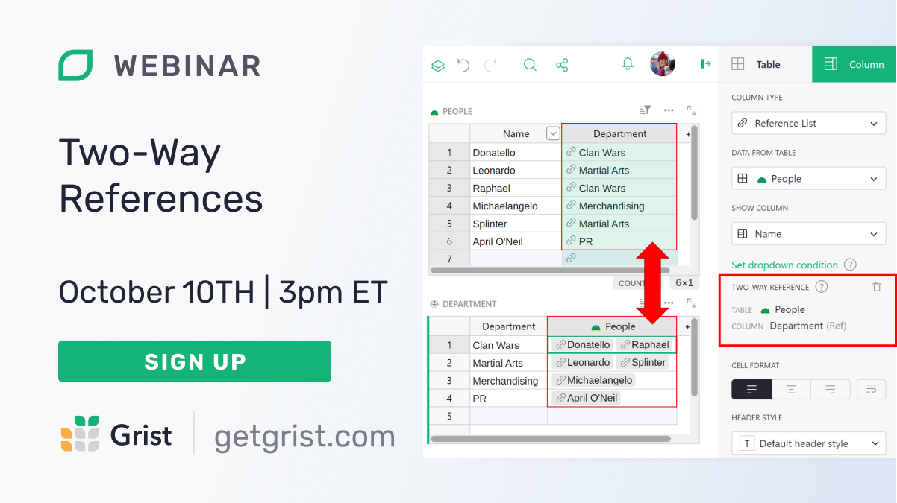

# September 2024 Newsletter

<table class="header" cellpadding="0" cellspacing="0" border="0"><tr>
  <td class="header-text">
    <table class="header-top"><tr>
      <td class="header-image">
        
      </td>
      <td class="header-top-text">
        
Grist for the Mill

        
September 2024
          &#8226; <a href="https://www.getgrist.com/">getgrist.com</a>

      </td>
    </tr></table>
    

      Welcome to our monthly newsletter of updates and tips for Grist users.
    

  </td>
</tr></table>

## What's new

### Two-way references

References now support *twice* the ways! Two-way references are a powerful tool that we’ve found ourselves using for projects even while in development. As the overly-complex GIF above demonstrates, with the click of a button you can now add a two-way reference to a reference column.

And what exactly happens when you add a two-way reference? Get ready for the word “reference” a lot... 

1. A new reference column is created in the target table. Essentially, a “reverse reference column”.
2. This column is automatically populated with references from the table where the two-way reference was created.
3. Any reference changes between the two columns are automatically synchronized.

Once you get a hang of their particularities, two-way references open up a new field of data relations. Learn more about two-way references in the [Help Center](https://support.getgrist.com/col-refs/#creating-a-two-way-reference){:target="\_blank"}.

Need a primer on what, exactly, references are, and where you might find relationships in your data? Take a look at our [new blog post](https://www.getgrist.com/blog/understanding-relationships-in-relational-databases/){:target="\_blank"} to learn about the Big Four: one-to-one, one-to-many, many-to-one, and last but not least: many-to-many.

### Grist Desktop 0.3.0

The summer is over, but the hard work of our summer intern Leslie continues to bear fruit. This release makes Grist Desktop behave more like a desktop app than ever before, as part of our “make Grist Desktop feel more normal” initiative. How normal you ask? You can open and save files anywhere on the filesystem, for example. That’s *extremely* normal, and things just get more normal from there...

Check out the latest release [on GitHub](https://github.com/gristlabs/grist-desktop/releases){:target="\_blank"}.

### Formula Assistant model updates

We’ve updated the model used by the [AI Formula Assistant](https://www.getgrist.com/ai-formula-assistant/){:target="\_blank"} from `gpt-3.5-turbo` to `gpt-4o`. Based on our internal testing, we’re seeing a modest increase in assistant accuracy. 

For self-hosters, the Formula Assistant now functions against any OpenAI chat completion endpoints ending in `/v1/chat/completions`. We’ve also tested using the Formula Assistant via local models through [LM Studio](https://lmstudio.ai/){:target="\_blank"}. 

## Community highlights

### 🔨 Grist hackathon

Longtime Grist partners ANCT and DINUM joined forces with more members of Grist’s French-speaking community to form the French Grist Federation. The new group hosted a hackathon last weekend in Paris as a branch of [Code For France](https://codefor.fr/){:target="\_blank"}, which aims to develop a transparent and participatory digital commons. Read a summary of the hackathon [at Open Source Politics](https://opensourcepolitics-eu.translate.goog/actualites/lassociation-grist-france-voit-le-jour-et-sinvite-aux-nec-off/?_x_tr_sl=fr&_x_tr_tl=en&_x_tr_hl=en&_x_tr_pto=wapp){:target="\_blank"}, auto-translated from French.

Hosting a hackathon of your own? Please let us know!

### ♻️ Grist reusable code repository

Users on Grist’s [Community Forum](https://community.getgrist.com/t/showcase-feature-request-reusable-user-code-repository/6370){:target="\_blank"} have started collaborating on a [shared user code repository](https://github.com/tomnitschke/gristruc/tree/main){:target="\_blank"}, which already hosts cool utilities such as TomNit’s [self-sanitizing reference fields](https://community.getgrist.com/t/self-sanitizing-reference-fields/6403){:target="\_blank"}.

It’s also a great example of how Grist can be extended via Python classes, essentially storing function “libraries” in formula columns.

### 🦸‍♀️ Super dashboards

Do you use lots of charts? We support you and celebrate you. Still, Grist can get a bit cramped with several charts. To work around this, Rogerio has created [“super dashboards”](https://community.getgrist.com/t/super-dashboards-with-iframes-and-html-widget/6266){:target="\_blank"} which use the HTML widget and scrollable iframes to go from this:

To this:

For more heroic uses of the HTML widget, also check out Rogerio’s [thread on creating a dynamic risk matrix](https://community.getgrist.com/t/luke-if-you-only-knew-the-power-of-the-html-widget/6487/1){:target="\_blank"}.

### ✅ Change tracking with trigger formulas

We saw above how trigger formulas can help sanitize references, and here’s another handy use case. Rogerio is back with [a solution for simply tracking changes](https://community.getgrist.com/t/how-to-make-column-b-track-all-changes-in-column-a-as-history/6441){:target="\_blank"} made to columns, including timestamps.

Working on something cool with Grist? Let us know by posting in the [Showcase forum](https://community.getgrist.com/c/showcase/8){:target="\_blank"} or our [#grist-showcase Discord channel](https://discord.gg/MYKpYQ3fbP){:target="\_blank"}!

## Learning Grist

### Webinar: 🔄 Two-Way References

They're heeereee 👻... Spooky season comes a bit early with a feature that's haunted us for a while now: two-way references. Link data in both directions, opening up new and powerful ways to leverage relational data. Now it's time to be haunted by possibilities. Join us in October to explore how!

**Thursday October 10 at 3:00pm US Eastern Time.**

{:target="\_blank"}

[SIGN UP FOR OCTOBER'S WEBINAR](https://www.getgrist.com/webinars/two-way-references/?utm_source=support-newsletter&utm_medium=internal&utm_campaign=build-webinar&utm_term=october-2024){:target="\_blank"}
{: .grist-button}

### ✨ New Feature Showcase

In September, Natalie caught us up on the latest Grist features that you may have missed, including markdown in cells, cumulative functions, the formula timer, and record cards. Learn how these tools can enhance your existing Grist docs, or give you new ideas for future workflows.

[WATCH SEPTEMBER'S RECORDING](https://www.getgrist.com/webinars/grist-new-feature-showcase/){:target="\_blank"}
{: .grist-button}

## Help spread the word
If you’re interested in helping Grist grow, consider leaving a review on product review sites. Here’s a short list where your review could make a big impact. Thank you! 🙏

* [AlternativeTo](https://alternativeto.net/software/grist/about/){:target="\_blank"}
* [Capterra](https://www.capterra.com/p/232821/Grist/){:target="\_blank"}
* [G2](https://www.g2.com/products/grist){:target="\_blank"}
* [TrustRadius](https://www.trustradius.com/products/grist/){:target="\_blank"}

## We are here to support you

**Professional services.** Grist often surprises people with its capabilities. Schedule a **free** call to assess your needs and help connect you with a Grist expert. [Learn more.](https://www.getgrist.com/professional-services/){:target="\_blank"}

**Have questions, feedback, or need help?** Search our [Help Center](../index.md), [watch video
tutorials](https://www.youtube.com/channel/UCx0ioQrrC-bIrkmZ7ZULr0g/playlists), share ideas in our
[Community Forum](https://community.getgrist.com), or contact us at <support@getgrist.com>.