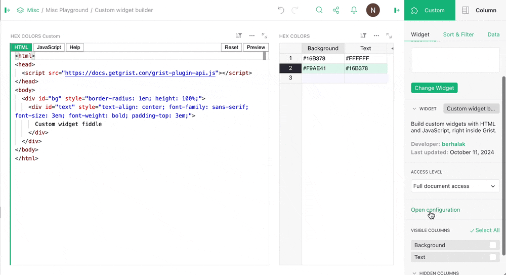
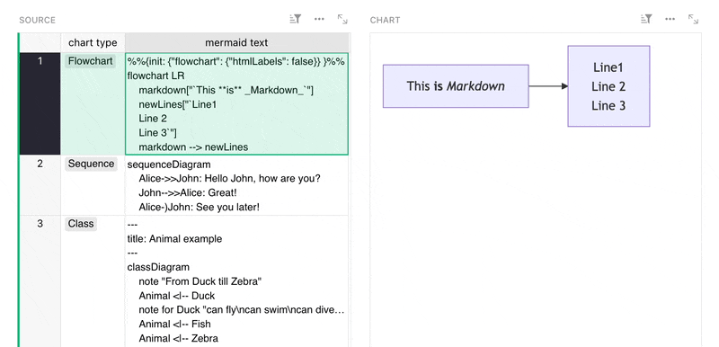
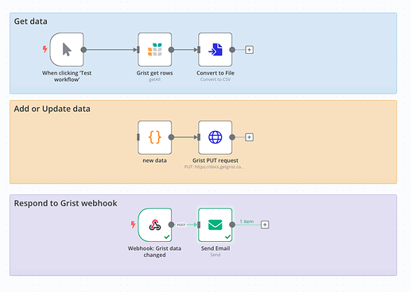
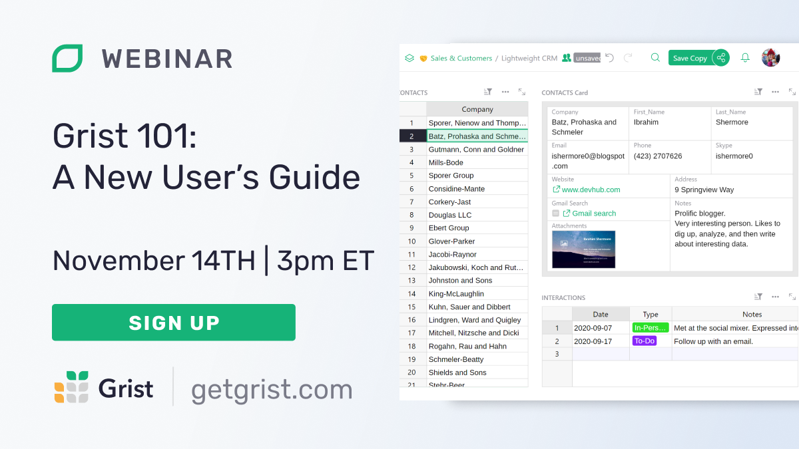

# October 2024 Newsletter

<table class="header" cellpadding="0" cellspacing="0" border="0"><tr>
  <td class="header-text">
    <table class="header-top"><tr>
      <td class="header-image">
        
      </td>
      <td class="header-top-text">
        
Grist for the Mill

        
October 2024
          &#8226; <a href="https://www.getgrist.com/">getgrist.com</a>

      </td>
    </tr></table>
    

      Welcome to our monthly newsletter of updates and tips for Grist users.
    

  </td>
</tr></table>

## Register for the Grist Paris Summit

As you may have heard, the first official [Grist Summit](https://www.getgrist.com/grist-paris-summit-2024/){:target="\_blank"} will be held in Paris, France on December 3rd, 2024. If you’re in the area and not yet convinced, seriously [take a look at the venue](https://www.lafaiencerie.com/galerie){:target="\_blank"}. 🤩

See advanced real-world Grist examples, chat with us and other power users, and find out what [La Suite Numérique](https://lasuite.numerique.gouv.fr/){:target="\_blank"} – France’s open source data suite — is all about.

## Halloween 🎃

In the spirit of the season, Grist Labs sat down to think of the scariest spreadsheet-related happening. And here it is, a trigger formula that returns `#REF!` if you don’t use a polite “Please”. Children may want to avert their eyes:

## What's new

### Custom widget builder widget

Say that ten times fast!

Custom widgets greatly expand what you can do within Grist, but building them doesn’t have to be super complicated. We’ve released a widget that lets you build and test widgets on the fly, *inside Grist itself*.

Now available as a community custom widget. More info in our [Community forum](https://community.getgrist.com/t/new-community-widget-custom-widget-builder/6803){:target="\_blank"}.

### Relational data explainer

One thing we know is that users familiar with relational data tend to get the most out of Grist. If you’re coming from tools where data relationships are somewhat limited, or just need a refresher, check out our 2-minute walkthrough:

<iframe width="560" height="315" src="https://www.youtube.com/embed/eWSGUSE6wyI?si=CjzfQzAVzJelWurc" title="YouTube video player" frameborder="0" allow="accelerometer; autoplay; clipboard-write; encrypted-media; gyroscope; picture-in-picture; web-share" referrerpolicy="strict-origin-when-cross-origin" allowfullscreen></iframe>

### Team site images

If you’re the Plan Manager of a [team site](https://support.getgrist.com/teams/#_top){:target="\_blank"} (free or paid), you can now upload a site-specific image by opening the user menu and clicking on ‘Billing Account’.

### Other Grist updates

* Self-hosters: are your documents getting too big on disk? Now you can choose to store less history to reduce file sizes ([GitHub PR](https://github.com/gristlabs/grist-core/pull/1262){:target="\_blank"}).
* Returning lists of records from a formula now does the right thing in more situations ([GitHub issue with example](https://github.com/gristlabs/grist-core/issues/1130){:target="\_blank"}).
* New `grist-core` release v1.2.1 [on GitHub](https://github.com/gristlabs/grist-core/releases/tag/v1.2.1){:target="\_blank"}.

## Community highlights

* A small but very welcome addition to general spreadsheeting is the new “Copy with headers” option in the context menu. Thanks to rtwfroody for this [new feature](https://github.com/gristlabs/grist-core/pull/1208){:target="\_blank"}!
**
{: .screenshot-half }

* nicobako’s Mermaid charts integration is now a [handy custom widget](https://community.getgrist.com/t/mermaid-charts-integration/6938){:target="\_blank"}! And check out [Dmitry’s example](https://community.getgrist.com/t/mermaid-charts-integration/6938/3?u=nick){:target="\_blank"} of how you can use Mermaid to visualize a Grist document’s own schema. 👀

* Peter_P_Breithaupt shared a [comprehensive guide](https://community.getgrist.com/t/finding-duplicate-contact-names-with-special-characters/6692){:target="\_blank"} to dealing with duplicates and special unicode characters (including accents & diacritics).
* Do you ever want to lock down structure edits from everyone to avoid accidental formula overwrites? David_Hawley [shared a way to do it using Special Rules](https://community.getgrist.com/t/make-formula-columns-write-protected/6345/4?u=nick){:target="\_blank"}.
* aude shared some [n8n-Grist tutorials](https://community.getgrist.com/t/very-basic-n8n-grist-workflows/7021){:target="\_blank"} to get you started with basic workflows.

* Check out our [profile of Savage Game Design](https://www.getgrist.com/case-studies/how-a-game-design-studio-uses-grist-to-turn-stories-into-structured-data/){:target="\_blank"} and see how they use Grist at the intersection of relational data and game development, but perhaps not in the way you’d expect.
* Finally, listen to Grist Labs co-CEO Anais and CTO Paul chat about the business of open source on Emily Omier’s podcast called – you guessed it – [The Business of Open Source](https://www.emilyomier.com/podcast/u9ertcqsv9y0y62gud30tzobn6tjk8){:target="\_blank"}. A topic that we don’t talk about a lot, but one we must think about frequently!

Working on something cool with Grist? Let us know by posting in the [Showcase forum](https://community.getgrist.com/c/showcase/8){:target="\_blank"} or our [#grist-showcase Discord channel](https://discord.gg/MYKpYQ3fbP){:target="\_blank"}!

## Learning Grist

### Webinar - Grist 101: A New User’s Guide

Join us for an introductory webinar designed to help new users navigate the basics of Grist. This session will provide you with the essential tools and knowledge to get started. We'll cover key features and best practices to maximize your productivity.

Perfect for beginners, this webinar will set you on the path to becoming a Grist pro. Don't miss out – reserve your spot today!

**Thursday November 14 at 3:00pm US Eastern Time.**

{:target="\_blank"}

[SIGN UP FOR NOVEMBER'S WEBINAR](https://www.getgrist.com/webinars/grist-101-new-users-guide-nov24/?utm_source=support-newsletter&utm_medium=internal&utm_campaign=build-webinar&utm_term=november-2024){:target="\_blank"}
{: .grist-button}

### Two-way references

In October, Natalie showed off our newest feature in Grist, two-way references! Link data in both directions, opening up new and powerful ways to leverage relational data.

[WATCH OCTOBER'S RECORDING](https://www.getgrist.com/webinars/two-way-references/){:target="\_blank"}
{: .grist-button}

## Help spread the word
If you’re interested in helping Grist grow, consider leaving a review on product review sites. Here’s a short list where your review could make a big impact. Thank you! 🙏

* [AlternativeTo](https://alternativeto.net/software/grist/about/){:target="\_blank"}
* [Capterra](https://www.capterra.com/p/232821/Grist/){:target="\_blank"}
* [G2](https://www.g2.com/products/grist){:target="\_blank"}
* [TrustRadius](https://www.trustradius.com/products/grist/){:target="\_blank"}

## We are here to support you

**Professional services.** Grist often surprises people with its capabilities. Schedule a **free** call to assess your needs and help connect you with a Grist expert. [Learn more.](https://www.getgrist.com/professional-services/){:target="\_blank"}

**Have questions, feedback, or need help?** Search our [Help Center](../index.md), [watch video
tutorials](https://www.youtube.com/channel/UCx0ioQrrC-bIrkmZ7ZULr0g/playlists), share ideas in our
[Community Forum](https://community.getgrist.com), or contact us at <support@getgrist.com>.